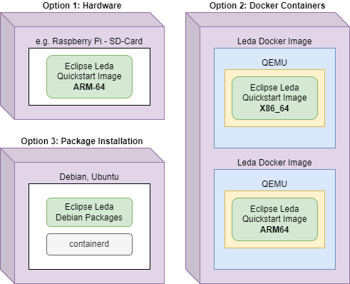

## Runtime Overview

> The runtime overview shows the general layer architecture for the runtime of the SDV edge stack as implemented by the Leda quickstart image.
  Dotted lines indicate out-of-scope components. They may be non-Edge components (such as cloud services, or SDKs and additional development tooling for vehicle applications). Dotted lines for in-vehicle edge components indicate that they may be used, but are not pre-installed or pre-configured on the Leda quickstart image.

## Deployment Overview

Eclipse Leda can be used in different deployment scenarios: on physical hardware, on virtual machines or installed on existing Linux distributions.
Depending on the specific deployment, some features may not be applicable. Each deployment option is meant for different uses. The applicabability
depend to your specific requirements.

- **Option 1: Hardware** - Suitable for proof-of-concepts, system integration tasks, access to actual physical actuators and sensors.
  However, an automated setup is much harder to realize, as additional hardware for remote controlling of power supply is needed.
  The constrained environment of a physical device is good to verify accidental assumptions made by application developers,
  such as resource consumptions (CPU, memory) or the existence of Linux tools, Kernel modules or device drivers.
- **Option 2: Docker Containers** - Good for quick startup and throw-away (ephemeral) uses, such as automated system testing or one-off troubleshooting.
  The access to physical hardware is limited and more complicated to set up. QEMU provides emulation of devices, such as CAN-Bus.
  Due to multiple nesting of abstraction technology (Docker + QEMU + OS), additional configuration of networking and device pass-thrus are necessary.
  It's easy and cheap to spin-off many separate instances to simulate a whole vehicle system with multiple vehicle computers and
  simulated ECUs in the same vehicle network.
- **Option 3: Package Installation** - Good for existing devices with feature-rich functionality where the original OS should be used.
  Leda does not support self-update for this deployment option, as it relies on the master OS distribution channels.
  The constraints of an embedded device are not replicable easily on a PC-style host machine without additional effort.
  Package installation is good when the focus is on exploring the Vehicle Applications, SDKs, Vehicle Signal Abstractions etc.

|                      | Option 1: Hardware | Option 2: Docker Containers | Option 3: Package Installation |
| -------------------- | --- | --- | --- |
| Target use case      | PoC | Automation | Existing devices |
| Cloud communication  | ++  | ++  | +++ |
| Automation           | --  | +++ | ++  |
| Device provisioning  | ++  | ++  | +++ |
| Access to hardware   | +++ | -   | ++  |
| Container isolation  | +++ | ++  | +++ |
| Network flexibility  | +++ | -   | ++  |
| Self update          | +++ | +   | --  |
| Realistic constrains | +++ | -   | -   |

## Build Environment Overview

