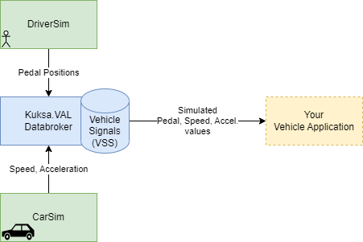
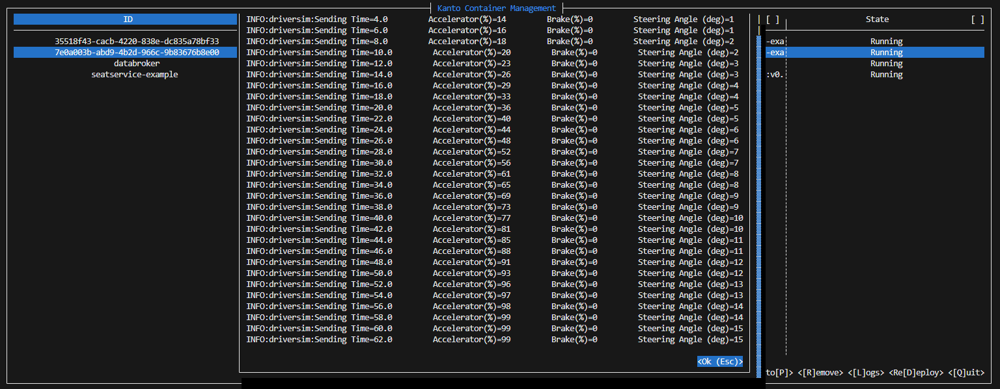

The **CarSim** example provides basic Vehicle Signals based on a physical model simulation and feeds them to the databroker.

[](./kinetic.svg)

## Architecture Overview

[](./carsim-arch-overview.svg)

## Description

CarSim is a simple physical model implementation, based on the [kinematic bicycle model](https://thef1clan.com/2020/09/21/vehicle-dynamics-the-kinematic-bicycle-model/).
It can be used as a *mock implementation* in development, testing and simulation scenarios.

It takes three external inputs:

- accelerator position
- brake position
- steering wheel angle

It propagates the physical model in time with a pre-defined step interval (10ms), recalculates the acceleration components,
speed and position, and finally publishes the numeric values as standard VSS datapoints to the databroker.

To simulate the input from a human driver, the optional **DriverSim** component can be run in parallel.
DriverSim toggles between two different types of driver style in a pre-defined time interval:

- **Good driver** - slowly accelerates and moves the steering angle accordingly and then slowly brakes.
- **Bad driver** - accelerates hard (full throttle), moves the steering wheel randomly in both directions, brakes hard.

## Background

{}
**Decoupled Design**

CarSim and DriverSim **only communicate through the databroker** by using standardized Vehicle Signals.
{}

Each component can be replaced individually **at runtime**, e.g. by more advanced or real implementations.
There is no need to adapt, recompile or redeploy any of the other applications.

This is **important** for decoupling and [standardizing vehicle signals](https://fosdem.org/2023/schedule/event/kuksa/),
to enable future vehicle application platforms to evolve.
Loose coupling and standardizing of vehicle signal interfaces enable thirdparty applications to use signals
in higher-level applications or value-add services.

Both implementors (imagine separate organizations), can agree to use the Vehicle Signal Specification
to decouple the development lifecycle for vehicle applications and vehicle services. This decoupling approach
reduces the time and effort for proprietary design specifications processes tremendously.

## Vehicle Signals

The CarSim application reads the following input signals from the databroker:

### Input

| "Human" driver input | Python variable | VSS subscription path | VSS datatype |
| ---   | --- | --- | --- |
| Brake pedal position | DP_BRAKE_POS | [`Vehicle.Chassis.Brake.PedalPosition`](/leda/docs/vss/vehicle/chassis/brake/pedalposition/) | uint8 |
| Accelerator pedal position | DP_ACCELR_POS | [`Vehicle.Chassis.Accelerator.PedalPosition`](/leda/docs/vss/vehicle/chassis/accelerator/pedalposition/) | uint8 |
| Steering wheel angle | DP_STEER_ANGLE | [`Vehicle.Chassis.SteeringWheel.Angle`](/leda/docs/vss/vehicle/chassis/steeringwheel/angle/) | int16 |

*Note: You can either provide these signals externally on your own, or use `DriverSim` to simulate them.*

### Output

The CarSim application feeds the following output signals to the databroker:

| Python variable | VSS feeding path | VSS datatype |
| --- | --- | --- |
| DP_SPEED | [`Vehicle.Speed`](/leda/docs/vss/vehicle/speed/) | float |
| DP_ACCEL_LAT | [`Vehicle.Acceleration.Lateral`](/leda/docs/vss/vehicle/acceleration/lateral/) | float |
| DP_ACCEL_LONG | [`Vehicle.Acceleration.Longitudinal`](/leda/docs/vss/vehicle/acceleration/longitudinal/) | float |
| DP_ACCEL_VERT | [`Vehicle.Acceleration.Vertical`](/leda/docs/vss/vehicle/acceleration/vertical/) | float |

## Getting started

1. Start up Leda and wait for the runtime to be available. For other deployment options, see [Getting Started](/leda/docs/general-usage/)

   ```shell
   docker run -it ghcr.io/eclipse-leda/leda-distro/leda-quickstart-x86
   ```

2. Deploy the [`CarSim`](https://github.com/eclipse-leda/leda-example-applications/pkgs/container/leda-example-applications%2Fleda-example-carsim)
   container:

   ```shell
   kanto-cm create --name carsim --e=DATABROKER_ADDRESS=databroker:55555 --hosts="databroker:container_databroker-host" ghcr.io/eclipse-leda/leda-example-applications/leda-example-carsim:v0.0.1
   kanto-cm start --name carsim
   ```

3. Deploy [`DriverSim`](https://github.com/eclipse-leda/leda-example-applications/pkgs/container/leda-example-applications%2Fleda-example-driversim)
   container:

   ```shell
   kanto-cm create --name driversim --e=DATABROKER_ADDRESS=databroker:55555 --hosts="databroker:container_databroker-host" ghcr.io/eclipse-leda/leda-example-applications/leda-example-driversim:v0.0.1
   kanto-cm start --name driversim
   ```

4. Use `kantui` or `kanto-cm logs --name <carsim|driversim>` to view log files:

   

   

5. Use the `databroker-cli` to subscribe to the following VSS signals.

   > *Note:* Separate multiple signals by commas. Use `<TAB>` to auto-complete signal names.
   See [QUERY.md](https://github.com/eclipse/kuksa.val/blob/master/kuksa_databroker/doc/QUERY.md) for the query syntax.

   ```shell
   $ databroker-cli
   connect localhost:30555
   subscribe
       SELECT
        Vehicle.Speed,
        Vehicle.Acceleration.Vertical,
        Vehicle.Acceleration.Longitudinal,
        Vehicle.Acceleration.Lateral
       WHERE
        Vehicle.Speed > 50
   ```

   

6. Happy hacking!

   Need ideas? How about implementing your own driver simulation and integrate with existing open source simulation technologies from *Autonomous Driving*?

## References

- Sources: <https://github.com/eclipse-leda/leda-example-applications/tree/main/kuksa-carsim>
- Kinetic Bicycle Model: <https://thef1clan.com/2020/09/21/vehicle-dynamics-the-kinematic-bicycle-model/>
- Kuksa.VAL: <https://github.com/eclipse/kuksa.val/tree/master/kuksa_databroker>
- COVESA Vehicle Signal Specification: <https://github.com/COVESA/vehicle_signal_specification>
