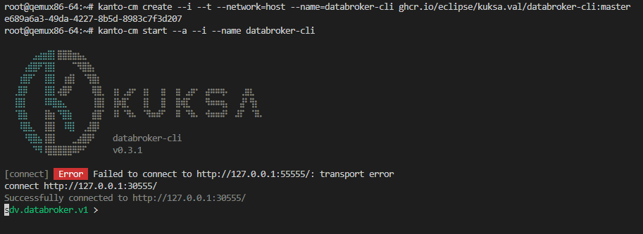

To generically interact with the Vehicle Signals which are managed in the Eclipse Kuksa.VAL Databroker,
you can either use the natively installed `databroker-cli` command line tool, or use the CLI tool from an updated and released containerized image.

## Kuksa Databroker CLI

To install a new version of the Kuksa Databroker CLI container, follow these steps:

1. Create the container in Kanto:

        kanto-cm create --i --t --network=host --name=databroker-cli ghcr.io/eclipse/kuksa.val/databroker-cli:master

2. Start the command line tool within a container in interactive mode:

        kanto-cm start --a --i --name databroker-cli

3. In the databroker shell, connect to the databroker via the URL `http://127.0.0.1:30555/`:

        connect http://127.0.0.1:30555/

## Kuksa Client

To install a new version of the Kuksa Client container, follow these steps:

1. Create the container in Kanto Namespace:

        ctr --namespace kanto-cm container create --net-host --tty ghcr.io/eclipse/kuksa.val/kuksa-client:master kuksa-client

2. Start the container in detached mode:

        ctr --namespace kanto-cm tasks start --detach kuksa-client

3. Start the command line tool with additional command line options:

        ctr --namespace kanto-cm tasks exec --tty --exec-id sometask kuksa-client /kuksa-client/bin/kuksa-client --port 30555 --protocol grpc --insecure
