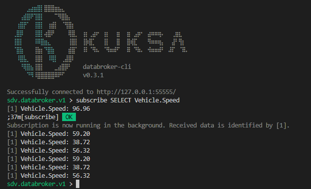

The [Vehicle Signal Specification](https://github.com/COVESA/vehicle_signal_specification) has a lot of standard Vehicle Signals already defined.

However, if you want to add additional custom signals or mappings from CAN-Bus for the
Kuksa.VAL [dbc2val feeder](https://github.com/eclipse/kuksa.val.feeders/tree/main/dbc2val),
the VSS data model needs to be customized and regenerated.

The following steps can be performed on a development machine to regenerate VSS data model with custom a *vspec* mapping.

1. Concepts
2. Setup workspace
3. Defining the VSS Overlay
4. Regenerate VSpec JSON
5. Generate a candump
6. Databroker and dbc2val containers
7. Testing with data

## Concepts

### VSS Overlay

The [VSS Overlay concept](https://covesa.github.io/vehicle_signal_specification/rule_set/overlay/) allows to override the
standard signals in the specification with custom signals. It defines metadata attributes like signal name, datatype, description etc.

In addition, the vspec file allows to add custom metadata, such as the `dbc` node in the following example:

```yaml
Vehicle.Speed:
  type: sensor
  datatype: float
  dbc:
    message: Kombi_01
    signal: KBI_angez_Geschw
    interval_ms: 1000
```

See Eclipse Kuksa documentation about [dbc2val mapping](https://github.com/eclipse/kuksa.val.feeders/blob/main/dbc2val/mapping/mapping.md) for details.

There are also ways to automatically transform the CAN-Bus signal values into VSS values:

- Mapping of literal values, such as enums and booleans
- Mathematical transformations
- Full and partial transformations

## Setup workspace

### Required tools

- Git
- Docker
- Python 3
- can-utils
- a YAML/JSON text editor

Depending on your host OS, you may need to install the packages first:

```shell
sudo apt-get update
sudo apt-get install can-utils git docker python3
```

### Workspace structure

You need the following files in your workspace folder:

- `./custom.dbc` - The vehicle-specific DBC file.
    You can use the [Tesla Model 3 example](https://github.com/joshwardell/model3dbc)
    or check out the [opendbc](https://github.com/commaai/opendbc) project.
- `./custom.vspec` - The VSS overlay from the previous step

## Defining the VSS Overlay

The definition of an VSS overlay is a manual process.
It requires research, browsing the existing VSS catalog and deep knowledge of the vehicle signals.
Especially knowing the semantic of a signal and how to map it between DBC and VSS is a complex task.

> Note: The Leda team is not aware of any advanced tooling to support the automation of this task.

1. Create a new file `custom.vspec`. Use YAML format
2. For each identified signal:
    1. Look up if there already is a corresponding signal in VSS. You may use the [Digital.Auto Playground](https://digital.auto) or the spec directly.
    2. Add a new top-level entry to the custom.vspec file. The key is the full VSS path name in dot notation.
    3. Add the corresponding `dbc` node
    4. Add the `signal` attribute and enter the name of the CAN-Bus signal name in the DBC
    5. Add additional attributes such as `interval_ms`, `message` or `transform`.
        > Note: The attributes `signal`, `interval_ms` and `transform` are evaluated by dbc2val.
        The attribute `message` is only evaluated by the below demo script and is optional.

Example:

```yaml
# CAN Message: Kombi_01
Vehicle.Speed:
  type: sensor
  datatype: float
  dbc:
    message: Kombi_01
    signal: KBI_angez_Geschw
    interval_ms: 1000

# CAN Message: FS_Position_01
Vehicle.Cabin.Seat.Row1.Pos1.Position:
  type: sensor
  datatype: float
  dbc:
    message: FS_Position_01
    signal: FSS_Laenge_Pos
    interval_ms: 1000
```

These two extensions will be added to the combined VSS tree:


### Regenerating VSpec

The script `vspec2json.py` from [COVESA VSS Tools](https://github.com/covesa/vss-tools) can then be used to merge the overlay file with the standard specification.

For Leda devices, you can use `kanto-cm` to run the tool as a container:

```shell
# Copy custom.dbc and custom.vspec to /home/root
# Run in /home/root
kanto-cm create --name vspec2json --rp no --mp="/home/root:/data" ghcr.io/eclipse-leda/leda-vss-vspec2json:main
kanto-cm start --a --i --name vspec2json
```

For developer workstations, there is a convenient pre-built Docker container:

```shell
docker run --name vspec2json --rm -v `pwd`:/data ghcr.io/eclipse-leda/leda-vss-vspec2json:main
```

Or, if you want to run vspec2json from the sources, clone the repository and invoke it like this:

```shell
git clone \
    --recurse-submodules \
    --branch v3.1 \
    --single-branch \
    --depth 1 \
    https://github.com/COVESA/vehicle_signal_specification

python3 vehicle_signal_specification/vss-tools/vspec2json.py \
    -e dbc \
    -o custom.vspec \
    --uuid \
    --json-pretty \
    --json-all-extended-attributes \
    ../vehicle_signal_specification/spec/VehicleSignalSpecification.vspec \
    custom_vss_dbc.json
```

With the resulting file `custom_vss_dbc.json` and the corresponding DBC file, the dbc2val feeder can relay the signals to the databroker.
dbc2val can either read from a CAN-Dump file (generated by `candump` from can-utils) in an endless loop, or can listen on actual virtual or physical CAN interfaces.

The output should look like this:

```shell
$ ls
custom.dbc  custom.vspec
$ docker run --name vspec2json --rm -v `pwd`:/data ghcr.io/eclipse-leda/leda-vss-vspec2json:main
INFO     Output to json format
INFO     Known extended attributes: dbc
INFO     Added 54 units from /vss/spec/units.yaml
INFO     Loading vspec from /vss/spec/VehicleSignalSpecification.vspec...
INFO     Applying VSS overlay from /data/custom.vspec...
INFO     Autocreating implicit branch Vehicle
INFO     Autocreating implicit branch Cabin
INFO     Autocreating implicit branch Seat
INFO     Autocreating implicit branch Row1
INFO     Autocreating implicit branch Pos1
INFO     Calling exporter...
INFO     Generating JSON output...
INFO     Serializing pretty JSON...
INFO     All done.
$ ls
custom.dbc  custom.vspec  custom_vss_dbc.json
```

## Databroker Container

Ensure the databroker container is up and running:

On developer workstation:

```shell
docker run --name databroker --detach --rm -p 55555:55555/tcp ghcr.io/eclipse/kuksa.val/databroker:0.3.1
```

On Leda device (if not already running)

```shell
kanto-cm start --name databroker
```

## Testing with data

To see actual data, we need to use the candump or another CAN source and feed that data into the databroker.
After that is running, we can use the databroker-cli tool to subscribe to the example VSS signals.

### Generate a candump

To generate a candump for testing purposes, start the candump tool and listen for some packets.

In the following example, the first 20 CAN frames are being recorded and the command will exit.

```shell
candump -L -n 20 vcan0 > candump.log
```

If you do not have an external CAN source, you may want to simulate CAN frames.
There is a Python library for parsing DBC files, which also let's you encode and send the actual CAN messages.

An example script could look like this:

> Note: Due to GPL-3 licensing, the Leda quickstart image does not contain some Python standard libraries. This script will not run on a Leda quickstart image.

```shell
import random
import time
from pprint import pprint

import yaml
import cantools
import can

can_bus = can.interface.Bus('vcan0', bustype='socketcan')
db = cantools.database.load_file('custom.dbc')
with open("custom.vspec", "r") as stream:
    try:
        vspec = yaml.safe_load(stream)

        for key in vspec:
            message_name=vspec[key]['dbc']['message']
            signal_name=vspec[key]['dbc']['signal']
            example_message = db.get_message_by_name(message_name)

            # Initialize an empty message
            data = {}
            for signal in example_message.signals:
                data[signal.name] = False

            pprint("Message: %s" % example_message)

            # Send 10 frames with random data
            for x in range(10):
                data[signal_name] = random.uniform(0,100)
                encoded_data = example_message.encode(data)
                message = can.Message(arbitration_id=example_message.frame_id, data=encoded_data)
                pprint("CAN Frame: %s" % message)
                can_bus.send(message)
                # Wait up to 1 second
                time.sleep(random.random())

    except yaml.YAMLError as exc:
        print(exc)

```

Example output:

```shell
"Message: message('Kombi_01', 0x30b, False, 8, {None: 'MQB'})"
('CAN Frame: Timestamp:        0.000000    ID: 0000030b    X Rx                '
 'DL:  8    00 00 00 00 00 00 b9 00')
('CAN Frame: Timestamp:        0.000000    ID: 0000030b    X Rx                '
 'DL:  8    00 00 00 00 00 00 16 00')
('CAN Frame: Timestamp:        0.000000    ID: 0000030b    X Rx                '
 'DL:  8    00 00 00 00 00 00 ca 00')
('CAN Frame: Timestamp:        0.000000    ID: 0000030b    X Rx                '
 'DL:  8    00 00 00 00 00 00 ad 00')
('CAN Frame: Timestamp:        0.000000    ID: 0000030b    X Rx                '
 'DL:  8    00 00 00 00 00 00 b0 00')
('CAN Frame: Timestamp:        0.000000    ID: 0000030b    X Rx                '
 'DL:  8    00 00 00 00 00 00 79 00')
('CAN Frame: Timestamp:        0.000000    ID: 0000030b    X Rx                '
 'DL:  8    00 00 00 00 00 00 1b 01')
('CAN Frame: Timestamp:        0.000000    ID: 0000030b    X Rx                '
 'DL:  8    00 00 00 00 00 00 19 01')
('CAN Frame: Timestamp:        0.000000    ID: 0000030b    X Rx                '
 'DL:  8    00 00 00 00 00 00 0a 00')
('CAN Frame: Timestamp:        0.000000    ID: 0000030b    X Rx                '
 'DL:  8    00 00 00 00 00 00 b0 00')
"Message: message('FS_Position_01', 0x6be, False, 8, None)"
('CAN Frame: Timestamp:        0.000000    ID: 000006be    X Rx                '
 'DL:  8    59 00 00 00 00 00 00 00')
('CAN Frame: Timestamp:        0.000000    ID: 000006be    X Rx                '
 'DL:  8    31 00 00 00 00 00 00 00')
('CAN Frame: Timestamp:        0.000000    ID: 000006be    X Rx                '
 'DL:  8    29 00 00 00 00 00 00 00')
('CAN Frame: Timestamp:        0.000000    ID: 000006be    X Rx                '
 'DL:  8    07 00 00 00 00 00 00 00')
('CAN Frame: Timestamp:        0.000000    ID: 000006be    X Rx                '
 'DL:  8    40 00 00 00 00 00 00 00')
('CAN Frame: Timestamp:        0.000000    ID: 000006be    X Rx                '
 'DL:  8    55 00 00 00 00 00 00 00')
('CAN Frame: Timestamp:        0.000000    ID: 000006be    X Rx                '
 'DL:  8    54 00 00 00 00 00 00 00')
('CAN Frame: Timestamp:        0.000000    ID: 000006be    X Rx                '
 'DL:  8    07 00 00 00 00 00 00 00')
('CAN Frame: Timestamp:        0.000000    ID: 000006be    X Rx                '
 'DL:  8    62 00 00 00 00 00 00 00')
('CAN Frame: Timestamp:        0.000000    ID: 000006be    X Rx                '
 'DL:  8    59 00 00 00 00 00 00 00')
```

### dbc2val on workstation

Get the latest sources:

```shell
git clone https://github.com/eclipse/kuksa.val.feeders
```

Looping a CAN dump recording:

```shell
kuksa.val.feeders/dbc2val/dbcfeeder.py \
    --dumpfile candump.log \
    --canport vcan0 \
    --server-type kuksa_databroker \
    --dbcfile custom.dbc \
    --mapping custom_vss_dbc.json
```

Listening on CAN interface:

```shell
# CAN must be set up up front, e.g.
# modprobe vcan
# ip link add dev vcan0 type vcan
# ip link set vcan0 up

kuksa.val.feeders/dbc2val/dbcfeeder.py \
    --canport vcan0 \
    --use-socketcan \
    --server-type kuksa_databroker \
    --dbcfile /custom/custom.dbc \
    --mapping /custom/custom_vss_dbc.json
```

### dbc2val on Leda device

To run the dbc2val feeder on Leda, you can use `kanto-cm` (instead of `docker`) to create the respective containers.

> Note: Due to [Issue #73](https://github.com/eclipse/kuksa.val.feeders/issues/73),
 the container `ghcr.io/eclipse/kuksa.val.feeders/dbc2val:v0.1.1` cannot be used with SocketCAN.
 Please use a later release or build the container from the sources after fixing the bug.
 Alternatively, use the candump file instead of SocketCAN.

1. Remove any existing `dbc2val` container:

    ```shell
    kanto-cm remove --force --name dbc2val
    ```

2. Create the new container in Kanto Container Management:

    ```shell
    kanto-cm create \
        --name dbc2val \
        --mp="/home/root:/data" \
        --e=VDB_ADDRESS="databroker:30555" \
        --e=USECASE="databroker" \
        --network=host \
        --privileged \
        ghcr.io/eclipse/kuksa.val.feeders/dbc2val:v0.1.1 \
        /dist/dbcfeeder-exe \
        --canport vcan0 \
        --use-socketcan \
        --usecase databroker \
        --dbcfile /data/custom.dbc \
        --mapping /data/custom_vss_dbc.json
    ```

    > Note: The *host networking* and *privileged* is used to allow the container access to the CAN sockets.

3. Start the container:

    ```shell
    kanto-cm start --a --i --name dbc2val
    ```

4. Check the logs to verify container is running:

    ```shell
    kanto-cm logs --name dbc2val
    ```

### Querying via CLI

To be able to see the changes, you may want to use the Kuksa Databroker CLI:

```shell
docker run --rm -it --network host ghcr.io/eclipse/kuksa.val/databroker-cli:0.3.1
```

Now, depending on the way how the dbc2val feeder has been started (candump vs. socketcan), you will either already see data from the candump loop.


