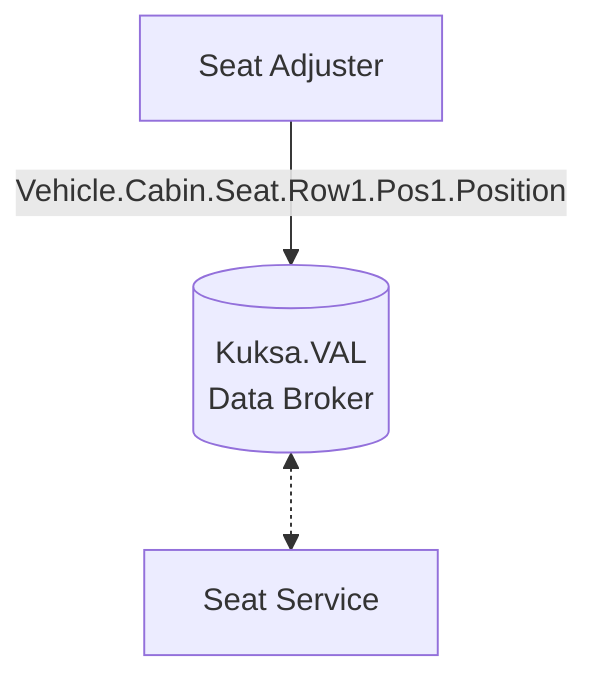
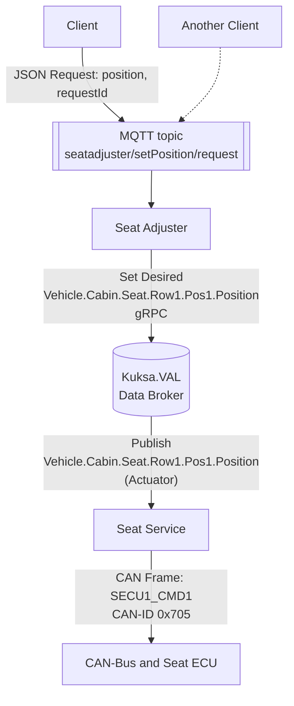
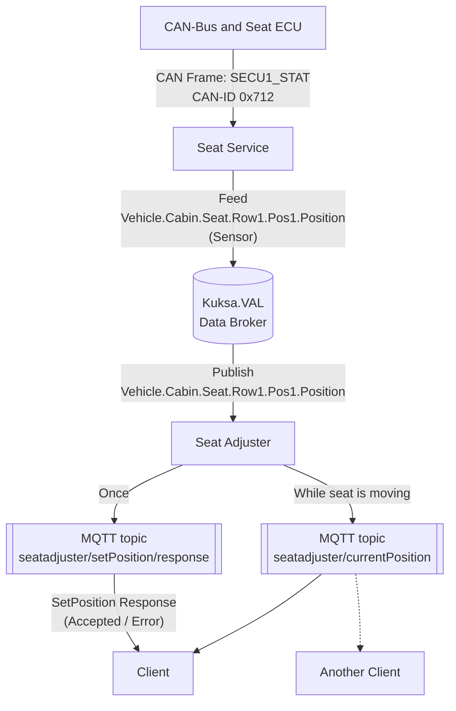

The **Seat Adjuster** use case has been derived from the [Eclipse Velocitas Seat Adjuster example](https://eclipse.dev/velocitas/docs/about/use_cases/seat_adjuster/),
the [Eclipse Kuksa.VAL Seat Service example](https://github.com/eclipse/kuksa.val.services/tree/main/seat_service)
and the [Digital.Playground Prototyping Library](https://digitalauto.netlify.app/model/997XF1ch2f5DjgPIzhY3/library/prototype/ZqhnonCBSSwP8ZVM7CFh)

## Description

The Seat Adjuster use cases demonstrates the idea of having a cloud-based driver profile hosted by a third-party web service,
which is then used by a custom application to move the driver seat to certain positions.

Examples range from simple personalization to dynamic seat control (such as periodic back massages) based on personal health treatment plans by an health insurance organization.
A driver could opt-in to such a service, which would lead to the ad-hoc installation of a seat adjuster vehicle application when the driver enters the vehicle.
The seat adjuster application would then contact the health insurance webservice to retrieve the driver's personal treatment plan for back massage and
start moving the motors in certain intervals, to ease or prevent back pain during long driving periods.

This example focuses on the technical aspect, namely the interface between such an assumed application with the high-level logic,
and the lower-level backend service (Seat Service), which controls the communication to the underlying hardware (Seat ECU).
In this case, the Vehicle Signal Specification and the simple signal for seat position is used exemplarily.

## Architecture Overview


- Cloud or mobile trigger: not part of the Leda image, but can be simulated by issueing MQTT messages
- Eclipse Velocitas - Vehicle Application: **Seat Adjuster** (to be deployed by user as part of the Velocitas tutorial)
- Eclipse Kuksa.VAL - Example Service: **Seat Service** (pre-installed)
- Eclipse Kuksa.VAL - **Data Broker** (pre-installed)
- Seat ECU and the separate Seat Motor hardware: not part of the Leda image, but can be emulated using virtual CAN-Bus.
The Kuksa Seat Service container contains configuration options to use VCAN

## Data Flow

In the high-level data flow, the northbound applications interact with the *Vehicle Abstraction Layer* via the data broker:



### Detailed: Setting position

In this tutorial, let's have a more detailed look into the involved interfaces in the data flow for setting a *desired seat position*.

The **Client** can be a local app, e.g. deployed in the Infotainment domain and provide a user interface to the driver. It could also be a remotely deployed cloud application, sending the same request to move the seat via cloud messageing infrastructure.



The **Data Broker** and its use of the *Vehicle Signal Specification* represents the abstraction layer, to make the application's interface independent of the actual physical seat service.

The **Seat Service** uses the physical layer (e.g. CAN-Bus) to communicate with the vehicle actuators.

### Responses and current position

In this data flow diagram, it shows how the information about the processing of the request to set the desired position is handled, as well as continuous updates to inform clients about the current position while the seat is moving towards the desired position.



### Safety Considerations

> **Attention:** Safety considerations are not in scope for this example tutorial. This example is for demonstrating the general approach.
Actual safety requirements must be handled within the Seat ECU as the lowest level component to guard against non-safe use of the seat motors.
Non-ASIL domains are not certified for safety requirements. **Please pay attention when following the physical CAN tutorial and attaching physical actuators to not harm anybody by accidental movements of seat motors.**

However, the Seat Adjuster example application contains a rudimentary "Safe State" condition check: it will only allow to move the seat
when the vehicle is not moving.

The condition is using VSS path notation: `Vehicle.Speed == 0` (see [main.py#L82 in v0.9.0](https://github.com/eclipse-velocitas/vehicle-app-python-sdk/blob/v0.9.0/examples/seat-adjuster/src/main.py#L82))

> Note: The Kuksa.VAL CAN Feeder, which is deployed *by default on Eclipse Leda* is constantly updating the [`Vehicle.Speed`](/leda/docs/vss/vehicle/driver/).
You need to disable the `feedercan` container, otherwise the Seat Adjuster application *will decline the request and not move the seat*.

## Getting started

The following steps are based on Velocitas 0.9.0 and Leda 0.1.0:

1. Follow the Velocitas [Seat Adjuster tutorial](https://eclipse.dev/velocitas/docs/about/use_cases/seat_adjuster/): fork, build and deploy your clone of the [seat adjuster example (v0.9.0)](https://github.com/eclipse-velocitas/vehicle-app-python-sdk/tree/v0.9.0/examples/seat-adjuster)
2. Download and run the Leda quickstart image, or run it in Docker:

    ```bash
    docker run -it ghcr.io/eclipse-leda/leda-distro/leda-quickstart-x86
    ```

4. Deploy your seat adjuster application to the container runtime
    
    3.1 Manually by using `kanto-cm`:

    ```bash
    kanto-cm create \
        --name seatadjuster-app \
        --e="SDV_SEATSERVICE_ADDRESS=grpc://seatservice-example:50051" \
        --e="SDV_MQTT_ADDRESS=mqtt://mosquitto:1883" \
        --e="SDV_VEHICLEDATABROKER_ADDRESS=grpc://databroker:55555" \
        --e="SDV_MIDDLEWARE_TYPE=native" \
        --hosts="databroker:container_databroker-host, mosquitto:host_ip, seatservice-example:container_seatservice-example-host" \
        ghcr.io/<YOUR_ORG>/seat-adjuster-app:latest

    kanto-cm start --name seatadjuster-app

    kanto-cm logs --name seatadjuster-app
    ```

    or

    3.2 Provide a deployment descriptor in `/var/containers/manifests`.
    An example deployment descriptor can be found in [meta-leda-components](https://github.com/eclipse-leda/meta-leda/blob/main/meta-leda-components/recipes-sdv/eclipse-leda/kanto-containers/example/seatadjuster-app.json.disabled). Details on the deployment can be found in [Leda Vehicle Applications](/leda/docs/app-deployment/velocitas/)

    ```bash
    systemctl restart kanto-auto-deployer
    ```

5. Ensure the databroker and the seat service containers are running and you know how to check their log files (kantui, kanto-cm)

    ```bash
    kanto-cm logs --name seatservice-example
    ```

6. Subscribe to MQTT topics `seatadjuster/#' to see the responses from the seat adjuster app:

    ```bash
    mosquitto_sub -t 'seatadjuster/#' -v
    ```

7. Disable the `feedercan` container: `kanto-cm stop -n feedercan` to stop updating the [`Vehicle.Speed`](/leda/docs/vss/vehicle/driver/) signal. If the feedercan container is not stopped, the seatadjuster-app will respond with the following error message:

    ```json
    seatadjuster/setPosition/response
    {"requestId": "12345", "result": {"status": 1, "message": "Not allowed to move seat because vehicle speed is 9.0 and not 0"}}
    ```

8. Publish an MQTT message for the seat adjuster application to set the maximum position to `1000` (which is the equivalent to 100%):

    ```bash
    mosquitto_pub -t seatadjuster/setPosition/request -m '{"position": 1000, "requestId": "12345"}'
    ```

9. The expected output responses on MQTT topics should look like this:

    ```text
    seatadjuster/setPosition/request {"position": 1000, "requestId": "12345"}
    seatadjuster/setPosition/response {"requestId": "12345", "result": {"status": 0, "message": "Set Seat position to: 1000"}}
    seatadjuster/currentPosition {"position": 00}
    seatadjuster/currentPosition {"position": 10}
    seatadjuster/currentPosition {"position": 20}
    seatadjuster/currentPosition {"position": 30}
    seatadjuster/currentPosition {"position": 40}
    seatadjuster/currentPosition {"position": 50}
    ...
    ```

## Seat Adjuster

The Seat Adjuster application needs to be reconfigured, as Velocitas SDK by default uses the DAPR middleware.
On Eclipse Leda, there is no DAPR middleware installed by default and hence, the Velocitas application will use the *Native* middleware type.

Also, the hostnames of dependent services need to be configured according to the actual network setup in Eclipse Leda's container runtime:

```text
SDV_SEATSERVICE_ADDRESS=grpc://seatservice-example:50051
SDV_MQTT_ADDRESS=mqtt://mosquitto:1883
SDV_VEHICLEDATABROKER_ADDRESS=grpc://databroker:55555
SDV_MIDDLEWARE_TYPE=native
```

Hostname configuration also needs to be updated accordingly:

```text
databroker:container_databroker-host
mosquitto:host_ip
seatservice-example:container_seatservice-example-host
```

### Prototyping

The pseudo-code for the Seat Adjuster application could look like the following excerpt from the [Digital.Playground example](https://digitalauto.netlify.app/model/997XF1ch2f5DjgPIzhY3/library/prototype/ZqhnonCBSSwP8ZVM7CFh/view/code):

```python
from sdv_model import Vehicle
vehicle = Vehicle()

on_user_profile_changed(Issuer):
    vehicle.Cabin.Seat.Row1.Pos1.Height.set(profile[Issuer]["VerticalHeight"])
    vehicle.Cabin.Seat.Row1.Pos1.Position.set(profile[Issuer]["HorizontalPosition"])
```

In the next step, this prototype can be taken to the next level of implementation by using the [Velocitas example](https://github.com/eclipse-velocitas/vehicle-app-python-sdk/blob/main/examples/seat-adjuster/src/main.py#L81) to express it like this, with possibly more logic:

```python
@subscribe_topic("seatadjuster/setPosition/request")
async def on_set_position_request_received(self, data_str: str) -> None:
  vehicle_speed = (await self.Vehicle.Speed.get()).value
  ...
  if vehicle_speed == 0:
    try:
        await self.Vehicle.Cabin.Seat.Row1.Pos1.Position.set(position)
        response_data["result"] = {
            "status": 0,
            "message": f"Set Seat position to: {position}",
        }
    except ValueError as error:
        response_data["result"] = {
            "status": 1,
            "message": f"Failed to set the position {position}, error: {error}",
        }
    except Exception:
        response_data["result"] = {
            "status": 1,
            "message": "Exception on set Seat position",
        }
  else:
    error_msg = f"""Not allowed to move seat because vehicle speed
        is {vehicle_speed} and not 0"""
    response_data["result"] = {"status": 1, "message": error_msg}

  await self.publish_event(response_topic, json.dumps(response_data))
```

## Seat Service

The Seat Service is a *Vehicle Service* example implementation.

It communicates with the physical vehicle layer, in this case either a virtual or physical CAN bus, to control the Seat ECU.

The example container is configured to use emulated CAN-Bus and deployed by default.

### Vehicle Signal

The VSS Path under control by Seat Service is [`Vehicle.Cabin.Seat.Row1.Pos1.Position`](/leda/docs/vss/vehicle/cabin/seat/row1/pos1/position/):

> *Signal Description:* Seat position on vehicle x-axis. Position is relative to the frontmost position supported by the seat. 0 = Frontmost position supported.

The value is the *distance measured in millimeters*.

The example implementation supports values between `0` and `1000` millimeters.

> *Note:* This range of valid values is not reflected in the standard Vehicle Signal Specification. OEMs would overlay the VSS tree with actual Min/Max values, depending on the specific seat hardware available in the specific vehicle model.

### Testing
    
Whether you are running the seatservice-example with a simulated CAN or a physical (emulated) CAN, the seatservice-example container included in the Leda Quickstart image provides a simple client application that can be used to test the GRPC interface.

To set the seat position to `x%`, take `x*10` and truncate it to an integer `<position>`. Then using the sdv-ctr-exec script issue the following command:

```shell
$ sdv-ctr-exec -n seatservice-example /app/bin/seat_svc_client <position>
```

You can now check the logs (either with `kanto-cm logs` or `kantui`) and you should be able to see the `seatservice-example` application responding to the command by moving the seat to the desired position.

### Virtual CAN-Bus

1. You will have to generate initial CAN frames that will emulate the car ECU responding to the service:

    ```shell
    $ cangen -v can0 -L 8 -I 712 -D r -n 5
    can0  712#4F.BF.B0.6B.5F.2D.54.09
    can0  712#13.2E.98.7E.77.11.99.5B
    can0  712#15.70.87.07.73.24.3A.7A
    can0  712#99.7F.F5.3F.FB.99.00.04
    can0  712#FE.1C.D5.55.22.86.3A.1F
    ```
2. You can now start tracing CAN frames written to the bus with `candump can0`

3. From now on when a request to change the seat position is issued you will be able to see the corresponding CAN frames in the trace.

_Note_: On QEMU you can tunnel the host CAN bus to the guest: [Tunneling a CAN Interface from the Host](../../general-usage/running-qemu/canbus/#enabling-can-bus-interfaces-can).

### Hardware CAN-Bus

The default configuration of the *Seat Service* is using simulated VCAN. If you want to switch to a physical CAN-Bus interface, the container needs to have access to the CAN-Bus hardware.

Such a CAN-Bus device might be a Raspberry Pi setup with an MCP251x-based CAN-Hat extension or a QEMU image with an emulated *kvaser_pci* device (enabled on the Leda QEMU Quickstart images by default).

This setup would require some adjustments to the container manifest in order for the container to have access to the physical CAN-Bus.

1. Make Seat Service container privileged and run on the host network interface:

    ```json
    "host_config": {
    ...
    "network_mode": "host",
    "privileged": true,
    ...
    }
    ```

2. Remove all port mappings and extra hosts (set `"extra_hosts": []` and `"port_mappings": []`) for the container as it's now running in host-networking mode (host_ip variable no longer available) and all ports are directly exposed.

3. Set the address to the databroker to `localhost:30555`: 

    ```json
        "config": {
        "env": [
           ...
            "BROKER_ADDR=127.0.0.1:30555",
           ...
        ],
        ...
        }
    ```

4. Reconfigure the seat controller application to use the physical CAN interface, please see Eclipse Kuksa.VAL [seat_controller/README.md](https://github.com/eclipse/kuksa.val.services/blob/main/seat_service/src/lib/seat_adjuster/seat_controller/README.md) for details:

    ```shell
    SC_CAN=can0
    CAN=can0
    ```

    All the necessary changes combined for clarity as a single diff can be found below:

    ```diff
    --- ../meta-leda-fork/meta-leda-components/recipes-sdv/eclipse-leda/kanto-containers/example_dev/seatservice.json	2023-03-06 11:32:00.771754434 +0200
    +++ seatservice-new.json	2023-03-06 11:37:12.967182044 +0200
    @@ -14,26 +14,16 @@
        "hooks": [],
        "host_config": {
            "devices": [],
    -        "network_mode": "bridge",
    -        "privileged": false,
    +        "network_mode": "host",
    +        "privileged": true,
            "restart_policy": {
                "maximum_retry_count": 0,
                "retry_timeout": 0,
                "type": "unless-stopped"
            },
            "runtime": "io.containerd.runc.v2",
    -        "extra_hosts": [
    -            "databroker-host:host_ip"
    -        ],
    -        "port_mappings": [
    -            {
    -              "protocol": "tcp",
    -              "container_port": 50051,
    -              "host_ip": "localhost",
    -              "host_port": 30051,
    -              "host_port_end": 30051
    -            }
    -        ],
    +        "extra_hosts": [],
    +        "port_mappings": [],
            "log_config": {
                "driver_config": {
                    "type": "json-file",
    @@ -58,9 +48,11 @@
        },
        "config": {
            "env": [
    -           "BROKER_ADDR=databroker-host:30555",
    -           "RUST_LOG=info",
    -           "vehicle_data_broker=info"
    +            "CAN=can0",
    +            "SC_CAN=can0",
    +            "BROKER_ADDR=127.0.0.1:30555",
    +            "RUST_LOG=info",
    +            "vehicle_data_broker=info"
            ],
            "cmd": []
        },
    ```

## References
- https://github.com/COVESA/vehicle_signal_specification/blob/master/spec/Cabin/SingleSeat.vspec
- https://github.com/eclipse/kuksa.val.services/tree/main/seat_service
- https://eclipse.dev/velocitas/docs/about/use_cases/seat_adjuster/
- https://github.com/eclipse-velocitas/vehicle-app-python-sdk/tree/v0.9.0/examples/seat-adjuster
- https://github.com/eclipse-leda/meta-leda/blob/main/meta-leda-components/recipes-sdv/eclipse-leda/kanto-containers/example/seatadjuster-app.json.disabled
- https://github.com/eclipse-leda/meta-leda/blob/main/meta-leda-components/recipes-sdv/eclipse-leda/kanto-containers/example/seatservice.json