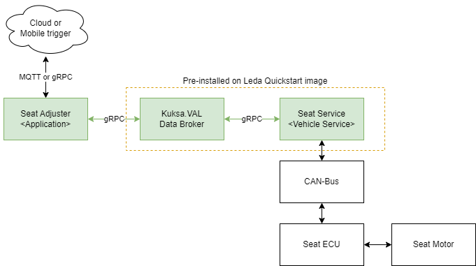

The **seat adjuster** is an example to showcase how to create a vehicle application which senses and actuates signals in the vehicle
for Eclipse Leda with help of Eclipse Velocitas and Eclipse Kuksa
. The aim is not to build the best available seat adjuster application possible but to show how one can use the applied technologies
to build a companion app for the interaction with a vehicle.
If you are new to the concepts around Eclipse SDV and the mentioned projects
we recommend to read the [SDV Tutorial](/leda/docs/general-usage/sdv-introduction/) first.

## Description

The idea of the seat adjuster application is to have a custom application to move the driver seat to positions defined
in a driver profile hosted by a third-party web service.

The setup contains the following components:

- Cloud or mobile trigger: not part of the Leda image, but we simulate it by issuing MQTT messages
- **Seat Adjuster** : Developed with Eclipse Velocitas to be deployed by user
- Eclipse Kuksa.val - **KUKSA Databroker** (pre-installed with Eclipse Leda)
- **Mock Service**: Example provider for Eclipse Kuksa.VAL which mocks the behavior of the vehicle.
- Seat ECU and the separate Seat Motor hardware can be emulated using a virtual CAN-Bus, which is beyond the scope of this guide.

In the following paragraphs, we next introduce the [architecture and the assumed data flow](architecture-seat-adjuster)
before we explain the [development](develop-seat-adjuster) and [deployment](deploy-seat-adjuster) steps.
If you are more interested in the general development steps, you may directly jump to the [develop seat adjuster](develop-seat-adjuster).
