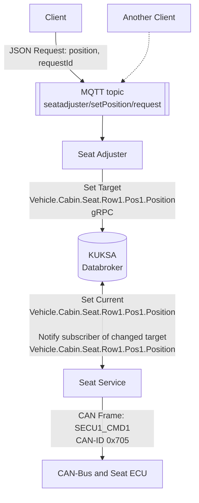
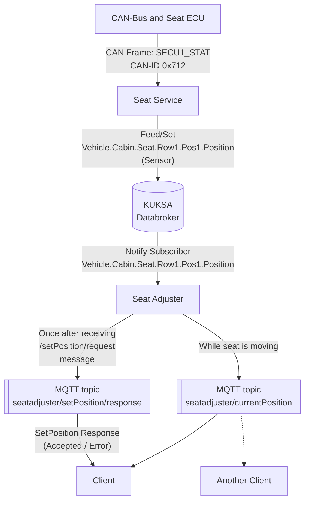

The seat adjuster application interacts with the vehicle through a *Vehicle Abstraction Layer* created by the KUKSA Databroker,
which uses the [Vehicle Signal Specification (VSS)](https://covesa.github.io/vehicle_signal_specification/)
to express the current value and in case of actuators also the desired state of the vehicle signal.
By developing against the abstraction layer, the application becomes independent from the actual physical seat.

To control the position of the driver seat, the seat adjuster sets the target value of the `Vehicle.Cabin.Seat.Row1.Pos1.Position` signal in the KUKSA Databroker.

In addition, we have the seat service that subscribes to this signal and is responsible for realizing this target state in the physical world
by interacting with the responsible ECUs, e.g., through CAN.
Once the seat has moved, the seat service updates the current value of the `Vehicle.Cabin.Seat.Row1.Pos1.Position` signal.
For our initial setup, the seat service emulates the hardware interaction and updates the current value based on the target value.
In the diagrams, we still include the communication over CAN to show the whole interaction from an actual vehicle.



As interface to the user, we assume a **client** that can, for example, be a local app in the infotainment domain with a user interface
or an off-board application sending the request from a backend.
Either way, the client controls our seat adjuster application through a JSON encoded message over MQTT using the topic `setPosition/request`.

An example request looks like this:

```bash
mosquitto_pub -t seatadjuster/setPosition/request 
    -m '{"position": 1000, "requestId": "12345"}'
```

The position parameter can be any value between 0 and 1000.

### Getting Seat Position

When the seat moves, the seat service gets this information, for example, from the seat ECU over the CAN-bus.
For each update the seat service sets the current value for the `Vehicle.Cabin.Seat.Row1.Pos1.Position` signal in the KUKSA Databroker.

To receive the changes to the seat position, the seat adjuster application already subscribed to the current value of the signals and thus gets notified.
As a result, the seat adjuster constructs a JSON message and sends the new seat position to the MQTT-topic `seatadjuster/currentPosition`
where any client can consume it.

The seat adjuster also sends responses to each request received at the MQTT-topic `seatadjuster/request` with a message to the MQTT-topic `seatadjuster/response`
indicating whether it accepted the incoming request and set the target value or whether there was an error like the vehicle currently moving.



The next step is to [develop the seat adjuster with the help of Eclipse Velocitas](../develop-seat-adjuster).
