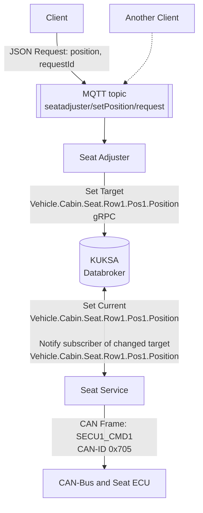

Within the seat adjuster guide, we so far mocked the behavior of the actual vehicle.
In the following, we give an overview of how to create a virtual CAN-bus and interact with it to send CAN-frames for moving a seat.

Instead of the `mock service` you use the `seat service` as a provider, which is another pre-installed container
acting as the connection between the KUKSA Databroker and the underlying hardware.
More specifically, it subscribes to the target value of the `Vehicle.Cabin.Seat.Row1.Pos1.Position` signal,
can send CAN-frames, and updates the current value of the signal in small steps until it is equal to the target value.
For more details, visit the [Kuksa.val.services](https://github.com/eclipse/kuksa.val.services/tree/main/seat_service) repository,
which hosts the code for the `seat service`.

With a new installation of Eclipse Leda, the `seat adjuster` comes by default.
If you performed the steps from the [deploy the seat adjuster in Eclipse Leda](../deploy-seat-adjuster) guide,
you need to re-add the `seatadjuster` container manifest and remove the `mockservice`.
More details on how to do this are available in that guide.

The setup then looks as follows:



## Virtual CAN-Bus

To set upa virtual CAN-Bus

1. You will have to generate initial CAN frames that will emulate the car ECU responding to the service:

    ```shell
    $ cangen -v can0 -L 8 -I 712 -D r -n 5
    can0  712#4F.BF.B0.6B.5F.2D.54.09
    can0  712#13.2E.98.7E.77.11.99.5B
    can0  712#15.70.87.07.73.24.3A.7A
    can0  712#99.7F.F5.3F.FB.99.00.04
    can0  712#FE.1C.D5.55.22.86.3A.1F
    ```

2. You can now start tracing CAN frames written to the bus with `candump can0`

3. From now on when a request to change the seat position is issued you will be able to see the corresponding CAN frames in the trace.

_Note_: On QEMU you can tunnel the host CAN bus to the guest: [Tunneling a CAN Interface from the Host](/leda/docs/general-usage/running-qemu/canbus/#enabling-can-bus-interfaces-can).

## Hardware CAN-Bus

The default configuration of the **Seat Service** is using simulated VCAN. If you want to switch to a physical CAN-Bus interface,
the container needs to have access to the CAN-Bus hardware.

Such a CAN-Bus device might be a Raspberry Pi setup with an MCP251x-based CAN-Hat extension or a QEMU image with an emulated **kvaser_pci** device
(enabled on the Leda QEMU Quickstart images by default).

This setup would require some adjustments to the container manifest in order for the container to have access to the physical CAN-Bus.

1. Make Seat Service container privileged and run on the host network interface:

    ```json
    "host_config": {
    ...
    "network_mode": "host",
    "privileged": true,
    ...
    }
    ```

2. Remove all port mappings and extra hosts (set `"extra_hosts": []` and `"port_mappings": []`) for the container as it's now running in host-networking mode
(host_ip variable no longer available) and all ports are directly exposed.

3. Set the address to the databroker to `localhost:30555`:

    ```json
        "config": {
        "env": [
           ...
            "BROKER_ADDR=127.0.0.1:30555",
           ...
        ],
        ...
        }
    ```

4. Reconfigure the seat controller application to use the physical CAN interface,please see Eclipse Kuksa.VAL
[seat_controller/README.md](https://github.com/eclipse/kuksa.val.services/blob/main/seat_service/src/lib/seat_adjuster/seat_controller/README.md) for details:

    ```shell
    SC_CAN=can0
    CAN=can0
    ```

    All the necessary changes combined for clarity as a single diff can be found below:

    ```diff
    --- ../meta-leda-fork/meta-leda-components/recipes-sdv/eclipse-leda/kanto-containers/example_dev/seatservice.json	2023-03-06 11:32:00.771754434 +0200
    +++ seatservice-new.json	2023-03-06 11:37:12.967182044 +0200
    @@ -14,26 +14,16 @@
        "hooks": [],
        "host_config": {
            "devices": [],
    -        "network_mode": "bridge",
    -        "privileged": false,
    +        "network_mode": "host",
    +        "privileged": true,
            "restart_policy": {
                "maximum_retry_count": 0,
                "retry_timeout": 0,
                "type": "unless-stopped"
            },
            "runtime": "io.containerd.runc.v2",
    -        "extra_hosts": [
    -            "databroker-host:host_ip"
    -        ],
    -        "port_mappings": [
    -            {
    -              "protocol": "tcp",
    -              "container_port": 50051,
    -              "host_ip": "localhost",
    -              "host_port": 30051,
    -              "host_port_end": 30051
    -            }
    -        ],
    +        "extra_hosts": [],
    +        "port_mappings": [],
            "log_config": {
                "driver_config": {
                    "type": "json-file",
    @@ -58,9 +48,11 @@
        },
        "config": {
            "env": [
    -           "BROKER_ADDR=databroker-host:30555",
    -           "RUST_LOG=info",
    -           "vehicle_data_broker=info"
    +            "CAN=can0",
    +            "SC_CAN=can0",
    +            "BROKER_ADDR=127.0.0.1:30555",
    +            "RUST_LOG=info",
    +            "vehicle_data_broker=info"
            ],
            "cmd": []
        },
    ```

### Safety Considerations

> **Attention:** Safety considerations are not in scope for this example tutorial. This example is for demonstrating the general approach.
Actual safety requirements must be handled within the Seat ECU as the lowest level component to guard against non-safe use of the seat motors.
Non-ASIL domains are not certified for safety requirements. **Please pay attention when following the physical CAN tutorial and attaching physical actuators to
not harm anybody by accidental movements of seat motors or any other actuator.**

However, the Seat Adjuster example application contains a rudimentary "Safe State" condition check: it will only allow to move the seat
when the vehicle is not moving.

The condition is using VSS path notation: `Vehicle.Speed == 0` (see [main.py#L82 in v0.9.0](https://github.com/eclipse-velocitas/vehicle-app-python-sdk/blob/v0.9.0/examples/seat-adjuster/src/main.py#L82))

> Note: The Kuksa.VAL CAN Feeder, which is deployed *by default on Eclipse Leda* is constantly updating the [`Vehicle.Speed`](/leda/docs/vss/vehicle/speed/)
You need to disable the `feedercan` container (see step 7 of Getting started), otherwise the Seat Adjuster application
*will decline the request and not move the seat*.
