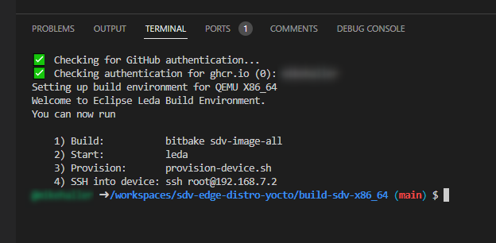

Running BitBake to build your own images requires some extra setup on the build machine. Please see the following chapters for more information about the build process itself and how to setup a development and build infrastructure.

If you are interested to contribute or to get in touch with us, please see our [Community](/leda/docs/project-info/community/) pages and [Contribution Guidelines](/leda/docs/project-info/contribution-guidelines/).
For reporting security vulnerabilities, please follow our [Security Policy](/leda/docs/project-info/security/).
