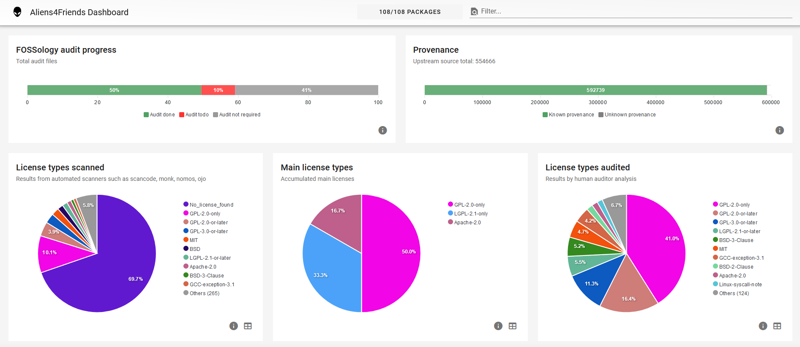

The Eclipse Leda distro is being scanned, audited and reviewed for OSS license and IP compliance.

The current state of this progress is shown in this documentation.

Our friends from the [Eclipse Oniro](https://gitlab.eclipse.org/eclipse/oniro-compliancetoolchain/third-party/mirrors/leda/-/pipelines) project
have been so kind to set up a build and scan for Eclipse Leda as well.
We're currently reusing that infrastructure, until we can either merge the
build infrastructure or set it up on our own, depending on how things continue.

## Tooling

The tools being used:

- [TinfoilHat and AliensRC Creator](https://gitlab.eclipse.org/eclipse/oniro-compliancetoolchain/toolchain/tinfoilhat)
- [Aliens4Friends](https://gitlab.eclipse.org/eclipse/oniro-compliancetoolchain/toolchain/aliens4friends)
- [Scancode](https://github.com/nexB/scancode-toolkit)
- [Fossology](https://github.com/fossology/)
- [Aliens4Friends Dashboard](https://github.com/noi-techpark/solda-aliens4friends-dashboard) by NOI Techpark

The scan tools environment are available in [`leda-distro/resources/oss-compliance`](https://github.com/eclipse-leda/leda-distro/tree/main/resources/oss-compliance)

There are additional BitBake / kas configurations, which need to be used for the build before the OSS compliance toolchain can be used with the build directory:

- [leda-distro/kas/oss-compliance/tinfoilhat.yaml](https://github.com/eclipse-leda/leda-distro/blob/main/kas/oss-compliance/tinfoilhat.yaml)

## Current Status



## Evaluation

- The scanned licenses report contains all potentially used license types. For each finding, a human audit is required for deciding which license is actually being in use.
- Numbers: 41% percent don't need human audit, 50% has been manually audited and cleared, 10% work is left to do

| Package | Status | Expected License Result | Risk | Task |
| --- | --- | --- | --- | --- |
| containerd | Audit Open | Apache-2.0, BSD | Green | |
| elfutils | Audit Open | GPL-3.0 | Red | Remove/Replace: Why is it installed? |
| expat | Audit Open | MIT | Green | |
| gcc | Audit Open | GPL-3.0 | Red | Remove: No need for gcc on Leda image |
| libgcc | Audit Open | GPL-3.0 | Red | Remove: No need for gcc on Leda image |
| json-glib | Done | Partly GPL-3.0 | Yellow | Check which parts are GPL-3.0 |
| libffi | Audit Open | Partly GPL-3.0 | Yellow | Needed? Check which parts are GPL-3.0 |
| libidn2 | Done | Partly GPL-3.0 | Yellow | Needed? Check which parts are GPL-3.0 |
| libunistring | Done | Partly GPL-3.0 | Yellow | Needed? Check which parts are GPL-3.0 |
| libxcrypt | Audit Open | Mixed | Red | Check licenses, Needed? |
| linux-firmware-rpidistro | Done | Mixed | Red | Check licenses |
| onig | Audit Open | BSD-2 | Red | Check licenses, Needed? |
| popt | Audit Open | FSF, Mixed | Red | Check licenses, Needed? |
| rauc | Audit Open | Apache-2.0 | Green | |
| runc-opencontainers | Done | BSD-3 | Green | |
| sudo | Audit Open | BSD-3 | Green | |
| zstd | Done | Partly GPL-3.0 | Yellow | Needed? Check which parts are GPL-3.0 |
| kanto-auto-deployer | Audit Open | Apache-2.0, EPL-2.0 | Green | |
| linux-raspberrypi | Done | GPL-2.0 + 50 others | Green | Check other licenses |

> *Note: excerpt, current work in progress*

## Yocto Configuration

Our distro configuration and the image definitions use the following license-compliance related settings:

Image-based configuration:

```shell
INCOMPATIBLE_LICENSE = "GPL-3.0* LGPL-3.0* AGPL-3.0*"
```

See [meta-leda-distro/recipes-sdv-distro/images/sdv-image-all.bb](https://github.com/eclipse-leda/meta-leda/blob/4b303ceb370887a530ebf313f26dd23be47872d7/meta-leda-distro/recipes-sdv-distro/images/sdv-image-all.bb#L80)

Global configuration:
```shell
INHERIT += "archiver"
ARCHIVER_MODE[src] = "patched"

COPYLEFT_LICENSE_INCLUDE = 'GPL* LGPL*'
COPYLEFT_LICENSE_EXCLUDE = 'CLOSED Proprietary MIT BSD'
COPYLEFT_RECIPE_TYPES = "target"
ARCHIVER_MODE[mirror] = "combined"

# Some licenses require the license text to accompany the binary. You can achieve this by adding the following:
COPY_LIC_MANIFEST = "1"
COPY_LIC_DIRS = "1"
LICENSE_CREATE_PACKAGE = "1"

# Vulnerability Scanning
INHERIT += "cve-check"
```

See [meta-leda-distro/conf/distro/include/leda-oss-compliance.inc](https://github.com/eclipse-leda/meta-leda/blob/4b303ceb370887a530ebf313f26dd23be47872d7/meta-leda-distro/conf/distro/include/leda-oss-compliance.inc#L20)
