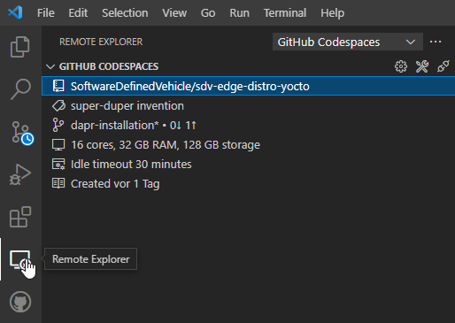

# Setting up Development Environment in GitHub Codespaces

## Install the GitHub Codespaces Extension

*Note:* When using our DevContainer, the *GitHub Codespaces* extension is pre-installed.

- Start VSCode
- Go to *Extensions*
- Search for "GitHub Codespaces"
- Click *Install*

Alternatively, create a new codespace via the GitHub web interface:


Select a big enough machine type for Yocto/BitBake, e.g. 16 CPU. You need at leasst 50GB disk space.



## Private Repositories

When using GitHub Codespaces with submodules and private repositories,
a separate tool for git authentication is required (see [VSCode issue #109050](https://github.com/microsoft/vscode/issues/109050)), as the authentication token provided to the GitHub Codespaces virtual machine only allows access to the main repository.

Git Credential Manager:
https://aka.ms/gcm

Installation:
```
curl -LO https://raw.githubusercontent.com/GitCredentialManager/git-credential-manager/main/src/linux/Packaging.Linux/install-from-source.sh &&
sh ./install-from-source.sh &&
git-credential-manager-core configure
```
