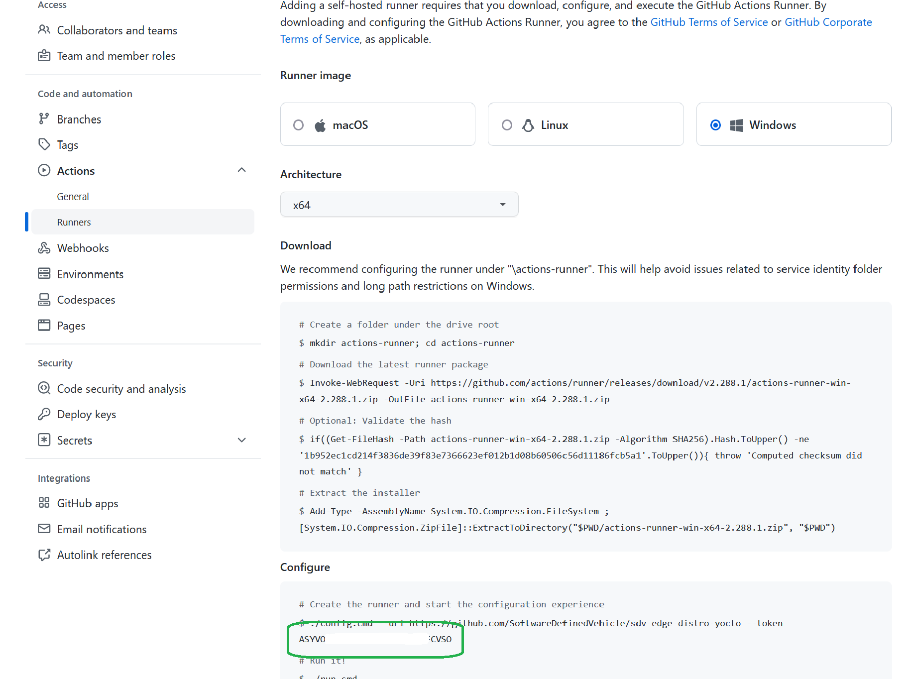

# Create a new GitHub Runner for this repo

Start with creating a new azure VM:
- Ubuntu Server Latest, currently 20.04
- Size Standard D16ds v5 
- The admin user should be called "runner"

Once the VM is ready:
1. Stop the VM
2. Go to "Disk" and resize the OS disk to 512 GB
3. Start the VM again

# Run the script to setup the runner

Log on to the VM as runner. Either copy the `scripts/PrepVMasGHRunner.sh` onto the VM or create a new script:
```bash
nano prep.sh
```

Copy the content of the PrepVMasGHRunner.sh from this repo into the new file, save it and make it executable:
```bash
chmod 755 prep.sh
```

Call it with the token and the next available nummer, see below how to get this items:
```bash
./prep.sh "ASYVOMU........DTCFCMBA" 3
```

In the Azure portal go the VM, go to the "network" section and delete the rule opening port 22.
Congratulation, you are done!

# How to get the token and the number to call the script

In the repo, go to "Settings" -> "Actions". You see the currently provisioned runners:


Pick the next number and pass it to the script.

To get the token press the green button in the above screenshot. The token is in the command:



