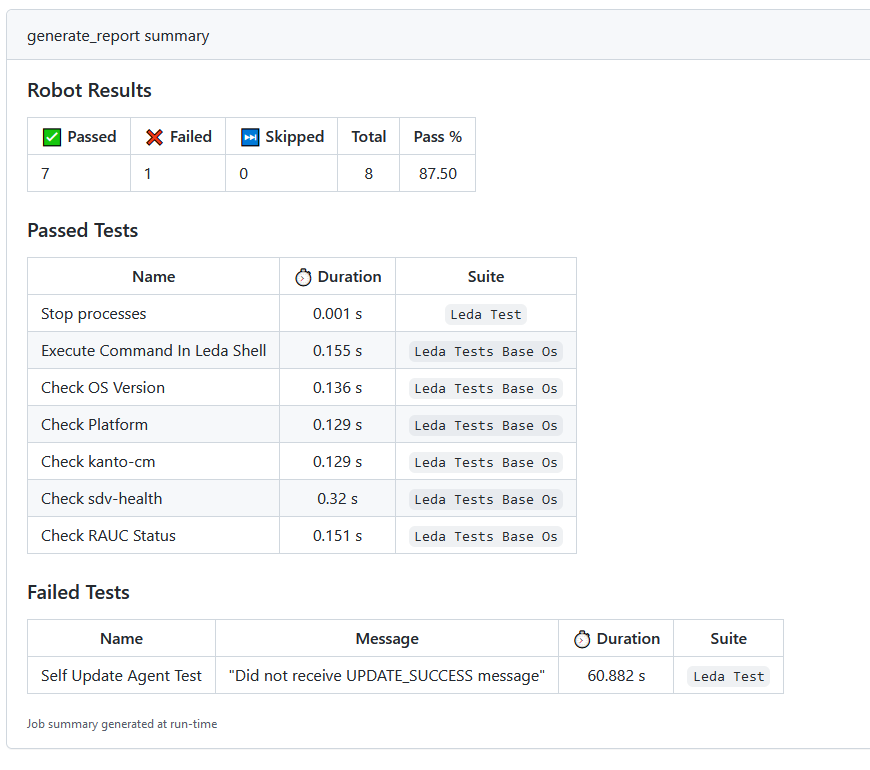

Eclipse Leda is using the [Robot Framework](https://robotframework.org/) for black box tests and system tests.

The black box tests are supposed to only use _public_ API from SDV components, for example the MQTT interface of the Self Update Agent.
The system tests are supposed to test on Leda Distro level and can use shell and SSH commands to verify system behavior, e.g. performing a reboot.

1. Test Execution: an external trigger, such as the `./test-docker.sh` shell script, starts the `leda-tests` container.
2. Docker Compose ensures that the needed containers are built and started.
    The test cases and test resources are copied into the leda-tests container at build time.
3. The Robot process is started and performs the execution of all test cases
4. Black box test cases use the MQTT interface to connect to the test target and publish messages
5. System level test cases use SSH to connect to the test target and execute commands
6. Test reports are written to a mounted volume, so that they are available on the host for further processing

### Run the tests

The easiest way to run the test cases is to run it in the Docker Compose setup:

1. Clone the [leda-distro](https://github.com/eclipse-leda/leda-distro) repository:

        git clone https://github.com/eclipse-leda/leda-distro

2. _Optional:_ Build both images (qemuarm64 and qemux86-64) using kas / BitBake. If you omit this step, docker compose will download the latest container images from the Eclipse Leda Container Registry on ghcr.io.

        kas build kas/leda-qemux86-64.yml
        kas build kas/leda-qemuarm64.yml

3. Switch to the docker-snapshot directory:

        cd resources/docker-snapshot/

4. Run the Leda Tests

        ./test-docker.sh

### Test Reports

The output of `test-docker.sh` will show the test results from Robot.

The test reports and debug logs are available on the host's filesystem in the path `resources/docker-snapshot/leda-tests-reports`

- `output.xml` - The main Robot output report
- `report.html` - A Robot HTML summary report
- `leda-tests-xunit.xml` - A xUnit report file suitable for rendering with various tools
- `log.html` - A Robot HTML report with the test execution log
- `leda-tests-debug.log` - Debug log file of the test execution, helpful during implementation of test cases and troubleshooting of failed tests

The xunit report is being used to visualize the test execution results in the GitHub Workflow:

Example Test Report:

### Adding new tests

The tests are located in the following locations of the [leda-distro](https://github.com/eclipse-leda/leda-distro) repository:

- `resources/docker-snapshot/dockerfiles/leda-tests` - Robot Tests which are executed inside of a Docker Compose setup
- `tests/src/robot` - Robot Tests which can be executed on the build host with a Leda Runqemu instance running

General steps are:

1. Decide whether to implement a system-level test or a black-box integration test
2. Add the test case to an existing, matching `.robot` file. If no matching test suite can be found, create a new `.robot` file. Prefix with the order number, e.g. `33__my-new-test.robot`
3. Check if a refactoring of new keywords may be worthwhile for better reusability.
