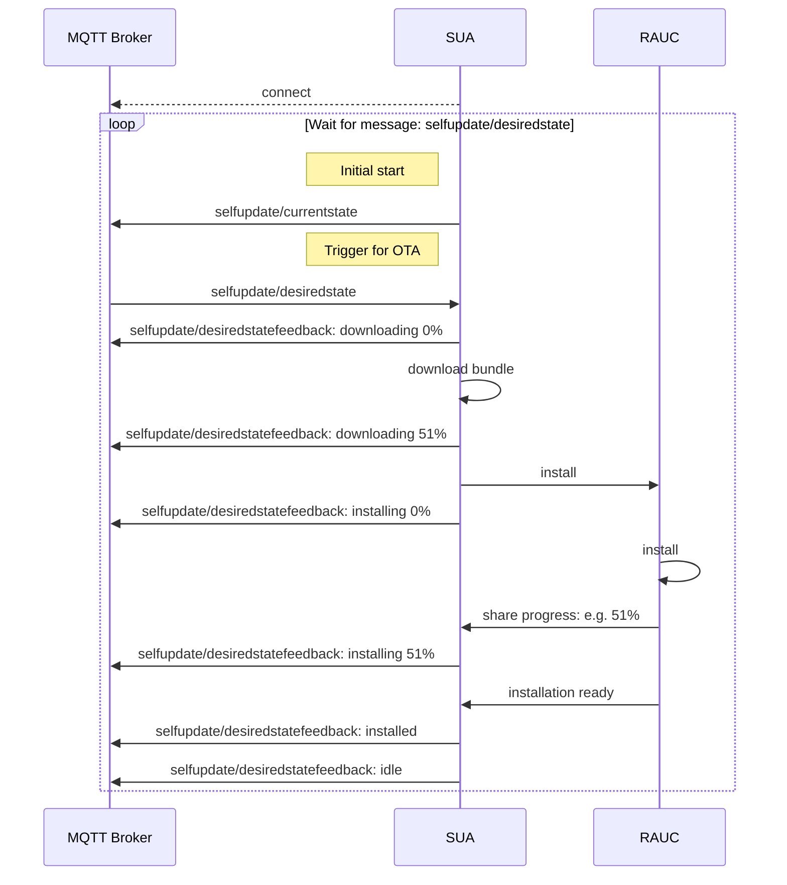

The self update agent (SUA) is a component responsible for the OS Update process.  SUA is communicating on MQTT interface via usage of defined messages. Internally, SUA uses [RAUC](https://rauc.io/) to perform the update. 

Following sequence diagram shows the happy path example of communication between components. 

## Process Overview



## MQTT Message Definitions

MQTT messages are specified as follows:

### selfupdate/desiredstate
| Topic | Direction | Description |
|-------|  -------- | ----------- |
| selfupdate/desiredstate | IN | This message triggers the update process. The payload shall contain all data necessary to obtain the update bundle and to install it. |
```
apiVersion: "sdv.eclipse.org/v1"
kind: SelfUpdateBundle
metadata:
  name: self-update-bundle-example
spec:
  bundleName: swdv-arm64-build42
  bundleVersion: v1beta3
  bundleDownloadUrl: https://example.com/repository/base/
  bundleTarget: base
```

### selfupdate/currentstate
| Topic| Direction | Description |
|------|  -------- | ----------- |
| selfupdate/currentstate | OUT | This message is being sent once, on SUA start. It contains information about currently installed OS version.
```
apiVersion: "sdv.eclipse.org/v1"
kind: SelfUpdateBundle
metadata:
  name: self-update-bundle-example
spec:
  bundleVersion: v1beta3
```

### selfupdate/desiredstatefeedback
| Topic| Direction | Description |
|------|  -------- | ----------- |
| selfupdate/desiredstatefeedback | OUT | This message is being sent by SUA to share current progress of triggered update process. This is the *OUT* counterpart of *selfupdate/desiredstate* input message. 
```
apiVersion: "sdv.eclipse.org/v1"
kind: SelfUpdateBundle
metadata:
  name: self-update-bundle-example
spec:
  bundleName: swdv-arm64-build42
  bundleVersion: v1beta3
  bundleDownloadUrl: https://example.com/repository/base/
  bundleTarget: base
state:
  name: "idle|installing|etc."
  progress: 0|51|99|etc., 
  techCode: 0|1|5|etc.,  
  message: "Cannot download from url|Bundle already installed|etc." 
```

#### state enum

State name field can have one of following values:

| State | Description | Additional payload data | 
|  ---------- |  ---------- | ---------- |
| uninitialized | When the SUA is not configured yet | - |
| idle |  Configured and waiting for messages | - |
| downloading | Downloading the bundle file  | progress |
| installing | Performing installation   | progress |
| installed |  Installation process was successful, new OS version is installed on inactive disc Slot. <br>**Important: to finish the OTA process, reboot is required, and it shall be performed by another component, such as the Vehicle Update Manager.** |  - |
| failed | Error occurred  | techCode |

#### techCode values
techCode field is providing additional details to the state value. It is especially useful for the **failed** state, as it can specify the reason of failure. 

| Value | Description |
|  ---- |  ---------- | 
| 0 | OK, no error|
| 1001 |  Download failed |
| 2001 |  Invalid Bundle|
| 3001 |  Installation failed |
| 4001 |  Update rejected, bundle version same as current OS version |
| 5001 |  Unknown Error |

