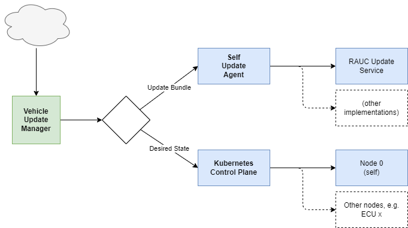

The *Vehicle Update Manager* delegates two different types of updates:
1. The *Desired State* on the Kubernetes layer
2. The *Self Update* on operating system layer

# Desired State

The *Desired State* is applied at runtime on the Kubernetes cluster layer.

This type of update mechanism can update vehicle applications, vehicle services and other containers together with configuration resources or data files at runtime. If the applications support it, the rollout can also use high-availability strategies, such as rolling deployments.

# Self Update

The *Self Update* is applied on reboot of the device only.

This type of update mechanism is used for system-level updates which require the operating system to be rebooted to take effect.

