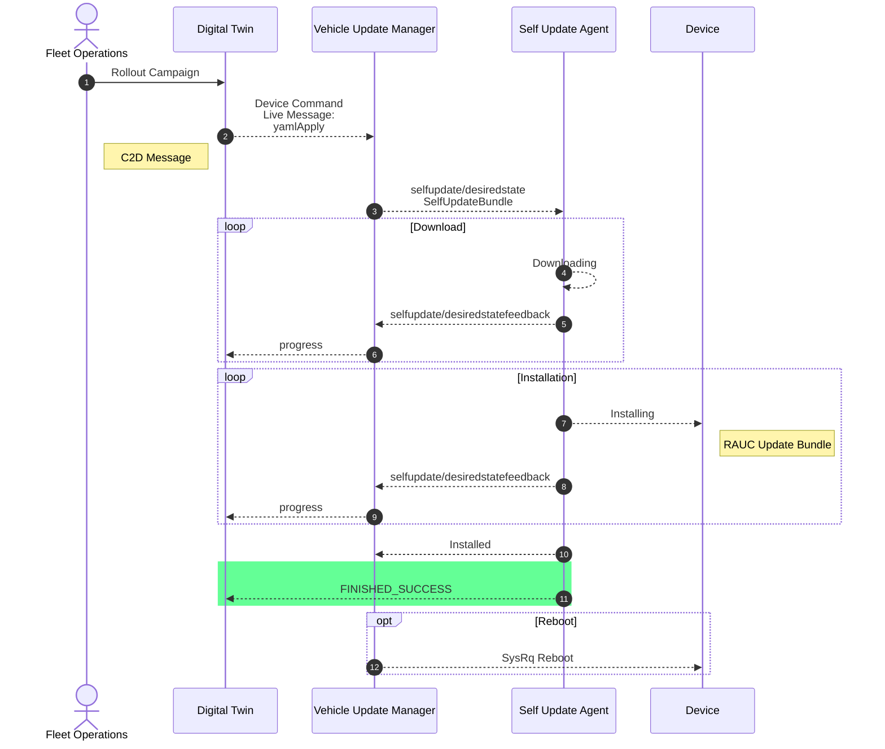

The following message flow is an example for the *Self Update* use case.
The message is triggered by command line via Azure IoT Hub.




# Messages

The following describes the message flow with example messages in more detail. The following variables are used for dynamic parts of the messages:
- `<cuid>` - A Correlation ID in form of a UUID
- `<selfUpdateRequestYaml>` or `<payload>`- The Desired State Self Update Request message in YAML, as defined by the Self Update Agent API
- `<hub>` - The name or identifier of the message hub
- `<device>` - The device identifier used by the message hub or other components to identify the device.

1. Cloud backend sends the Self-Update Request Message as YAML embedded into an Azure IoT Hub C2D Message Envelope:

    Payload:
    ```
    {
        "appId": "mc-ota-update",
        "cmdName": "desiredstate.update",
        "cId": "<cuid>",
        "eVer": "2.0",
        "pVer": "1.0",
        "p": <selfUpdateRequestYaml>
    }
    ```

2. Cloud Connector validates envelope and transforms request message into a *ContainerOrechestrator* message:

   Topic: `command//azure.edge:<hub>:<device>:edge:containers/req/<cuid>/yamlApply`

   Body (json):
   ```
    {
     "topic": "azure.edge/<hub>:<device>:edge:containers/things/live/messages/yamlApply",
     "headers": {
        "content-type": "application/json",
        "correlation-id": "<cuid>"},
        "path": "/features/ContainerOrchestrator/inbox/messages/yamlApply",
        "value": {
            "correlationId": "<cuid>",
            "payload": "<payload>"
            }
        }
    }
    ```

   *Note: Payload (Yaml encoded in JSON) omitted here for clarity, see next step.*

3) Vehicle Update manager extracts payload and forward the message to the Self Update Agent message inbox:

    Topic: `selfupdate/desiredstate`

    Message:
    ```
    apiVersion: sdv.eclipse.org/v1
    kind: SelfUpdateBundle
    metadata:
        name: self-update-bundle-example
    spec:
        bundleDownloadUrl: http://leda-bundle-server/sdv-rauc-bundle-qemux86-64.raucb
        bundleName: swdv-arm64-build42
        bundleTarget: base
        bundleVersion: v1beta3
    ```
4. The Self Update Agent response with status messages during download and installation phases.

    Topic: `selfupdate/desiredstatefeedback`

    Message:
    ```
    apiVersion: sdv.eclipse.org/v1
    kind: SelfUpdateBundle
    metadata: 
      name: "self-update-bundle-example"
    spec: 
      bundleDownloadUrl: "http://leda-bundle-server/sdv-rauc-bundle-qemux86-64.raucb"
      bundleName: "swdv-arm64-build42"
      bundleTarget: base
      bundleVersion: v1beta3
    state: 
      message: Entered Downloading state
      name: downloading
      progress: 0
      techCode: 0
    ```
5. Once finished, the Vehicle Update Manager will also return a `FINISHED_SUCCESS` message for the conversation with the backend.

    Topic: `e/defaultTenant/azure.edge:<hub>:<device>:edge:containers`

    Message: 
    ```
    {
      "topic": "azure.edge/<hub>:<device>:edge:containers/things/twin/commands/modify",
      "headers": {
        "response-required":false
      },
      "path": "/features/ContainerOrchestrator/properties/status/state",
      "value": {
        "manifest": [],
        "status": "FINISHED_SUCCESS",
        "correlationId":"<cuid>"
        }
    }
    ```
