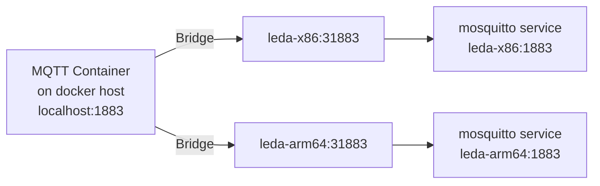

By using the dockerized Leda quickstart images, the SDV vehicle edge components can be evaluated on emulated X86-64 and ARM64 system images,
without having to install QEMU and dependencies manually.


If you want to execute the image without Docker, please see [Running on QEMU](../running-qemu/).
This allows to tweak the startup script, modify the emulated hardware device and set up advanced network configurations.

There are two options to run Leda:

- Docker: Simple, restricted to one container
- Docker Compose: Advanced, allows networking between containers

## Recommendations

- A **Linux host** with 4 vCPUs, 8GB of RAM and SSD storage is recommended
- Docker

## Docker

The easiest way is to run a single instance of Leda in a Docker container:

- Run the Leda Docker quickstart image:

  ```shell
  docker run -it ghcr.io/eclipse-leda/leda-distro/leda-quickstart-x86
  ```

- Login with `root`

- Stop the Docker container

  ```shell
  shutdown now
  ```

  > Note: If you need to stop the container from outside, use the `docker stop <id>` command from a separate terminal.

### Privileged Containers

When run as a privileged container, QEMU will try to set up a TAP network and use KVM acceleration.
Network and CPU will be faster, depending on the host system.

To be able to use these host devices, QEMU needs access to the following devices:

- `/dev/kvm`
- `/dev/net/tun`

Example command:

```shell
docker run -it --privileged --device=/dev/kvm:/dev/kvm --device=/dev/net/tun:/dev/net/tun ghcr.io/eclipse-leda/leda-distro/leda-quickstart-x86
```

### Exposing additional ports

To also expose ports to connect to ssh, mqtt or the Kuksa databroker, add the port mappings to the Docker command:

```shell
docker run -it --privileged -p 2222:2222 -p 1883:1883 -p 30555:30555 ghcr.io/eclipse-leda/leda-distro/leda-quickstart-x86:latest
```

The following ports are specifically of interest and exposed by the docker container:

- `2222` for SSH (mapped internally to `22`)
- `1880` - free slot reserved for user service
- `1883` for MQTT
- `8888` - free slot reserved for user service
- `30555` for Kuksa Databroker

> Note: In unprivileged mode, only these ports are mapped by the Docker container and forwarded to the Leda system.
  In privileged mode, all TCP ports can be exposed, which will then be forwarded from the Docker container into the Leda system.
  See the
  [entrypoint script](https://github.com/eclipse-leda/leda-distro/blob/main/resources/docker-snapshot/dockerfiles/leda-quickstart-docker-entrypoint-x86.sh)
  for details.

### Running ARM-64 version

To run the ARM-64 bit version of the image, use the `leda-quickstart-arm64` container image:

```shell
docker run -it ghcr.io/eclipse-leda/leda-distro/leda-quickstart-arm64:latest
```

## Docker Compose

A more convenient way to setup advanced scenarios is to use Docker Compose.
There is a Docker Compose configuration for an Eclipse Leda setup in [resources/docker-compose](https://github.com/eclipse-leda/leda-distro/tree/main/resources/docker-compose).

It will start up the following containers:

- Leda Quickstart image (QEMU x86-64)
- Leda Quickstart image (QEMU ARM-64)
- Web Server with pre-built RAUC Update Bundles
- MQTT Bridge
- DNS Proxy (Allows QEMU to use the Docker DNS)

### Usage

Get the Docker Compose configuration file and additional dockerfiles from the
[https://github.com/eclipse-leda/leda-distro](https://github.com/eclipse-leda/leda-distro) repository:

```shell
git clone --filter=blob:none https://github.com/eclipse-leda/leda-distro
cd leda-distro/resources/docker-compose
```

Starting the containers with:

```shell
docker compose up --detach --wait
```

Log in to a development shell inside of the docker network:

```shell
docker compose run --rm devshell
```

Stopping the containers:

```shell
docker compose down
```

### Docker Compose Services

Checking all containers are running or exited successfully:

```shell
$ docker compose ps
NAME                 COMMAND                  SERVICE              STATUS              PORTS
leda-arm64           "/docker/leda-quicks…"   leda-arm64           running (healthy)   1883/tcp, 0.0.0.0:2002->2222/tcp, 0.0.0.0:30556->30555/tcp
leda-bundle-server   "/docker-entrypoint.…"   leda-bundle-server   running (healthy)   0.0.0.0:8080->80/tcp
leda-dns-proxy       "dnsmasq -k"             dns-proxy            running             53/tcp, 0.0.0.0:5353->53/udp
leda-initializer     "/bin/sh -c /root/le…"   leda-initializer     exited (0)          
leda-mqtt-broker     "/docker-entrypoint.…"   mqtt-broker          running (healthy)   0.0.0.0:1883->1883/tcp
leda-x86             "/docker/leda-quicks…"   leda-x86             running (healthy)   1883/tcp, 0.0.0.0:30555->30555/tcp, 0.0.0.0:2001->2222/tcp
```

### Network setup

As the networking is a bit more complicated to set up with emulated network inside of QEMU, the following explanation is helpful to understand networking better.

- All docker compose containers are attached to a network called `leda-bridge` and `leda-network` and can see each other
- The QEMU instances use a TAP network inside of each leda-quickstart-xxx container and do a NAT network translation to their own container
- The Docker internal DNS server is being used. This is implemented by a DNS Proxy container,
  which will forward incoming DNS requests to the Docker DNS running on the 127.0.0.x network.
- In unprivileged mode: Only the exposed ports are forwarded from the docker container into the QEMU process:
  mosquitto `1883`, ssh `2222` and kuksa.val databroker `30555`.
  In privileged mode, all TCP ports are forwarded from the Docker container into the QEMU process and the special port `2222` is forwarded to ssh port.

### Developer Shell

Developer Shell:

```shell
docker compose run --rm devshell
```

From there, you can log in to either Leda on QEMU x86-64, or log in to Leda on QEMU ARM-64.

```shell
ssh leda-x86
ssh leda-arm64
```

To run an additional terminal in the developer shell, execute this:

```shell
docker compose exec devshell /bin/bash
```

### Interacting with Eclipse Leda

1. Check the general system status

```shell
sdv-health
```

### Device Provisioning

1. Run the provisioning script:

   ```shell
   sdv-provision
   ```

2. Copy the fingerprints

3. Go to Azure IoT Hub, create a new device

4. Use the certificate's common name (CN) as Device Id - on Leda, this defaults to a part of the MAC Address

5. Select `X.509 Self-Signed` authentication type and enter both fingerprints

6. Click Save

### MQTT Broker Bridge



The Docker Compose setup will also start an Eclipse Mosquitto message broker as a bridge to both Leda instances.
This allows a user or developer to monitor messages sent by or received by both virtual devices.

Connect your MQTT client to `mqtt-broker.leda-network` by using the exposed port 1883 on the host:

```shell
mosquitto_sub -h localhost -p 1883 -t '#' -v
```

### Docker Networking

You need to enable IP forwarding from Docker containers to make networking work.
The containers (leda-arm64, leda-x86) need to run with ``--privileged`` as they change iptables rules for proper forwarding of network packets.

See [Docker documentation for bridge networking](https://docs.docker.com/network/bridge/#enable-forwarding-from-docker-containers-to-the-outside-world) for details.

```shell
sudo sysctl net.ipv4.conf.all.forwarding=1
sudo iptables -P FORWARD ACCEPT
```

Each Eclipse Leda instance (ARM64, x86_64) is running within a QEMU emulated network (192.168.7.2), which itself is contained
in a containerized network called `leda-network` (192.168.8.x).

The containers wrapping the QEMU instances will forward the following ports to the respective QEMU process:

- SSH on port 2222
- Mosquitto on port 1883

### DHCP and DNS setup

Each Leda-QEMU container is running a local DHCP on the `tap0` network interface and listens for DHCP requests by the Leda Distro running inside of QEMU.
The DHCP server will respond with the same IP address (`192.168.7.2`) to the request from QEMU.

The DHCP response contains a DNS nameserver pointing to the `dns-proxy.leda-network` (`192.168.8.14`) IP,
which in turn forwards to Docker's internal `127.0.0.11` nameserver.
This allows the QEMU guests to resolve Docker Compose Services by their service name, e.g. `leda-bundle-server.leda-network`.

### Volumes

The `/root` path inside of the Leda containers is mounted as a volume and contains the raw disk image and runner scripts for the QEMU Leda distribution.
Changes on the QEMU filesystem are made persistent on a copy of the QCOW2 disk image, so that restarting the device will keep any changes.

To reset to the original state, delete the respective docker volumes and restart the containers:

```shell
docker compose down
docker compose rm --force --stop --volumes
docker volume rm leda-arm64
docker volume rm leda-x86
```

### Profiles

Profiles can be used to determine which containers (services) docker compose should be starting by default.
This is mostly used to have the `devshell` container not start up by default.

- `tools`: Contains docker containers which are not essential at runtime, must useful for testing and development purposes
