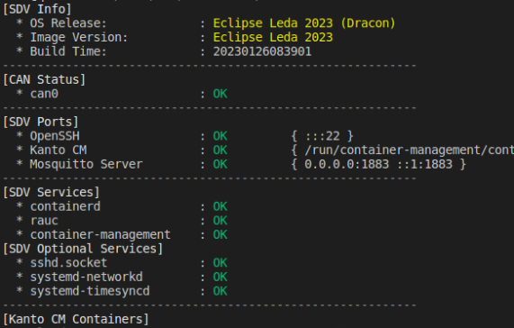

If you want to execute the image without building first, grab the latest release or build artifacts from https://github.com/eclipse-leda/leda-distro/

## Recommendations

- A **Linux host** with 8 vCPUs, 16GB of RAM and SSD storage is recommended 
- Your Linux user should be **sudoer** to allow TAP network interfaces to be set up

## QEMU x86_64
- Install Qemu https://www.qemu.org/, e.g. for Ubuntu:

      sudo apt-get update -y
      sudo apt-get install -y qemu-system-x86-64

- Download [latest Eclipse Leda release](/leda/docs/general-usage/download-releases/)
- Uncompress the archive

      tar xf eclipse-leda-qemu-x86_64.tar.xz

- Run QEMU on Linux:

      ./run-leda.sh

- Run QEMU on Windows:

      run-leda.cmd

  

- Login as `root` without password on login prompt
- Verify and wait until k3s is started: `systemctl status k3s`
  
- *Optional:* Check the system health: `sdv-health`
  

  *Note: The status of some pods and the cloud connector are expected to
  stay in _**FAILED**_ status as long as the **Device Provisioning** steps are not completed.*

- Continue with [Device Provisioning](/leda/docs/device-provisioning/)

## QEMU ARM 64-Bit
- Install Qemu https://www.qemu.org/, e.g. for ARM 64-Bit: `sudo apt install qemu-system-aarch64`
- Download [latest Eclipse Leda release](/leda/docs/general-usage/download-releases/)
- Uncompress the archive

      tar xf eclipse-leda-qemu-arm64.tar.xz

- Run QEMU on Linux:

      ./run-leda.sh

- Run QEMU on Windows:

      run-leda.cmd

- Login as `root` without password on login prompt
- Verify and wait until k3s is started: `systemctl status k3s`
- *Optional:* Check the system health: `sdv-health`

  *Note: The status of some pods and the cloud connector are expected to
  stay in _**FAILED**_ status as long as the **Device Provisioning** steps are not completed.*

- Continue with [Device Provisioning](/leda/docs/device-provisioning/)

## QEMU ARM 32-Bit
- Install Qemu https://www.qemu.org/, e.g. for ARM 32-Bit: `sudo apt install qemu-system-arm`
- Download [latest Eclipse Leda release](/leda/docs/general-usage/download-releases/)
- Uncompress the archive

      tar xf eclipse-leda-qemu-arm.tar.xz

- Run QEMU on Linux:

      ./run-leda.sh

- Run QEMU on Windows:

      run-leda.cmd

- Login as `root` without password on login prompt
- Verify and wait until k3s is started: `systemctl status k3s`
- *Optional:* Check the system health: `sdv-health`

  *Note: The status of some pods and the cloud connector are expected to
  stay in _**FAILED**_ status as long as the **Device Provisioning** steps are not completed.*

- Continue with [Device Provisioning](/leda/docs/device-provisioning/)
