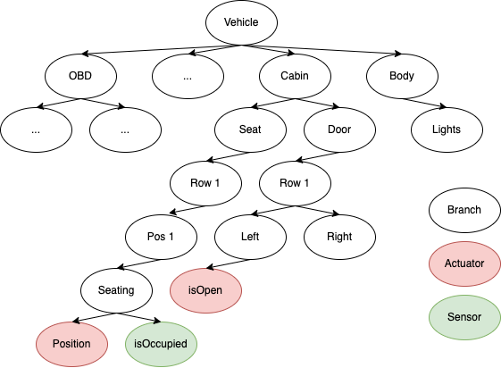
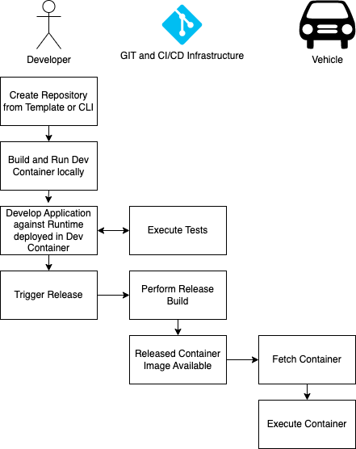

This page introduces the main concepts around Eclipse Leda, Eclipse Kuksa, Eclipse Velocitas, and Eclipse Kanto for developing and deploying applications for a software defined vehicle (SDV). The intention is to introduce the main concepts and how these projects interact. When you are already familiar with the general ideas of the Eclipse SDV, you can also jump to a hands-on tutorial on how to develop a [seat adjuster application](../../app-deployment/seat-adjuster) or replicate an [Eclipse SDV Blueprint](https://github.com/eclipse-sdv-blueprints/fleet-management) for managing vehicle fleets using Eclipse SDV concepts and technologies.

# Abstract Architecture

For the software defined vehicle we may assume the following abstract architecture.

The architecture evolves around actuators and sensors in a vehicle, like the state of a passenger seat or a door, which get controlled by connected ECUs. These ECUs react to and produce signals, which they communicate over automotive communication systems like CAN or SOME/IP. To establish a more flexible the interaction between these ECUs and make the overall vehicle more software-defined, we assume various vehicle applications which want to interact with the actuators and sensors, e.g., to control a seat based on a saved driver profile.
The architecture contains a vehicle abstraction layer between the ECUs and the vehicle applications. 
This abstraction layer introduces a potential control point for security and safety considerations and generally decouples the application logic from the more deeply embedded soft- and hardware layers. 

# Vehicle Abstraction Layer

As the name implies the vehicle abstraction layers offers abstract ways to interact with the underlying vehicle. 
## Vehicle Signal Specification (VSS)
We therefore need a joint data model for the potential signals with which an application can interact. We propose to use the [Vehicle Signal Specification (VSS)](https://covesa.github.io/vehicle_signal_specification/introduction/overview/) from the Connected Vehicle Systems Alliance (COVESA) for this.

VSS essentially defines a [rule set](https://covesa.github.io/vehicle_signal_specification/rule_set/) of how to express the definition of signals in a vehicle. This definition bases a tree structure where each domain, like body control gets an individual sub-tree. The authors of VSS further provide a [default tree](https://github.com/COVESA/vehicle_signal_specification/tree/master/spec) of signals to expect in a vehicle. However, it is common practice to tailor the default tree for a specific vehicle model by adding overlays. 

VSS allows modeling and structuring of the data from a vehicle but does not define interfaces for the interaction with this data since this depends on the used communication technology and further circumstances like whether VSS data gets processed inside the vehicle or off-board. 

## Eclipse KUKSA.val databroker
For our architecture, we therefore add the [Eclipse Kuksa.val databroker](https://github.com/eclipse/kuksa.val/tree/master/kuksa_databroker) from the [Eclipse Kuksa](https://eclipse-kuksa.github.io/kuksa-website/) project.

The Eclipse Kuksa.val databroker acts as a vehicle abstraction layer by brokering VSS signals between vehicle applications and deeply embedded systems in the vehicle. Enabling this abstraction requires a vehicle-specific component to translate between the Kuksa.val databroker and the underlying transport systems and ECUs. With Eclipse Kuksa, we refer to these software components as providers and further differentiate between actuation and data providers.

For actuators, the Kuksa.val databroker stores the desired and the current state. Typically, an application would perform a control operation by setting the target state and monitoring the current state. It is then the task of the actuation provider to perform the action while the data provider updates the current state according to signals sent on the vehicle bus. To get notified of any changes, applications, and providers can subscribe to specific signals at the Kuksa.val databroker.

The Kuksa.val databroker is written in Rust and offers communication over gRCP. To make life easier for developers using the Kuksa.val databroker there is a [Python-client](https://github.com/eclipse/kuksa.val/blob/master/kuksa-client/docs/main.md) which can be integrated in own applications. When developing with other languages, you may have to generate client code yourself with the [gRPC tooling](https://grpc.io/docs/languages/). Either way, these clients allow the development of vehicle applications and providers.

# Vehicle Application Development
When developing an application to interact with the abstraction layer, there are a couple of aspects to cover which are not specific to a single application. Because of that, some projects are evolving around the application development phase.

## Eclipse Autowrx and digital.auto Playground
A good starting point to figure out what signals are available is the website of the [digital.auto playground](https://digitalauto.netlify.app)  based on Eclipse Autowrx. 

In the next step, one can ideate on new applications, start coding, and get fast feedback using the prototyping feature of the playground. Once one is confident with the initial version, one can continue the development journey with the help of [Eclipse Velocitas](https://eclipse.dev/velocitas/), which comes with several features making the life of vehicle application developers easier. 

## Eclipse Velocitas
As a starting point, Eclipse Velocitas provides a [template repository](https://github.com/eclipse-velocitas/vehicle-app-python-template). To kick-start the development of a new application, one can create an individual repository from this template. As an alternative, Eclipse Velocitas provides a CLI application with which one can configure the creation of a tailored vehicle application repository. Either way, the resulting repository containers [skeleton code for the actual application](https://github.com/eclipse-velocitas/vehicle-app-python-template/blob/main/app/src/main.py) and comes with pre-defined [GitHub Actions workflows](https://github.com/eclipse-velocitas/vehicle-app-python-template/tree/main/.github) to automate the testing and releasing of applications as containers. The repository further contains the Dockerfile for a dev container that setups a development and vehicle environment on the developer machine. It is then possible to interact with this container through VSCode.  

Another aspect of Eclipse Velocitas is the so-called vehicle model. Here it becomes possible to take a custom vehicle model expressed in VSS and [generate a tailored SDK](https://github.com/eclipse-velocitas/vehicle-model-generator) with specific domain classes to interact with a Kuksa.val databroker using the same model. This way, one can directly develop against the used vehicle model. 

<!-- TODO make this text describing the picture -->
A typical Eclipse Velocitas application development flow then may contain the following steps:
- create Repository
- build and run Dev Container locally from VSCode
- start vehicle runtime in Dev container
- develop vehicle application and integration tests
- commit and push vehicle applications to trigger tests in GitHub Actions workflows
- trigger release workflow in GitHub

As a result of the Release workflow, the generated repository contains a Container image with the vehicle application. A target device, e.g., a vehicle or test device, can pull and execute this container.

## Vehicle Providers and Emulation
The underlying assumption when developing a vehicle application against the vehicle abstraction layer is that components below the abstraction fulfill the requests coming from the application. In other words: Developers have to assume that there are providers for the signals with which their application interacts. For a production-ready vehicle, this should be the case. But during development and testing the creation of such providers adds overhead and is a potential cause for further errors. An alternative is to use [pre-developed services](https://github.com/eclipse/kuksa.val.services) or even a generalized [vehicle mock service](https://github.com/eclipse/kuksa.val.services/tree/main/mock_service) which acts as such a provider. Developers can alter the vehicle mock service by defining the desired behavior through a Python-based DSL. 

# Vehicle Application Runtime
The next step is to bring the application to the target device and the vehicle. There are various options for how to run and orchestrate vehicle application containers. Some originate from general IT scenarios like Kubernetes or Docker Compose, and others focus more on automotive and IoT-use cases like [Eclipse Kanto](https://eclipse.dev/kanto/). So a vehicle application developer now faces the challenge of picking a runtime and integrating this runtime with required infrastructure components like the Kuksa.val databroker or respective Kuksa.val providers to enable the vehicle application. 

## Eclipse Leda
Among other things, [Eclipse Leda](https://eclipse-leda.github.io/leda/) already provides such a target platform through a Linux-based distribution of pre-integrated Eclipse SDV components. See the [architecture page](../../about/architecture/) for more details on the elements in Eclipse Leda. For the container execution, Eclipse Leda utilizes Eclipse Kanto, which implements lightweight management of OCI-compliant containers and comes by default with containerd. It is possible to manage the containers either through a CLI or by writing container manifest files and placing them in a dedicated folder on the file system from where Eclipse Kanto automatically performs them.

## Service Exchange
Another challenge when deploying multiple components that need to collaborate as services is how they find and communicate with each other. In Eclipse Kanto, the discovery and exchange can happen over container indetifiers or topics on a local MQTT broker. The Eclipse SDV community already came up with other approaches for the service exchange topic like [Eclipse uProtocol](https://github.com/eclipse-uprotocol), [Eclipse Chariott](https://github.com/eclipse-chariott/chariott) or [Eclipse Zenoh](https://zenoh.io).

# Seat Adjuster
To see the explained concepts in action, it is best to build your own application. The [Seat Adjuster](../../app-deployment/seat-adjuster) is good starting point with specific examples. 