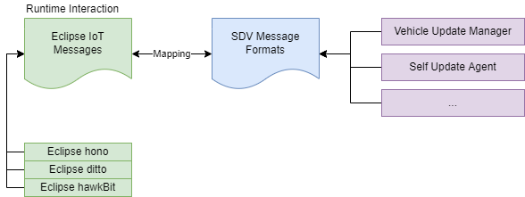

The cloud connector is used in the context of [Device Provisioning](/leda/docs/device-provisioning/) and cloud backend connectivity.

## Overview

Leda Cloud Connector for Azure IoT Hub is a fork (extended and adapted) of the generic [Eclipse Kanto's Azure connector](https://github.com/eclipse-kanto/azure-connector) that is being able to process cloud-to-device and device-to-cloud messages as defined for the Software-Defined Vehicle cloud backend.

## Runtime

The SDV cloud connector will come up with pluggable architecture that will allow easy **transformation of the incoming cloud-to-device command messages (SDV message envelope) to a format suitable and understandable by the rest of the in-vehicle components** and vice-versa. It shall be possible to map SDV messages to and from [Eclipse Hono](https://www.eclipse.org/hono/docs/concepts/connecting-devices/) and [Eclipse Ditto](https://www.eclipse.org/ditto/) messages using simple configuration, rules written in JSON; thus allowing this component to work together with other [Eclipse Kanto](https://websites.eclipseprojects.io/kanto/) components too.

## Source Repository

Source Repository: <https://github.com/eclipse-leda/leda-contrib-cloud-connector>
