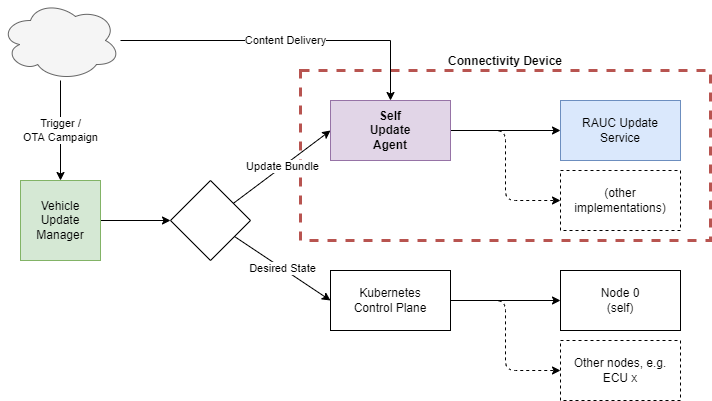
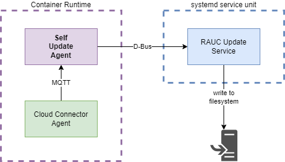

The self update agent is used in the context of [OTA Self Updates](/leda/docs/device-provisioning/self-update/).

## Overview

The Self Update Agent (SUA) as part of the [Eclipse Leda Incubator project proposal](https://projects.eclipse.org/projects/automotive.leda.ledaincubator/reviews/creation-review) is a software component responsible for **performing updates of system-level components of the connectivity device**, such as

- Boot Loader
- Operating System
- Device Firmware
- Hardware Drivers
- ... other parts of the system, which cannot be deployed as containerized packages or may require a reboot of the device.

## Implementation and Deployment

SUA is using the RAUC framework via D-Bus calls, but it is designed in a way that switching to other updating solution shall be possible. SUA may be controlled by an external higher-level orchestration component via defined MQTT messages, which carry necessary for update data, such as version and URL of the update bundle. Update process feedback and the end result are also communicated via defined MQTT messages. Software Update Agent is implemented in C++ and configured to be running inside of a container.

## Source Repository

Source Repository: <https://github.com/eclipse-leda/leda-contrib-self-update-agent>
