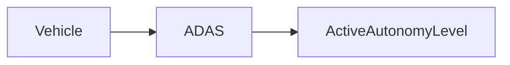

| | |
|---|---|
| Full qualified VSS Path: | `Vehicle.ADAS.ActiveAutonomyLevel` |
| Description: | Indicates the currently active level of autonomy according to SAE J3016 taxonomy. |
| Comment: | Follows https://www.sae.org/news/2019/01/sae-updates-j3016-automated-driving-graphic taxonomy. For SAE levels 3 and 4 the system is required to alert the driver before it will disengage. Level 4 systems are required to reach a safe state even if a driver does not take over. Only level 5 systems are required to not rely on a driver at all. While level 2 systems require the driver to be monitoring the system at all times, many level 2 systems, often termed "level 2.5" systems, do warn the driver shortly before reaching their operational limits, therefore we also support the DISENGAGING state for SAE_2. |

## Navigation



## Eclipse Leda: Usage Example

In [Eclipse Kuksa.VAL Databroker](https://github.com/eclipse/kuksa.val/tree/master/kuksa_databroker) CLI:


```bash
$ databroker-cli
sdv.databroker.v1 > connect
[connect] OK
sdv.databroker.v1 > get Vehicle.ADAS.ActiveAutonomyLevel
[get]  OK
Vehicle.ADAS.ActiveAutonomyLevel: ( NotAvailable )
sdv.databroker.v1 > set Vehicle.ADAS.ActiveAutonomyLevel Foo
[set]  OK
```

## Digital Auto: Playground

[playground.digital.auto](http://digital.auto) provides an in-browser, rapid prototyping environment utilizing the COVESA APIs for connected vehicles. 

| Vehicle Model | Direct link to Vehicle Signal |
|---|---|
| ACME Car (EV) v0.1 | [Vehicle.ADAS.ActiveAutonomyLevel](https://digitalauto.netlify.app/model/STLWzk1WyqVVLbfymb4f/cvi/list/Vehicle.ADAS.ActiveAutonomyLevel/) |

## Data Type & Unit

| | | |
|---|---|---|
| Path | `Vehicle.ADAS.ActiveAutonomyLevel` | [VSS: Addressing nodes](https://covesa.github.io/vehicle_signal_specification/rule_set/basics/) |
| Data type | `string` | [VSS: Datatypes](https://covesa.github.io/vehicle_signal_specification/rule_set/data_entry/data_types/) |
| Allowed values | `['SAE_0', 'SAE_1', 'SAE_2_DISENGAGING', 'SAE_2', 'SAE_3_DISENGAGING', 'SAE_3', 'SAE_4_DISENGAGING', 'SAE_4', 'SAE_5']` | [VSS: Specifying allowed values](https://covesa.github.io/vehicle_signal_specification/rule_set/data_entry/allowed/) |


**Note:** The `string` datatype is a *character string*.


## Signal Information


The vehicle signal `Vehicle.ADAS.ActiveAutonomyLevel` is a **Sensor**.

The vehicle signal `Vehicle.ADAS.ActiveAutonomyLevel` is a **Signal**.


## UUID

Each vehicle signal is identified by a [Universally Unique Identifier (UUID](https://en.wikipedia.org/wiki/Universally_unique_identifier))

The UUID for `Vehicle.ADAS.ActiveAutonomyLevel` is `b101c6928fc55948b1cc485e568ecd8d`


## Feedback

Do you think this Vehicle Signal specification needs enhancement? Do you want to discuss with experts? Try the following ressources to get in touch with the VSS community:

| | |
|---|---|
| Enhancement request | [Create COVESA GitHub Issue](https://github.com/COVESA/vehicle_signal_specification/issues/new?body=Please+describe+your+feedback&title=Signal+feedback+Vehicle.ADAS.ActiveAutonomyLevel) |
| Join COVESA | [www.covesa.global](https://www.covesa.global/join?src=sidebar) |
| Discuss VSS on Slack | [w3cauto.slack.com](http://w3cauto.slack.com/) |
| VSS Data Experts on Google Groups | [covesa.global data-expert-group](https://groups.google.com/a/covesa.global/g/data-expert-group) |

## About VSS

The [Vehicle Signal Specification](https://covesa.github.io/vehicle_signal_specification/) (VSS)
is an initiative by COVESA to define a syntax and a catalog for vehicle signals.
The source code and releases can be found in the [VSS github repository](https://github.com/COVESA/vehicle_signal_specification).

## Supported datatypes

The following is a list of VSS supported built-in datatypes:

Name       | Type                       | Min  | Max
:----------|:---------------------------|:-----|:---
uint8      | unsigned 8-bit integer     | 0    | 255
int8       | signed 8-bit integer       | -128 | 127
uint16     | unsigned 16-bit integer    |  0   | 65535
int16      | signed 16-bit integer      | -32768 | 32767
uint32     | unsigned 32-bit integer    | 0 | 4294967295
int32      | signed 32-bit integer      | -2147483648 | 2147483647
uint64     | unsigned 64-bit integer    | 0    | 2^64 - 1
int64      | signed 64-bit integer      | -2^63 | 2^63 - 1
boolean    | boolean value              | 0/false | 1/true
float      | floating point number      | -3.4e -38 | 3.4e 38
double     | double precision floating point number | -1.7e -300 | 1.7e 300
string     | character string           | n/a  | n/a

> Min, max and default values defined in a Vehicle Signal Specification must be in the supported range of the data type.
