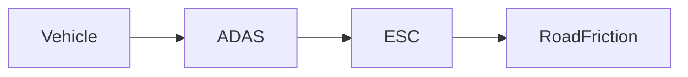

| | |
|---|---|
| Full qualified VSS Path: | `Vehicle.ADAS.ESC.RoadFriction` |
| Description: | Road friction values reported by the ESC system. |

## Navigation

## Digital Auto: Playground

[playground.digital.auto](http://digital.auto) provides an in-browser, rapid prototyping environment utilizing the COVESA APIs for connected vehicles. 

| Vehicle Model | Direct link to Vehicle Signal |
|---|---|
| ACME Car (EV) v0.1 | [Vehicle.ADAS.ESC.RoadFriction](https://digitalauto.netlify.app/model/STLWzk1WyqVVLbfymb4f/cvi/list/Vehicle.ADAS.ESC.RoadFriction/) |

## Signal Information

The vehicle signal `Vehicle.ADAS.ESC.RoadFriction` is a **Branch**.

## UUID

Each vehicle signal is identified by a [Universally Unique Identifier (UUID](https://en.wikipedia.org/wiki/Universally_unique_identifier))

The UUID for `Vehicle.ADAS.ESC.RoadFriction` is `71a32e4eb131532c82195508d93807ed`

## Children

This vehicle signal is a branch or structure and thus has sub-pages:

- [Vehicle.ADAS.ESC.RoadFriction.LowerBound](lowerbound/) (Lower bound road friction, as calculated by the ESC system. 5% possibility that road friction is below this value. 0 = no friction, 100 = maximum friction.)
- [Vehicle.ADAS.ESC.RoadFriction.MostProbable](mostprobable/) (Most probable road friction, as calculated by the ESC system. Exact meaning of most probable is implementation specific. 0 = no friction, 100 = maximum friction.)
- [Vehicle.ADAS.ESC.RoadFriction.UpperBound](upperbound/) (Upper bound road friction, as calculated by the ESC system. 95% possibility that road friction is below this value. 0 = no friction, 100 = maximum friction.)

## Feedback

Do you think this Vehicle Signal specification needs enhancement? Do you want to discuss with experts? Try the following ressources to get in touch with the VSS community:

| | |
|---|---|
| Enhancement request | [Create COVESA GitHub Issue](https://github.com/COVESA/vehicle_signal_specification/issues/new?body=Please+describe+your+feedback&title=Signal+feedback+Vehicle.ADAS.ESC.RoadFriction) |
| Join COVESA | [www.covesa.global](https://www.covesa.global/join?src=sidebar) |
| Discuss VSS on Slack | [w3cauto.slack.com](http://w3cauto.slack.com/) |
| VSS Data Experts on Google Groups | [covesa.global data-expert-group](https://groups.google.com/a/covesa.global/g/data-expert-group) |

## About VSS

The [Vehicle Signal Specification](https://covesa.github.io/vehicle_signal_specification/) (VSS)
is an initiative by COVESA to define a syntax and a catalog for vehicle signals.
The source code and releases can be found in the [VSS github repository](https://github.com/COVESA/vehicle_signal_specification).

