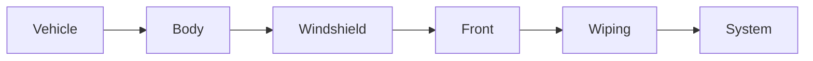

| | |
|---|---|
| Full qualified VSS Path: | `Vehicle.Body.Windshield.Front.Wiping.System` |
| Description: | Signals to control behavior of wipers in detail. By default VSS expects only one instance. |
| Comment: | These signals are typically not directly available to the user/driver of the vehicle. The overlay in overlays/extensions/dual_wiper_systems.vspec can be used to modify this branch to support two instances; Primary and Secondary. |

## Navigation

## Digital Auto: Playground

[playground.digital.auto](http://digital.auto) provides an in-browser, rapid prototyping environment utilizing the COVESA APIs for connected vehicles. 

| Vehicle Model | Direct link to Vehicle Signal |
|---|---|
| ACME Car (EV) v0.1 | [Vehicle.Body.Windshield.Front.Wiping.System](https://digitalauto.netlify.app/model/STLWzk1WyqVVLbfymb4f/cvi/list/Vehicle.Body.Windshield.Front.Wiping.System/) |

## Signal Information

The vehicle signal `Vehicle.Body.Windshield.Front.Wiping.System` is a **Branch**.

## UUID

Each vehicle signal is identified by a [Universally Unique Identifier (UUID](https://en.wikipedia.org/wiki/Universally_unique_identifier))

The UUID for `Vehicle.Body.Windshield.Front.Wiping.System` is `9002ff76166950e0aa3b7c9df3b53468`

## Children

This vehicle signal is a branch or structure and thus has sub-pages:

- [Vehicle.Body.Windshield.Front.Wiping.System.ActualPosition](actualposition/) (Actual position of main wiper blade for the wiper system relative to reference position. Location of reference position (0 degrees) and direction of positive/negative degrees is vehicle specific.)
- [Vehicle.Body.Windshield.Front.Wiping.System.DriveCurrent](drivecurrent/) (Actual current used by wiper drive.)
- [Vehicle.Body.Windshield.Front.Wiping.System.Frequency](frequency/) (Wiping frequency/speed, measured in cycles per minute. The signal concerns the actual speed of the wiper blades when moving. Intervals/pauses are excluded, i.e. the value corresponds to the number of cycles that would be completed in 1 minute if wiping permanently over default range.)
- [Vehicle.Body.Windshield.Front.Wiping.System.IsBlocked](isblocked/) (Indicates if wiper movement is blocked. True = Movement blocked. False = Movement not blocked.)
- [Vehicle.Body.Windshield.Front.Wiping.System.IsEndingWipeCycle](isendingwipecycle/) (Indicates if current wipe movement is completed or near completion. True = Movement is completed or near completion. Changes to RequestedPosition will be executed first after reaching previous RequestedPosition, if it has not already been reached. False = Movement is not near completion. Any change to RequestedPosition will be executed immediately. Change of direction may not be allowed.)
- [Vehicle.Body.Windshield.Front.Wiping.System.IsOverheated](isoverheated/) (Indicates if wiper system is overheated. True = Wiper system overheated. False = Wiper system not overheated.)
- [Vehicle.Body.Windshield.Front.Wiping.System.IsPositionReached](ispositionreached/) (Indicates if a requested position has been reached. IsPositionReached refers to the previous position in case the TargetPosition is updated while IsEndingWipeCycle=True. True = Current or Previous TargetPosition reached. False = Position not (yet) reached, or wipers have moved away from the reached position.)
- [Vehicle.Body.Windshield.Front.Wiping.System.IsWiperError](iswipererror/) (Indicates system failure. True if wiping is disabled due to system failure.)
- [Vehicle.Body.Windshield.Front.Wiping.System.IsWiping](iswiping/) (Indicates wiper movement. True if wiper blades are moving. Change of direction shall be considered as IsWiping if wipers will continue to move directly after the change of direction.)
- [Vehicle.Body.Windshield.Front.Wiping.System.Mode](mode/) (Requested mode of wiper system. STOP_HOLD means that the wipers shall move to position given by TargetPosition and then hold the position. WIPE means that wipers shall move to the position given by TargetPosition and then hold the position if no new TargetPosition is requested. PLANT_MODE means that wiping is disabled. Exact behavior is vehicle specific. EMERGENCY_STOP means that wiping shall be immediately stopped without holding the position.)
- [Vehicle.Body.Windshield.Front.Wiping.System.TargetPosition](targetposition/) (Requested position of main wiper blade for the wiper system relative to reference position. Location of reference position (0 degrees) and direction of positive/negative degrees is vehicle specific. System behavior when receiving TargetPosition depends on Mode and IsEndingWipeCycle. Supported values are vehicle specific and might be dynamically corrected. If IsEndingWipeCycle=True then wipers will complete current movement before actuating new TargetPosition. If IsEndingWipeCycle=False then wipers will directly change destination if the TargetPosition is changed.)

## Feedback

Do you think this Vehicle Signal specification needs enhancement? Do you want to discuss with experts? Try the following ressources to get in touch with the VSS community:

| | |
|---|---|
| Enhancement request | [Create COVESA GitHub Issue](https://github.com/COVESA/vehicle_signal_specification/issues/new?body=Please+describe+your+feedback&title=Signal+feedback+Vehicle.Body.Windshield.Front.Wiping.System) |
| Join COVESA | [www.covesa.global](https://www.covesa.global/join?src=sidebar) |
| Discuss VSS on Slack | [w3cauto.slack.com](http://w3cauto.slack.com/) |
| VSS Data Experts on Google Groups | [covesa.global data-expert-group](https://groups.google.com/a/covesa.global/g/data-expert-group) |

## About VSS

The [Vehicle Signal Specification](https://covesa.github.io/vehicle_signal_specification/) (VSS)
is an initiative by COVESA to define a syntax and a catalog for vehicle signals.
The source code and releases can be found in the [VSS github repository](https://github.com/COVESA/vehicle_signal_specification).

