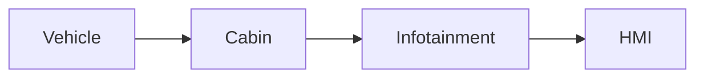

| | |
|---|---|
| Full qualified VSS Path: | `Vehicle.Cabin.Infotainment.HMI` |
| Description: | HMI related signals |

## Navigation

## Digital Auto: Playground

[playground.digital.auto](http://digital.auto) provides an in-browser, rapid prototyping environment utilizing the COVESA APIs for connected vehicles. 

| Vehicle Model | Direct link to Vehicle Signal |
|---|---|
| ACME Car (EV) v0.1 | [Vehicle.Cabin.Infotainment.HMI](https://digitalauto.netlify.app/model/STLWzk1WyqVVLbfymb4f/cvi/list/Vehicle.Cabin.Infotainment.HMI/) |

## Signal Information

The vehicle signal `Vehicle.Cabin.Infotainment.HMI` is a **Branch**.

## UUID

Each vehicle signal is identified by a [Universally Unique Identifier (UUID](https://en.wikipedia.org/wiki/Universally_unique_identifier))

The UUID for `Vehicle.Cabin.Infotainment.HMI` is `271e3d9202825f37bd054820e5ea8141`

## Children

This vehicle signal is a branch or structure and thus has sub-pages:

- [Vehicle.Cabin.Infotainment.HMI.Brightness](brightness/) (Brightness of the HMI, relative to supported range. 0 = Lowest brightness possible. 100 = Maximum Brightness possible.)
- [Vehicle.Cabin.Infotainment.HMI.CurrentLanguage](currentlanguage/) (ISO 639-1 standard language code for the current HMI)
- [Vehicle.Cabin.Infotainment.HMI.DateFormat](dateformat/) (Date format used in the current HMI)
- [Vehicle.Cabin.Infotainment.HMI.DayNightMode](daynightmode/) (Current display theme)
- [Vehicle.Cabin.Infotainment.HMI.DistanceUnit](distanceunit/) (Distance unit used in the current HMI)
- [Vehicle.Cabin.Infotainment.HMI.EVEconomyUnits](eveconomyunits/) (EV fuel economy unit used in the current HMI)
- [Vehicle.Cabin.Infotainment.HMI.FuelEconomyUnits](fueleconomyunits/) (Fuel economy unit used in the current HMI)
- [Vehicle.Cabin.Infotainment.HMI.FuelVolumeUnit](fuelvolumeunit/) (Fuel volume unit used in the current HMI)
- [Vehicle.Cabin.Infotainment.HMI.TemperatureUnit](temperatureunit/) (Temperature unit used in the current HMI)
- [Vehicle.Cabin.Infotainment.HMI.TimeFormat](timeformat/) (Time format used in the current HMI)
- [Vehicle.Cabin.Infotainment.HMI.TirePressureUnit](tirepressureunit/) (Tire pressure unit used in the current HMI)

## Feedback

Do you think this Vehicle Signal specification needs enhancement? Do you want to discuss with experts? Try the following ressources to get in touch with the VSS community:

| | |
|---|---|
| Enhancement request | [Create COVESA GitHub Issue](https://github.com/COVESA/vehicle_signal_specification/issues/new?body=Please+describe+your+feedback&title=Signal+feedback+Vehicle.Cabin.Infotainment.HMI) |
| Join COVESA | [www.covesa.global](https://www.covesa.global/join?src=sidebar) |
| Discuss VSS on Slack | [w3cauto.slack.com](http://w3cauto.slack.com/) |
| VSS Data Experts on Google Groups | [covesa.global data-expert-group](https://groups.google.com/a/covesa.global/g/data-expert-group) |

## About VSS

The [Vehicle Signal Specification](https://covesa.github.io/vehicle_signal_specification/) (VSS)
is an initiative by COVESA to define a syntax and a catalog for vehicle signals.
The source code and releases can be found in the [VSS github repository](https://github.com/COVESA/vehicle_signal_specification).

