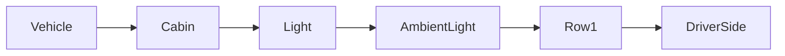

| | |
|---|---|
| Full qualified VSS Path: | `Vehicle.Cabin.Light.AmbientLight.Row1.DriverSide` |
| Description: | Decorative coloured light inside the cabin, usually mounted on the door, ceiling, etc. |

## Navigation

## Digital Auto: Playground

[playground.digital.auto](http://digital.auto) provides an in-browser, rapid prototyping environment utilizing the COVESA APIs for connected vehicles. 

| Vehicle Model | Direct link to Vehicle Signal |
|---|---|
| ACME Car (EV) v0.1 | [Vehicle.Cabin.Light.AmbientLight.Row1.DriverSide](https://digitalauto.netlify.app/model/STLWzk1WyqVVLbfymb4f/cvi/list/Vehicle.Cabin.Light.AmbientLight.Row1.DriverSide/) |

## Signal Information

The vehicle signal `Vehicle.Cabin.Light.AmbientLight.Row1.DriverSide` is a **Branch**.

## UUID

Each vehicle signal is identified by a [Universally Unique Identifier (UUID](https://en.wikipedia.org/wiki/Universally_unique_identifier))

The UUID for `Vehicle.Cabin.Light.AmbientLight.Row1.DriverSide` is `e42bfc0abac857f0a40f579cc0ced424`

## Children

This vehicle signal is a branch or structure and thus has sub-pages:

- [Vehicle.Cabin.Light.AmbientLight.Row1.DriverSide.Color](color/) (Hexadecimal color code represented as a 3-byte RGB (i.e. Red, Green, and Blue) value preceded by a hash symbol "#". Allowed range "#000000" to "#FFFFFF".)
- [Vehicle.Cabin.Light.AmbientLight.Row1.DriverSide.Intensity](intensity/) (How much of the maximum possible brightness of the light is used. 1 = Maximum attenuation, 100 = No attenuation (i.e. full brightness).)
- [Vehicle.Cabin.Light.AmbientLight.Row1.DriverSide.IsLightOn](islighton/) (Indicates whether the light is turned on. True = On, False = Off.)

## Feedback

Do you think this Vehicle Signal specification needs enhancement? Do you want to discuss with experts? Try the following ressources to get in touch with the VSS community:

| | |
|---|---|
| Enhancement request | [Create COVESA GitHub Issue](https://github.com/COVESA/vehicle_signal_specification/issues/new?body=Please+describe+your+feedback&title=Signal+feedback+Vehicle.Cabin.Light.AmbientLight.Row1.DriverSide) |
| Join COVESA | [www.covesa.global](https://www.covesa.global/join?src=sidebar) |
| Discuss VSS on Slack | [w3cauto.slack.com](http://w3cauto.slack.com/) |
| VSS Data Experts on Google Groups | [covesa.global data-expert-group](https://groups.google.com/a/covesa.global/g/data-expert-group) |

## About VSS

The [Vehicle Signal Specification](https://covesa.github.io/vehicle_signal_specification/) (VSS)
is an initiative by COVESA to define a syntax and a catalog for vehicle signals.
The source code and releases can be found in the [VSS github repository](https://github.com/COVESA/vehicle_signal_specification).

