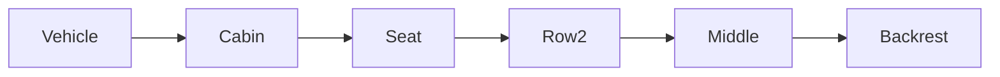

| | |
|---|---|
| Full qualified VSS Path: | `Vehicle.Cabin.Seat.Row2.Middle.Backrest` |
| Description: | Describes signals related to the backrest of the seat. |

## Navigation

## Digital Auto: Playground

[playground.digital.auto](http://digital.auto) provides an in-browser, rapid prototyping environment utilizing the COVESA APIs for connected vehicles. 

| Vehicle Model | Direct link to Vehicle Signal |
|---|---|
| ACME Car (EV) v0.1 | [Vehicle.Cabin.Seat.Row2.Middle.Backrest](https://digitalauto.netlify.app/model/STLWzk1WyqVVLbfymb4f/cvi/list/Vehicle.Cabin.Seat.Row2.Middle.Backrest/) |

## Signal Information

The vehicle signal `Vehicle.Cabin.Seat.Row2.Middle.Backrest` is a **Branch**.

## UUID

Each vehicle signal is identified by a [Universally Unique Identifier (UUID](https://en.wikipedia.org/wiki/Universally_unique_identifier))

The UUID for `Vehicle.Cabin.Seat.Row2.Middle.Backrest` is `4f54b32f4c85549b88acbe7cd19dcb20`

## Children

This vehicle signal is a branch or structure and thus has sub-pages:

- [Vehicle.Cabin.Seat.Row2.Middle.Backrest.BottomLumbarSupport](bottomlumbarsupport/) (Bottom lumbar support (in/out position). 0 = Innermost position. 100 = Outermost position.)
- [Vehicle.Cabin.Seat.Row2.Middle.Backrest.HeatingCooling](heatingcooling/) (Heating or Cooling requsted for the Item. -100 = Maximum cooling, 0 = Heating/cooling deactivated, 100 = Maximum heating.)
- [Vehicle.Cabin.Seat.Row2.Middle.Backrest.IsLessLumbarSupportSwitchEngaged](islesslumbarsupportswitchengaged/) (Is switch for less lumbar support engaged.)
- [Vehicle.Cabin.Seat.Row2.Middle.Backrest.IsLessSideBolsterSupportSwitchEngaged](islesssidebolstersupportswitchengaged/) (Is switch for less side bolster support engaged.)
- [Vehicle.Cabin.Seat.Row2.Middle.Backrest.IsLumbarDownSwitchEngaged](islumbardownswitchengaged/) (Lumbar down switch engaged.)
- [Vehicle.Cabin.Seat.Row2.Middle.Backrest.IsLumbarUpSwitchEngaged](islumbarupswitchengaged/) (Lumbar up switch engaged.)
- [Vehicle.Cabin.Seat.Row2.Middle.Backrest.IsMoreLumbarSupportSwitchEngaged](ismorelumbarsupportswitchengaged/) (Is switch for more lumbar support engaged.)
- [Vehicle.Cabin.Seat.Row2.Middle.Backrest.IsMoreSideBolsterSupportSwitchEngaged](ismoresidebolstersupportswitchengaged/) (Is switch for more side bolster support engaged.)
- [Vehicle.Cabin.Seat.Row2.Middle.Backrest.IsReclineBackwardSwitchEngaged](isreclinebackwardswitchengaged/) (Backrest recline backward switch engaged.)
- [Vehicle.Cabin.Seat.Row2.Middle.Backrest.IsReclineForwardSwitchEngaged](isreclineforwardswitchengaged/) (Backrest recline forward switch engaged.)
- [Vehicle.Cabin.Seat.Row2.Middle.Backrest.LumbarHeight](lumbarheight/) (Height of lumbar support. Position is relative within available movable range of the lumbar support. 0 = Lowermost position supported.)
- [Vehicle.Cabin.Seat.Row2.Middle.Backrest.LumbarSupport](lumbarsupport/) (Lumbar support (in/out position). 0 = Innermost position. 100 = Outermost position.)
- [Vehicle.Cabin.Seat.Row2.Middle.Backrest.MidLumbarSupport](midlumbarsupport/) (Mid lumbar support (in/out position). 0 = Innermost position. 100 = Outermost position.)
- [Vehicle.Cabin.Seat.Row2.Middle.Backrest.Recline](recline/) (Backrest recline compared to seat z-axis (seat vertical axis). 0 degrees = Upright/Vertical backrest. Negative degrees for forward recline. Positive degrees for backward recline.)
- [Vehicle.Cabin.Seat.Row2.Middle.Backrest.SideBolsterSupport](sidebolstersupport/) (Side bolster support. 0 = Minimum support (widest side bolster setting). 100 = Maximum support.)
- [Vehicle.Cabin.Seat.Row2.Middle.Backrest.SideBolsterSupportLeft](sidebolstersupportleft/) (Side bolster support left. 0 = Minimum support (widest side bolster setting). 100 = Maximum support.)
- [Vehicle.Cabin.Seat.Row2.Middle.Backrest.SideBolsterSupportRight](sidebolstersupportright/) (Side bolster support right. 0 = Minimum support (widest side bolster setting). 100 = Maximum support.)
- [Vehicle.Cabin.Seat.Row2.Middle.Backrest.TopLumbarSupport](toplumbarsupport/) (Top lumbar support (in/out position). 0 = Innermost position. 100 = Outermost position.)
- [Vehicle.Cabin.Seat.Row2.Middle.Backrest.UpperShoulderSupport](uppershouldersupport/) (Upper shoulder support. 0 = Minimum support (widest side bolster setting). 100 = Maximum support.)

## Feedback

Do you think this Vehicle Signal specification needs enhancement? Do you want to discuss with experts? Try the following ressources to get in touch with the VSS community:

| | |
|---|---|
| Enhancement request | [Create COVESA GitHub Issue](https://github.com/COVESA/vehicle_signal_specification/issues/new?body=Please+describe+your+feedback&title=Signal+feedback+Vehicle.Cabin.Seat.Row2.Middle.Backrest) |
| Join COVESA | [www.covesa.global](https://www.covesa.global/join?src=sidebar) |
| Discuss VSS on Slack | [w3cauto.slack.com](http://w3cauto.slack.com/) |
| VSS Data Experts on Google Groups | [covesa.global data-expert-group](https://groups.google.com/a/covesa.global/g/data-expert-group) |

## About VSS

The [Vehicle Signal Specification](https://covesa.github.io/vehicle_signal_specification/) (VSS)
is an initiative by COVESA to define a syntax and a catalog for vehicle signals.
The source code and releases can be found in the [VSS github repository](https://github.com/COVESA/vehicle_signal_specification).

