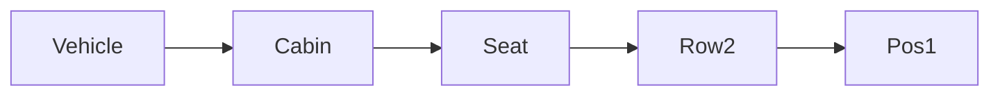

| | |
|---|---|
| Full qualified VSS Path: | `Vehicle.Cabin.Seat.Row2.Pos1` |
| Description: | All seats. |

## Navigation

## Digital Auto: Playground

[playground.digital.auto](http://digital.auto) provides an in-browser, rapid prototyping environment utilizing the COVESA APIs for connected vehicles. 

| Vehicle Model | Direct link to Vehicle Signal |
|---|---|
| ACME Car (EV) v0.1 | [Vehicle.Cabin.Seat.Row2.Pos1](https://digitalauto.netlify.app/model/STLWzk1WyqVVLbfymb4f/cvi/list/Vehicle.Cabin.Seat.Row2.Pos1/) |

## Signal Information

The vehicle signal `Vehicle.Cabin.Seat.Row2.Pos1` is a **Branch**.

## UUID

Each vehicle signal is identified by a [Universally Unique Identifier (UUID](https://en.wikipedia.org/wiki/Universally_unique_identifier))

The UUID for `Vehicle.Cabin.Seat.Row2.Pos1` is `ba975a6536f15545851d27972ab1fffe`

## Children

This vehicle signal is a branch or structure and thus has sub-pages:

- [Vehicle.Cabin.Seat.Row2.Pos1.Airbag](airbag/) (Airbag signals.)
- [Vehicle.Cabin.Seat.Row2.Pos1.Backrest](backrest/) (Describes signals related to the backrest of the seat.)
- [Vehicle.Cabin.Seat.Row2.Pos1.Headrest](headrest/) (Headrest settings.)
- [Vehicle.Cabin.Seat.Row2.Pos1.Heating](heating/) (Seat cooling / heating. 0 = off. -100 = max cold. +100 = max heat.)
- [Vehicle.Cabin.Seat.Row2.Pos1.Height](height/) (Seat position on vehicle z-axis. Position is relative within available movable range of the seating. 0 = Lowermost position supported.)
- [Vehicle.Cabin.Seat.Row2.Pos1.IsBelted](isbelted/) (Is the belt engaged.)
- [Vehicle.Cabin.Seat.Row2.Pos1.IsOccupied](isoccupied/) (Does the seat have a passenger in it.)
- [Vehicle.Cabin.Seat.Row2.Pos1.Massage](massage/) (Seat massage level. 0 = off. 100 = max massage.)
- [Vehicle.Cabin.Seat.Row2.Pos1.Occupant](occupant/) (Occupant data.)
- [Vehicle.Cabin.Seat.Row2.Pos1.Position](position/) (Seat position on vehicle x-axis. Position is relative to the frontmost position supported by the seat. 0 = Frontmost position supported.)
- [Vehicle.Cabin.Seat.Row2.Pos1.Seating](seating/) (Describes signals related to the seat bottom of the seat.)
- [Vehicle.Cabin.Seat.Row2.Pos1.Switch](switch/) (Seat switch signals)
- [Vehicle.Cabin.Seat.Row2.Pos1.Tilt](tilt/) (Tilting of seat (seating and backrest) relative to vehicle x-axis. 0 = seat bottom is flat, seat bottom and vehicle x-axis are parallel. Positive degrees = seat tilted backwards, seat x-axis tilted upward, seat z-axis is tilted backward.)

## Feedback

Do you think this Vehicle Signal specification needs enhancement? Do you want to discuss with experts? Try the following ressources to get in touch with the VSS community:

| | |
|---|---|
| Enhancement request | [Create COVESA GitHub Issue](https://github.com/COVESA/vehicle_signal_specification/issues/new?body=Please+describe+your+feedback&title=Signal+feedback+Vehicle.Cabin.Seat.Row2.Pos1) |
| Join COVESA | [www.covesa.global](https://www.covesa.global/join?src=sidebar) |
| Discuss VSS on Slack | [w3cauto.slack.com](http://w3cauto.slack.com/) |
| VSS Data Experts on Google Groups | [covesa.global data-expert-group](https://groups.google.com/a/covesa.global/g/data-expert-group) |

## About VSS

The [Vehicle Signal Specification](https://covesa.github.io/vehicle_signal_specification/) (VSS)
is an initiative by COVESA to define a syntax and a catalog for vehicle signals.
The source code and releases can be found in the [VSS github repository](https://github.com/COVESA/vehicle_signal_specification).

