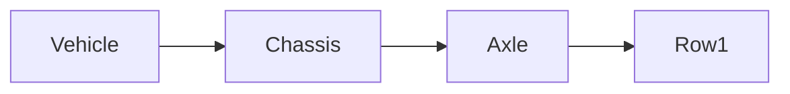

| | |
|---|---|
| Full qualified VSS Path: | `Vehicle.Chassis.Axle.Row1` |
| Description: | Axle signals |

## Navigation

## Digital Auto: Playground

[playground.digital.auto](http://digital.auto) provides an in-browser, rapid prototyping environment utilizing the COVESA APIs for connected vehicles. 

| Vehicle Model | Direct link to Vehicle Signal |
|---|---|
| ACME Car (EV) v0.1 | [Vehicle.Chassis.Axle.Row1](https://digitalauto.netlify.app/model/STLWzk1WyqVVLbfymb4f/cvi/list/Vehicle.Chassis.Axle.Row1/) |

## Signal Information

The vehicle signal `Vehicle.Chassis.Axle.Row1` is a **Branch**.

## UUID

Each vehicle signal is identified by a [Universally Unique Identifier (UUID](https://en.wikipedia.org/wiki/Universally_unique_identifier))

The UUID for `Vehicle.Chassis.Axle.Row1` is `d7e93a94af0752aaab36819f6be4f67a`

## Children

This vehicle signal is a branch or structure and thus has sub-pages:

- [Vehicle.Chassis.Axle.Row1.AxleWidth](axlewidth/) (The lateral distance between the wheel mounting faces, measured along the spindle axis.)
- [Vehicle.Chassis.Axle.Row1.SteeringAngle](steeringangle/) (Single track two-axle model steering angle. Angle according to ISO 8855. Positive = degrees to the left. Negative = degrees to the right.)
- [Vehicle.Chassis.Axle.Row1.TireAspectRatio](tireaspectratio/) (Aspect ratio between tire section height and tire section width, as per ETRTO / TRA standard.)
- [Vehicle.Chassis.Axle.Row1.TireDiameter](tirediameter/) (Outer diameter of tires, in inches, as per ETRTO / TRA standard.)
- [Vehicle.Chassis.Axle.Row1.TireWidth](tirewidth/) (Nominal section width of tires, in mm, as per ETRTO / TRA standard.)
- [Vehicle.Chassis.Axle.Row1.TrackWidth](trackwidth/) (The lateral distance between the centers of the wheels, measured along the spindle, or axle axis. If there are dual rear wheels, measure from the midway points between the inner and outer tires.)
- [Vehicle.Chassis.Axle.Row1.TreadWidth](treadwidth/) (The lateral distance between the centerlines of the base tires at ground, including camber angle. If there are dual rear wheels, measure from the midway points between the inner and outer tires.)
- [Vehicle.Chassis.Axle.Row1.Wheel](wheel/) (Wheel signals for axle)
- [Vehicle.Chassis.Axle.Row1.WheelCount](wheelcount/) (Number of wheels on the axle)
- [Vehicle.Chassis.Axle.Row1.WheelDiameter](wheeldiameter/) (Diameter of wheels (rims without tires), in inches, as per ETRTO / TRA standard.)
- [Vehicle.Chassis.Axle.Row1.WheelWidth](wheelwidth/) (Width of wheels (rims without tires), in inches, as per ETRTO / TRA standard.)

## Feedback

Do you think this Vehicle Signal specification needs enhancement? Do you want to discuss with experts? Try the following ressources to get in touch with the VSS community:

| | |
|---|---|
| Enhancement request | [Create COVESA GitHub Issue](https://github.com/COVESA/vehicle_signal_specification/issues/new?body=Please+describe+your+feedback&title=Signal+feedback+Vehicle.Chassis.Axle.Row1) |
| Join COVESA | [www.covesa.global](https://www.covesa.global/join?src=sidebar) |
| Discuss VSS on Slack | [w3cauto.slack.com](http://w3cauto.slack.com/) |
| VSS Data Experts on Google Groups | [covesa.global data-expert-group](https://groups.google.com/a/covesa.global/g/data-expert-group) |

## About VSS

The [Vehicle Signal Specification](https://covesa.github.io/vehicle_signal_specification/) (VSS)
is an initiative by COVESA to define a syntax and a catalog for vehicle signals.
The source code and releases can be found in the [VSS github repository](https://github.com/COVESA/vehicle_signal_specification).

