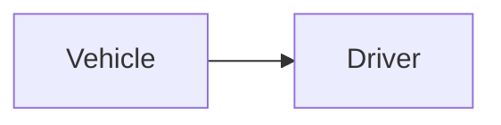

| | |
|---|---|
| Full qualified VSS Path: | `Vehicle.Driver` |
| Description: | Driver data. |

## Navigation

## Digital Auto: Playground

[playground.digital.auto](http://digital.auto) provides an in-browser, rapid prototyping environment utilizing the COVESA APIs for connected vehicles. 

| Vehicle Model | Direct link to Vehicle Signal |
|---|---|
| ACME Car (EV) v0.1 | [Vehicle.Driver](https://digitalauto.netlify.app/model/STLWzk1WyqVVLbfymb4f/cvi/list/Vehicle.Driver/) |

## Signal Information

The vehicle signal `Vehicle.Driver` is a **Branch**.

## UUID

Each vehicle signal is identified by a [Universally Unique Identifier (UUID](https://en.wikipedia.org/wiki/Universally_unique_identifier))

The UUID for `Vehicle.Driver` is `1cac57e7b7e756dc8a154eaacbce6426`

## Children

This vehicle signal is a branch or structure and thus has sub-pages:

- [Vehicle.Driver.AttentiveProbability](attentiveprobability/) (Probability of attentiveness of the driver.)
- [Vehicle.Driver.DistractionLevel](distractionlevel/) (Distraction level of the driver will be the level how much the driver is distracted, by multiple factors. E.g. Driving situation, acustical or optical signales inside the cockpit, phone calls.)
- [Vehicle.Driver.FatigueLevel](fatiguelevel/) (Fatigueness level of driver. Evaluated by multiple factors like trip time, behaviour of steering, eye status.)
- [Vehicle.Driver.HeartRate](heartrate/) (Heart rate of the driver.)
- [Vehicle.Driver.Identifier](identifier/) (Identifier attributes based on OAuth 2.0.)
- [Vehicle.Driver.IsEyesOnRoad](iseyesonroad/) (Has driver the eyes on road or not?)

## Feedback

Do you think this Vehicle Signal specification needs enhancement? Do you want to discuss with experts? Try the following ressources to get in touch with the VSS community:

| | |
|---|---|
| Enhancement request | [Create COVESA GitHub Issue](https://github.com/COVESA/vehicle_signal_specification/issues/new?body=Please+describe+your+feedback&title=Signal+feedback+Vehicle.Driver) |
| Join COVESA | [www.covesa.global](https://www.covesa.global/join?src=sidebar) |
| Discuss VSS on Slack | [w3cauto.slack.com](http://w3cauto.slack.com/) |
| VSS Data Experts on Google Groups | [covesa.global data-expert-group](https://groups.google.com/a/covesa.global/g/data-expert-group) |

## About VSS

The [Vehicle Signal Specification](https://covesa.github.io/vehicle_signal_specification/) (VSS)
is an initiative by COVESA to define a syntax and a catalog for vehicle signals.
The source code and releases can be found in the [VSS github repository](https://github.com/COVESA/vehicle_signal_specification).

