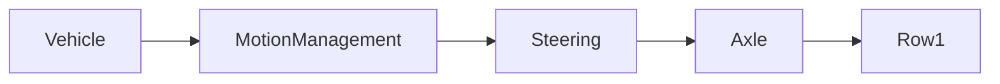

| | |
|---|---|
| Full qualified VSS Path: | `Vehicle.MotionManagement.Steering.Axle.Row1` |
| Description: | MotionManagement related to front axle. |

## Navigation

## Digital Auto: Playground

[playground.digital.auto](http://digital.auto) provides an in-browser, rapid prototyping environment utilizing the COVESA APIs for connected vehicles. 

| Vehicle Model | Direct link to Vehicle Signal |
|---|---|
| ACME Car (EV) v0.1 | [Vehicle.MotionManagement.Steering.Axle.Row1](https://digitalauto.netlify.app/model/STLWzk1WyqVVLbfymb4f/cvi/list/Vehicle.MotionManagement.Steering.Axle.Row1/) |

## Signal Information

The vehicle signal `Vehicle.MotionManagement.Steering.Axle.Row1` is a **Branch**.

## UUID

Each vehicle signal is identified by a [Universally Unique Identifier (UUID](https://en.wikipedia.org/wiki/Universally_unique_identifier))

The UUID for `Vehicle.MotionManagement.Steering.Axle.Row1` is `018d6d9d7d88521fa7e0be8a57449d16`

## Children

This vehicle signal is a branch or structure and thus has sub-pages:

- [Vehicle.MotionManagement.Steering.Axle.Row1.PositionOffsetTargetMode](positionoffsettargetmode/) (Mode used for controlling position offset interface of axle steering actuator. 0 indicates interface disabled. Other values activate vehicle specific modes.)
- [Vehicle.MotionManagement.Steering.Axle.Row1.PositionTargetMode](positiontargetmode/) (Mode used for controlling position interface of axle steering actuator. 0 indicates interface disabled. Other values activate vehicle specific modes.)
- [Vehicle.MotionManagement.Steering.Axle.Row1.RackPosition](rackposition/) (Represents the current position of the steering rack on axle steering actuator. Positive values leads to a left turn of the vehicle (based on ISO8855).)
- [Vehicle.MotionManagement.Steering.Axle.Row1.RackPositionOffsetTarget](rackpositionoffsettarget/) (Rack position offset request to the axle steering actuator (for steer-by-wire), added to the actuator internal calculated set-point. Positive values without internal calculated set point change lead to a left movement of the vehicle (based on ISO8855).)
- [Vehicle.MotionManagement.Steering.Axle.Row1.RackPositionTarget](rackpositiontarget/) (Rack position request to the axle steering actuator (external set-point). Positive values lead to a left turn of the vehicle (based on ISO8855).)
- [Vehicle.MotionManagement.Steering.Axle.Row1.SteerAngle](steerangle/) (Represents the current actuated steering angle of the steered wheels. Signal orientation according ISO8855, single track model.)
- [Vehicle.MotionManagement.Steering.Axle.Row1.SteerAngleOffsetTarget](steerangleoffsettarget/) (Steer angle offset request to the axle steering actuator (for steer-by-wire), added to the actuator internal calculated set-point. Signal orientation according ISO8855, single track model.)
- [Vehicle.MotionManagement.Steering.Axle.Row1.SteerAngleTarget](steerangletarget/) (Steer angle request to the axle steering actuator (external set-point). Signal orientation according ISO8855, single track model.)

## Feedback

Do you think this Vehicle Signal specification needs enhancement? Do you want to discuss with experts? Try the following ressources to get in touch with the VSS community:

| | |
|---|---|
| Enhancement request | [Create COVESA GitHub Issue](https://github.com/COVESA/vehicle_signal_specification/issues/new?body=Please+describe+your+feedback&title=Signal+feedback+Vehicle.MotionManagement.Steering.Axle.Row1) |
| Join COVESA | [www.covesa.global](https://www.covesa.global/join?src=sidebar) |
| Discuss VSS on Slack | [w3cauto.slack.com](http://w3cauto.slack.com/) |
| VSS Data Experts on Google Groups | [covesa.global data-expert-group](https://groups.google.com/a/covesa.global/g/data-expert-group) |

## About VSS

The [Vehicle Signal Specification](https://covesa.github.io/vehicle_signal_specification/) (VSS)
is an initiative by COVESA to define a syntax and a catalog for vehicle signals.
The source code and releases can be found in the [VSS github repository](https://github.com/COVESA/vehicle_signal_specification).

