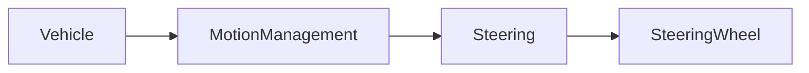

| | |
|---|---|
| Full qualified VSS Path: | `Vehicle.MotionManagement.Steering.SteeringWheel` |
| Description: | MotionManagement related to steering wheel. |

## Navigation

## Digital Auto: Playground

[playground.digital.auto](http://digital.auto) provides an in-browser, rapid prototyping environment utilizing the COVESA APIs for connected vehicles. 

| Vehicle Model | Direct link to Vehicle Signal |
|---|---|
| ACME Car (EV) v0.1 | [Vehicle.MotionManagement.Steering.SteeringWheel](https://digitalauto.netlify.app/model/STLWzk1WyqVVLbfymb4f/cvi/list/Vehicle.MotionManagement.Steering.SteeringWheel/) |

## Signal Information

The vehicle signal `Vehicle.MotionManagement.Steering.SteeringWheel` is a **Branch**.

## UUID

Each vehicle signal is identified by a [Universally Unique Identifier (UUID](https://en.wikipedia.org/wiki/Universally_unique_identifier))

The UUID for `Vehicle.MotionManagement.Steering.SteeringWheel` is `34f152e517e8594c9180d52777b83782`

## Children

This vehicle signal is a branch or structure and thus has sub-pages:

- [Vehicle.MotionManagement.Steering.SteeringWheel.Angle](angle/) (Represents the current input angle of the steering system, typically corresponds to angle applied by driver on the steering-wheel. Positive for angle in counterclockwise direction (based on ISO8855).)
- [Vehicle.MotionManagement.Steering.SteeringWheel.AngleTarget](angletarget/) (Steering-wheel angle request to the steering actuator (external set-point for steer-by-wire). Positive sign for angle in counterclockwise direction (based on ISO8855).)
- [Vehicle.MotionManagement.Steering.SteeringWheel.AngleTargetMode](angletargetmode/) (Mode used for controlling Steering-wheel angle interface. 0 indicates interface disabled. Other values activate vehicle specific modes.)
- [Vehicle.MotionManagement.Steering.SteeringWheel.Torque](torque/) (Represents the current input torque for steering system, typically corresponds to torque applied by driver on the steering wheel. Positive for torque in counterclockwise direction (based on ISO8855).)
- [Vehicle.MotionManagement.Steering.SteeringWheel.TorqueOffsetTarget](torqueoffsettarget/) (Steering-wheel torque offset request to the steering actuator, added to the actuator internal calculated target value. Positive sign for torque in counterclockwise direction (based on ISO8855).)
- [Vehicle.MotionManagement.Steering.SteeringWheel.TorqueOffsetTargetMode](torqueoffsettargetmode/) (Mode used for controlling steering-wheel torque offset interface. 0 indicates interface disabled. Other values activate vehicle specific modes.)
- [Vehicle.MotionManagement.Steering.SteeringWheel.TorqueTarget](torquetarget/) (Steering-wheel torque request to the steering actuator (external set-point for steer-by-wire). Positive sign for torque in counterclockwise direction (based on ISO8855).)
- [Vehicle.MotionManagement.Steering.SteeringWheel.TorqueTargetMode](torquetargetmode/) (Mode used for controlling Steering-wheel torque interface. 0 indicates interface disabled. Other values activate vehicle specific modes.)

## Feedback

Do you think this Vehicle Signal specification needs enhancement? Do you want to discuss with experts? Try the following ressources to get in touch with the VSS community:

| | |
|---|---|
| Enhancement request | [Create COVESA GitHub Issue](https://github.com/COVESA/vehicle_signal_specification/issues/new?body=Please+describe+your+feedback&title=Signal+feedback+Vehicle.MotionManagement.Steering.SteeringWheel) |
| Join COVESA | [www.covesa.global](https://www.covesa.global/join?src=sidebar) |
| Discuss VSS on Slack | [w3cauto.slack.com](http://w3cauto.slack.com/) |
| VSS Data Experts on Google Groups | [covesa.global data-expert-group](https://groups.google.com/a/covesa.global/g/data-expert-group) |

## About VSS

The [Vehicle Signal Specification](https://covesa.github.io/vehicle_signal_specification/) (VSS)
is an initiative by COVESA to define a syntax and a catalog for vehicle signals.
The source code and releases can be found in the [VSS github repository](https://github.com/COVESA/vehicle_signal_specification).

