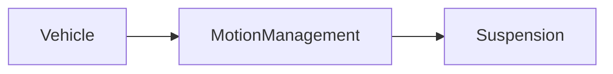

| | |
|---|---|
| Full qualified VSS Path: | `Vehicle.MotionManagement.Suspension` |
| Description: | MotionManagement related to suspension. |

## Navigation

## Digital Auto: Playground

[playground.digital.auto](http://digital.auto) provides an in-browser, rapid prototyping environment utilizing the COVESA APIs for connected vehicles. 

| Vehicle Model | Direct link to Vehicle Signal |
|---|---|
| ACME Car (EV) v0.1 | [Vehicle.MotionManagement.Suspension](https://digitalauto.netlify.app/model/STLWzk1WyqVVLbfymb4f/cvi/list/Vehicle.MotionManagement.Suspension/) |

## Signal Information

The vehicle signal `Vehicle.MotionManagement.Suspension` is a **Branch**.

## UUID

Each vehicle signal is identified by a [Universally Unique Identifier (UUID](https://en.wikipedia.org/wiki/Universally_unique_identifier))

The UUID for `Vehicle.MotionManagement.Suspension` is `e25dbc8776465914b1e87a15ffdf6df0`

## Children

This vehicle signal is a branch or structure and thus has sub-pages:

- [Vehicle.MotionManagement.Suspension.Axle](axle/) (MotionManagement for suspension for a specific axle.)
- [Vehicle.MotionManagement.Suspension.DampingPrioTarget](dampingpriotarget/) (Prioritization target for damping control 0% = damping control by damping actuator (e.g. base functions) 100% = damping control by VMM system (e.g. vehicle dynamics))
- [Vehicle.MotionManagement.Suspension.RollPrioTarget](rollpriotarget/) (Prioritization target for anti-roll control 0% = anti-roll control by anti-roll actuator (e.g. base function) 100% = anti-roll control by VMM system (e.g. vehicle dynamics))
- [Vehicle.MotionManagement.Suspension.RollTorqueDistributionFrontMaximum](rolltorquedistributionfrontmaximum/) (Maximum distribution range request of roll torque to front axle. 0% = Complete roll torque shall be shifted to rear axle 100% = Complete roll torque may be shifted to front axle)
- [Vehicle.MotionManagement.Suspension.RollTorqueDistributionFrontMinimum](rolltorquedistributionfrontminimum/) (Minimum distribution range request of roll torque to front axle. 0% = Complete roll torque may be shifted to rear axle 100% = Complete roll torque shall be shifted to front axle)
- [Vehicle.MotionManagement.Suspension.RollTorqueTarget](rolltorquetarget/) (Roll torque request on vehicle level. Signal orientation according to ISO8855.)

## Feedback

Do you think this Vehicle Signal specification needs enhancement? Do you want to discuss with experts? Try the following ressources to get in touch with the VSS community:

| | |
|---|---|
| Enhancement request | [Create COVESA GitHub Issue](https://github.com/COVESA/vehicle_signal_specification/issues/new?body=Please+describe+your+feedback&title=Signal+feedback+Vehicle.MotionManagement.Suspension) |
| Join COVESA | [www.covesa.global](https://www.covesa.global/join?src=sidebar) |
| Discuss VSS on Slack | [w3cauto.slack.com](http://w3cauto.slack.com/) |
| VSS Data Experts on Google Groups | [covesa.global data-expert-group](https://groups.google.com/a/covesa.global/g/data-expert-group) |

## About VSS

The [Vehicle Signal Specification](https://covesa.github.io/vehicle_signal_specification/) (VSS)
is an initiative by COVESA to define a syntax and a catalog for vehicle signals.
The source code and releases can be found in the [VSS github repository](https://github.com/COVESA/vehicle_signal_specification).

