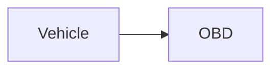

| | |
|---|---|
| Full qualified VSS Path: | `Vehicle.OBD` |
| Description: | OBD data. |

## Navigation

## Digital Auto: Playground

[playground.digital.auto](http://digital.auto) provides an in-browser, rapid prototyping environment utilizing the COVESA APIs for connected vehicles. 

| Vehicle Model | Direct link to Vehicle Signal |
|---|---|
| ACME Car (EV) v0.1 | [Vehicle.OBD](https://digitalauto.netlify.app/model/STLWzk1WyqVVLbfymb4f/cvi/list/Vehicle.OBD/) |

## Signal Information

The vehicle signal `Vehicle.OBD` is a **Branch**.

## UUID

Each vehicle signal is identified by a [Universally Unique Identifier (UUID](https://en.wikipedia.org/wiki/Universally_unique_identifier))

The UUID for `Vehicle.OBD` is `7ad7c512ed5d52c8b31944d2d47a4bc3`

## Children

This vehicle signal is a branch or structure and thus has sub-pages:

- [Vehicle.OBD.AbsoluteLoad](absoluteload/) (PID 43 - Absolute load value)
- [Vehicle.OBD.AcceleratorPositionD](acceleratorpositiond/) (PID 49 - Accelerator pedal position D)
- [Vehicle.OBD.AcceleratorPositionE](acceleratorpositione/) (PID 4A - Accelerator pedal position E)
- [Vehicle.OBD.AcceleratorPositionF](acceleratorpositionf/) (PID 4B - Accelerator pedal position F)
- [Vehicle.OBD.AirStatus](airstatus/) (PID 12 - Secondary air status)
- [Vehicle.OBD.AmbientAirTemperature](ambientairtemperature/) (PID 46 - Ambient air temperature)
- [Vehicle.OBD.BarometricPressure](barometricpressure/) (PID 33 - Barometric pressure)
- [Vehicle.OBD.Catalyst](catalyst/) (Catalyst signals)
- [Vehicle.OBD.CommandedEGR](commandedegr/) (PID 2C - Commanded exhaust gas recirculation (EGR))
- [Vehicle.OBD.CommandedEVAP](commandedevap/) (PID 2E - Commanded evaporative purge (EVAP) valve)
- [Vehicle.OBD.CommandedEquivalenceRatio](commandedequivalenceratio/) (PID 44 - Commanded equivalence ratio)
- [Vehicle.OBD.ControlModuleVoltage](controlmodulevoltage/) (PID 42 - Control module voltage)
- [Vehicle.OBD.CoolantTemperature](coolanttemperature/) (PID 05 - Coolant temperature)
- [Vehicle.OBD.DTCList](dtclist/) (List of currently active DTCs formatted according OBD II (SAE-J2012DA_201812) standard ([P|C|B|U]XXXXX ))
- [Vehicle.OBD.DistanceSinceDTCClear](distancesincedtcclear/) (PID 31 - Distance traveled since codes cleared)
- [Vehicle.OBD.DistanceWithMIL](distancewithmil/) (PID 21 - Distance traveled with MIL on)
- [Vehicle.OBD.DriveCycleStatus](drivecyclestatus/) (PID 41 - OBD status for the current drive cycle)
- [Vehicle.OBD.EGRError](egrerror/) (PID 2D - Exhaust gas recirculation (EGR) error)
- [Vehicle.OBD.EVAPVaporPressure](evapvaporpressure/) (PID 32 - Evaporative purge (EVAP) system pressure)
- [Vehicle.OBD.EVAPVaporPressureAbsolute](evapvaporpressureabsolute/) (PID 53 - Absolute evaporative purge (EVAP) system pressure)
- [Vehicle.OBD.EVAPVaporPressureAlternate](evapvaporpressurealternate/) (PID 54 - Alternate evaporative purge (EVAP) system pressure)
- [Vehicle.OBD.EngineLoad](engineload/) (PID 04 - Engine load in percent - 0 = no load, 100 = full load)
- [Vehicle.OBD.EngineSpeed](enginespeed/) (PID 0C - Engine speed measured as rotations per minute)
- [Vehicle.OBD.EthanolPercent](ethanolpercent/) (PID 52 - Percentage of ethanol in the fuel)
- [Vehicle.OBD.FreezeDTC](freezedtc/) (PID 02 - DTC that triggered the freeze frame)
- [Vehicle.OBD.FuelInjectionTiming](fuelinjectiontiming/) (PID 5D - Fuel injection timing)
- [Vehicle.OBD.FuelLevel](fuellevel/) (PID 2F - Fuel level in the fuel tank)
- [Vehicle.OBD.FuelPressure](fuelpressure/) (PID 0A - Fuel pressure)
- [Vehicle.OBD.FuelRailPressureAbsolute](fuelrailpressureabsolute/) (PID 59 - Absolute fuel rail pressure)
- [Vehicle.OBD.FuelRailPressureDirect](fuelrailpressuredirect/) (PID 23 - Fuel rail pressure direct inject)
- [Vehicle.OBD.FuelRailPressureVac](fuelrailpressurevac/) (PID 22 - Fuel rail pressure relative to vacuum)
- [Vehicle.OBD.FuelRate](fuelrate/) (PID 5E - Engine fuel rate)
- [Vehicle.OBD.FuelStatus](fuelstatus/) (PID 03 - Fuel status)
- [Vehicle.OBD.FuelType](fueltype/) (PID 51 - Fuel type)
- [Vehicle.OBD.HybridBatteryRemaining](hybridbatteryremaining/) (PID 5B - Remaining life of hybrid battery)
- [Vehicle.OBD.IntakeTemp](intaketemp/) (PID 0F - Intake temperature)
- [Vehicle.OBD.IsPTOActive](isptoactive/) (PID 1E - Auxiliary input status (power take off))
- [Vehicle.OBD.LongTermFuelTrim1](longtermfueltrim1/) (PID 07 - Long Term (learned) Fuel Trim - Bank 1 - negative percent leaner, positive percent richer)
- [Vehicle.OBD.LongTermFuelTrim2](longtermfueltrim2/) (PID 09 - Long Term (learned) Fuel Trim - Bank 2 - negative percent leaner, positive percent richer)
- [Vehicle.OBD.LongTermO2Trim1](longtermo2trim1/) (PID 56 (byte A) - Long term secondary O2 trim - Bank 1)
- [Vehicle.OBD.LongTermO2Trim2](longtermo2trim2/) (PID 58 (byte A) - Long term secondary O2 trim - Bank 2)
- [Vehicle.OBD.LongTermO2Trim3](longtermo2trim3/) (PID 56 (byte B) - Long term secondary O2 trim - Bank 3)
- [Vehicle.OBD.LongTermO2Trim4](longtermo2trim4/) (PID 58 (byte B) - Long term secondary O2 trim - Bank 4)
- [Vehicle.OBD.MAF](maf/) (PID 10 - Grams of air drawn into engine per second)
- [Vehicle.OBD.MAP](map/) (PID 0B - Intake manifold pressure)
- [Vehicle.OBD.MaxMAF](maxmaf/) (PID 50 - Maximum flow for mass air flow sensor)
- [Vehicle.OBD.O2](o2/) (Oxygen sensors (PID 14 - PID 1B))
- [Vehicle.OBD.O2WR](o2wr/) (Wide range/band oxygen sensors (PID 24 - 2B and PID 34 - 3B))
- [Vehicle.OBD.OBDStandards](obdstandards/) (PID 1C - OBD standards this vehicle conforms to)
- [Vehicle.OBD.OilTemperature](oiltemperature/) (PID 5C - Engine oil temperature)
- [Vehicle.OBD.OxygenSensorsIn2Banks](oxygensensorsin2banks/) (PID 13 - Presence of oxygen sensors in 2 banks. [A0..A3] == Bank 1, Sensors 1-4. [A4..A7] == Bank 2, Sensors 1-4)
- [Vehicle.OBD.OxygenSensorsIn4Banks](oxygensensorsin4banks/) (PID 1D - Presence of oxygen sensors in 4 banks. Similar to PID 13, but [A0..A7] == [B1S1, B1S2, B2S1, B2S2, B3S1, B3S2, B4S1, B4S2])
- [Vehicle.OBD.PidsA](pidsa/) (PID 00 - Bit array of the supported pids 01 to 20)
- [Vehicle.OBD.PidsB](pidsb/) (PID 20 - Bit array of the supported pids 21 to 40)
- [Vehicle.OBD.PidsC](pidsc/) (PID 40 - Bit array of the supported pids 41 to 60)
- [Vehicle.OBD.RelativeAcceleratorPosition](relativeacceleratorposition/) (PID 5A - Relative accelerator pedal position)
- [Vehicle.OBD.RelativeThrottlePosition](relativethrottleposition/) (PID 45 - Relative throttle position)
- [Vehicle.OBD.RunTime](runtime/) (PID 1F - Engine run time)
- [Vehicle.OBD.RunTimeMIL](runtimemil/) (PID 4D - Run time with MIL on)
- [Vehicle.OBD.ShortTermFuelTrim1](shorttermfueltrim1/) (PID 06 - Short Term (immediate) Fuel Trim - Bank 1 - negative percent leaner, positive percent richer)
- [Vehicle.OBD.ShortTermFuelTrim2](shorttermfueltrim2/) (PID 08 - Short Term (immediate) Fuel Trim - Bank 2 - negative percent leaner, positive percent richer)
- [Vehicle.OBD.ShortTermO2Trim1](shorttermo2trim1/) (PID 55 (byte A) - Short term secondary O2 trim - Bank 1)
- [Vehicle.OBD.ShortTermO2Trim2](shorttermo2trim2/) (PID 57 (byte A) - Short term secondary O2 trim - Bank 2)
- [Vehicle.OBD.ShortTermO2Trim3](shorttermo2trim3/) (PID 55 (byte B) - Short term secondary O2 trim - Bank 3)
- [Vehicle.OBD.ShortTermO2Trim4](shorttermo2trim4/) (PID 57 (byte B) - Short term secondary O2 trim - Bank 4)
- [Vehicle.OBD.Speed](speed/) (PID 0D - Vehicle speed)
- [Vehicle.OBD.Status](status/) (PID 01 - OBD status)
- [Vehicle.OBD.ThrottleActuator](throttleactuator/) (PID 4C - Commanded throttle actuator)
- [Vehicle.OBD.ThrottlePosition](throttleposition/) (PID 11 - Throttle position - 0 = closed throttle, 100 = open throttle)
- [Vehicle.OBD.ThrottlePositionB](throttlepositionb/) (PID 47 - Absolute throttle position B)
- [Vehicle.OBD.ThrottlePositionC](throttlepositionc/) (PID 48 - Absolute throttle position C)
- [Vehicle.OBD.TimeSinceDTCCleared](timesincedtccleared/) (PID 4E - Time since trouble codes cleared)
- [Vehicle.OBD.TimingAdvance](timingadvance/) (PID 0E - Time advance)
- [Vehicle.OBD.WarmupsSinceDTCClear](warmupssincedtcclear/) (PID 30 - Number of warm-ups since codes cleared)

## Feedback

Do you think this Vehicle Signal specification needs enhancement? Do you want to discuss with experts? Try the following ressources to get in touch with the VSS community:

| | |
|---|---|
| Enhancement request | [Create COVESA GitHub Issue](https://github.com/COVESA/vehicle_signal_specification/issues/new?body=Please+describe+your+feedback&title=Signal+feedback+Vehicle.OBD) |
| Join COVESA | [www.covesa.global](https://www.covesa.global/join?src=sidebar) |
| Discuss VSS on Slack | [w3cauto.slack.com](http://w3cauto.slack.com/) |
| VSS Data Experts on Google Groups | [covesa.global data-expert-group](https://groups.google.com/a/covesa.global/g/data-expert-group) |

## About VSS

The [Vehicle Signal Specification](https://covesa.github.io/vehicle_signal_specification/) (VSS)
is an initiative by COVESA to define a syntax and a catalog for vehicle signals.
The source code and releases can be found in the [VSS github repository](https://github.com/COVESA/vehicle_signal_specification).

