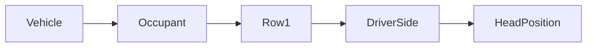

| | |
|---|---|
| Full qualified VSS Path: | `Vehicle.Occupant.Row1.DriverSide.HeadPosition` |
| Description: | The current position of the driver head on vehicle axis according to ISO 23150:2023. |

## Navigation

## Digital Auto: Playground

[playground.digital.auto](http://digital.auto) provides an in-browser, rapid prototyping environment utilizing the COVESA APIs for connected vehicles. 

| Vehicle Model | Direct link to Vehicle Signal |
|---|---|
| ACME Car (EV) v0.1 | [Vehicle.Occupant.Row1.DriverSide.HeadPosition](https://digitalauto.netlify.app/model/STLWzk1WyqVVLbfymb4f/cvi/list/Vehicle.Occupant.Row1.DriverSide.HeadPosition/) |

## Signal Information

The vehicle signal `Vehicle.Occupant.Row1.DriverSide.HeadPosition` is a **Branch**.

## UUID

Each vehicle signal is identified by a [Universally Unique Identifier (UUID](https://en.wikipedia.org/wiki/Universally_unique_identifier))

The UUID for `Vehicle.Occupant.Row1.DriverSide.HeadPosition` is `4f780854e0205d8ab0347b1a00b45513`

## Children

This vehicle signal is a branch or structure and thus has sub-pages:

- [Vehicle.Occupant.Row1.DriverSide.HeadPosition.Pitch](pitch/) (Head pitch angle, measured as angle from vehicle sprung mass XY-plane as defined by ISO 23150:2023 to the head X-axis. 0 = Head in normal position. Positive values = Head leaning up. Negative values = Head leaning down.)
- [Vehicle.Occupant.Row1.DriverSide.HeadPosition.Roll](roll/) (Head roll angle about the head X-axis (right-hand rule). 0 = Head in normal position. Positive values = Head leaning to the right. Negative values = Head leaning to the left.)
- [Vehicle.Occupant.Row1.DriverSide.HeadPosition.X](x/) (Longitudinal position of head center measured as mid eye position on X-axis of the vehicle rear-axle coordinate system as defined by ISO 23150:2023 section 3.7.12 Mid eye position refers to the center of a line drawn between the center of the drivers eyes. Positive values = forward of (first) rear-axle. Negative values = backward of (first) rear-axle.)
- [Vehicle.Occupant.Row1.DriverSide.HeadPosition.Y](y/) (Lateral position of head center measured as mid eye position on X-axis of the vehicle rear-axle coordinate system as defined by ISO 23150:2023 section 3.7.12 Mid eye position refers to the center of a line drawn between the center of the drivers eyes. Positive values = left of rear-axle center. Negative values = right of rear-axle center.)
- [Vehicle.Occupant.Row1.DriverSide.HeadPosition.Yaw](yaw/) (Head yaw angle, measured from the vehicle sprung mass X-axis as defined by ISO 23150:2023 to the head X-axis, around the vehicle Z-axis (right-hand rule). 0 = Head in normal position. Positive values = Head turned left. Negative values = Head turned right.)
- [Vehicle.Occupant.Row1.DriverSide.HeadPosition.Z](z/) (Height position of head center measured as mid eye position on X-axis of the vehicle rear-axle coordinate system as defined by ISO 23150:2023 section 3.7.12 Mid eye position refers to the center of a line drawn between the center of the drivers eyes. Positive values = above center of rear-axle reference point. Negative values = below center of rear-axle reference point.)

## Feedback

Do you think this Vehicle Signal specification needs enhancement? Do you want to discuss with experts? Try the following ressources to get in touch with the VSS community:

| | |
|---|---|
| Enhancement request | [Create COVESA GitHub Issue](https://github.com/COVESA/vehicle_signal_specification/issues/new?body=Please+describe+your+feedback&title=Signal+feedback+Vehicle.Occupant.Row1.DriverSide.HeadPosition) |
| Join COVESA | [www.covesa.global](https://www.covesa.global/join?src=sidebar) |
| Discuss VSS on Slack | [w3cauto.slack.com](http://w3cauto.slack.com/) |
| VSS Data Experts on Google Groups | [covesa.global data-expert-group](https://groups.google.com/a/covesa.global/g/data-expert-group) |

## About VSS

The [Vehicle Signal Specification](https://covesa.github.io/vehicle_signal_specification/) (VSS)
is an initiative by COVESA to define a syntax and a catalog for vehicle signals.
The source code and releases can be found in the [VSS github repository](https://github.com/COVESA/vehicle_signal_specification).

