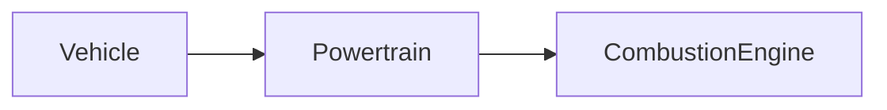

| | |
|---|---|
| Full qualified VSS Path: | `Vehicle.Powertrain.CombustionEngine` |
| Description: | Engine-specific data, stopping at the bell housing. |

## Navigation

## Digital Auto: Playground

[playground.digital.auto](http://digital.auto) provides an in-browser, rapid prototyping environment utilizing the COVESA APIs for connected vehicles. 

| Vehicle Model | Direct link to Vehicle Signal |
|---|---|
| ACME Car (EV) v0.1 | [Vehicle.Powertrain.CombustionEngine](https://digitalauto.netlify.app/model/STLWzk1WyqVVLbfymb4f/cvi/list/Vehicle.Powertrain.CombustionEngine/) |

## Signal Information

The vehicle signal `Vehicle.Powertrain.CombustionEngine` is a **Branch**.

## UUID

Each vehicle signal is identified by a [Universally Unique Identifier (UUID](https://en.wikipedia.org/wiki/Universally_unique_identifier))

The UUID for `Vehicle.Powertrain.CombustionEngine` is `159e2e3e75f0590f95b4d2f6cfae54b5`

## Children

This vehicle signal is a branch or structure and thus has sub-pages:

- [Vehicle.Powertrain.CombustionEngine.AspirationType](aspirationtype/) (Type of aspiration (natural, turbocharger, supercharger etc).)
- [Vehicle.Powertrain.CombustionEngine.Bore](bore/) (Bore in millimetres.)
- [Vehicle.Powertrain.CombustionEngine.CompressionRatio](compressionratio/) (Engine compression ratio, specified in the format 'X:1', e.g. '9.2:1'.)
- [Vehicle.Powertrain.CombustionEngine.Configuration](configuration/) (Engine configuration.)
- [Vehicle.Powertrain.CombustionEngine.DieselExhaustFluid](dieselexhaustfluid/) (Signals related to Diesel Exhaust Fluid (DEF). DEF is called AUS32 in ISO 22241.)
- [Vehicle.Powertrain.CombustionEngine.DieselParticulateFilter](dieselparticulatefilter/) (Diesel Particulate Filter signals.)
- [Vehicle.Powertrain.CombustionEngine.Displacement](displacement/) (Displacement in cubic centimetres.)
- [Vehicle.Powertrain.CombustionEngine.ECT](ect/) (Engine coolant temperature.)
- [Vehicle.Powertrain.CombustionEngine.EOP](eop/) (Engine oil pressure.)
- [Vehicle.Powertrain.CombustionEngine.EOT](eot/) (Engine oil temperature.)
- [Vehicle.Powertrain.CombustionEngine.EngineCode](enginecode/) (Engine code designation, as specified by vehicle manufacturer.)
- [Vehicle.Powertrain.CombustionEngine.EngineCoolantCapacity](enginecoolantcapacity/) (Engine coolant capacity in liters.)
- [Vehicle.Powertrain.CombustionEngine.EngineHours](enginehours/) (Accumulated time during engine lifetime with 'engine speed (rpm) > 0'.)
- [Vehicle.Powertrain.CombustionEngine.EngineOilCapacity](engineoilcapacity/) (Engine oil capacity in liters.)
- [Vehicle.Powertrain.CombustionEngine.EngineOilLevel](engineoillevel/) (Engine oil level.)
- [Vehicle.Powertrain.CombustionEngine.IdleHours](idlehours/) (Accumulated idling time during engine lifetime. Definition of idling is not standardized.)
- [Vehicle.Powertrain.CombustionEngine.IsRunning](isrunning/) (Engine Running. True if engine is rotating (Speed > 0).)
- [Vehicle.Powertrain.CombustionEngine.MAF](maf/) (Grams of air drawn into engine per second.)
- [Vehicle.Powertrain.CombustionEngine.MAP](map/) (Manifold absolute pressure possibly boosted using forced induction.)
- [Vehicle.Powertrain.CombustionEngine.MaxPower](maxpower/) (Peak power, in kilowatts, that engine can generate.)
- [Vehicle.Powertrain.CombustionEngine.MaxTorque](maxtorque/) (Peak torque, in newton meter, that the engine can generate.)
- [Vehicle.Powertrain.CombustionEngine.NumberOfCylinders](numberofcylinders/) (Number of cylinders.)
- [Vehicle.Powertrain.CombustionEngine.NumberOfValvesPerCylinder](numberofvalvespercylinder/) (Number of valves per cylinder.)
- [Vehicle.Powertrain.CombustionEngine.OilLifeRemaining](oilliferemaining/) (Remaining engine oil life in seconds. Negative values can be used to indicate that lifetime has been exceeded.)
- [Vehicle.Powertrain.CombustionEngine.Power](power/) (Current engine power output. Shall be reported as 0 during engine breaking.)
- [Vehicle.Powertrain.CombustionEngine.Speed](speed/) (Engine speed measured as rotations per minute.)
- [Vehicle.Powertrain.CombustionEngine.StrokeLength](strokelength/) (Stroke length in millimetres.)
- [Vehicle.Powertrain.CombustionEngine.TPS](tps/) (Current throttle position.)
- [Vehicle.Powertrain.CombustionEngine.Torque](torque/) (Current engine torque. Shall be reported as 0 during engine breaking.)

## Feedback

Do you think this Vehicle Signal specification needs enhancement? Do you want to discuss with experts? Try the following ressources to get in touch with the VSS community:

| | |
|---|---|
| Enhancement request | [Create COVESA GitHub Issue](https://github.com/COVESA/vehicle_signal_specification/issues/new?body=Please+describe+your+feedback&title=Signal+feedback+Vehicle.Powertrain.CombustionEngine) |
| Join COVESA | [www.covesa.global](https://www.covesa.global/join?src=sidebar) |
| Discuss VSS on Slack | [w3cauto.slack.com](http://w3cauto.slack.com/) |
| VSS Data Experts on Google Groups | [covesa.global data-expert-group](https://groups.google.com/a/covesa.global/g/data-expert-group) |

## About VSS

The [Vehicle Signal Specification](https://covesa.github.io/vehicle_signal_specification/) (VSS)
is an initiative by COVESA to define a syntax and a catalog for vehicle signals.
The source code and releases can be found in the [VSS github repository](https://github.com/COVESA/vehicle_signal_specification).

