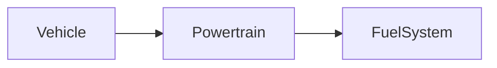

| | |
|---|---|
| Full qualified VSS Path: | `Vehicle.Powertrain.FuelSystem` |
| Description: | Fuel system data. |

## Navigation

## Digital Auto: Playground

[playground.digital.auto](http://digital.auto) provides an in-browser, rapid prototyping environment utilizing the COVESA APIs for connected vehicles. 

| Vehicle Model | Direct link to Vehicle Signal |
|---|---|
| ACME Car (EV) v0.1 | [Vehicle.Powertrain.FuelSystem](https://digitalauto.netlify.app/model/STLWzk1WyqVVLbfymb4f/cvi/list/Vehicle.Powertrain.FuelSystem/) |

## Signal Information

The vehicle signal `Vehicle.Powertrain.FuelSystem` is a **Branch**.

## UUID

Each vehicle signal is identified by a [Universally Unique Identifier (UUID](https://en.wikipedia.org/wiki/Universally_unique_identifier))

The UUID for `Vehicle.Powertrain.FuelSystem` is `dbc194a7f97d5a56bc8942c17c2db22e`

## Children

This vehicle signal is a branch or structure and thus has sub-pages:

- [Vehicle.Powertrain.FuelSystem.AverageConsumption](averageconsumption/) (Average consumption in liters per 100 km.)
- [Vehicle.Powertrain.FuelSystem.ConsumptionSinceStart](consumptionsincestart/) (Fuel amount in liters consumed since start of current trip.)
- [Vehicle.Powertrain.FuelSystem.HybridType](hybridtype/) (Defines the hybrid type of the vehicle.)
- [Vehicle.Powertrain.FuelSystem.InstantConsumption](instantconsumption/) (Current consumption in liters per 100 km.)
- [Vehicle.Powertrain.FuelSystem.IsEngineStopStartEnabled](isenginestopstartenabled/) (Indicates whether eco start stop is currently enabled.)
- [Vehicle.Powertrain.FuelSystem.IsFuelLevelLow](isfuellevellow/) (Indicates that the fuel level is low (e.g. <50km range).)
- [Vehicle.Powertrain.FuelSystem.Level](level/) (Level in fuel tank as percent of capacity. 0 = empty. 100 = full.)
- [Vehicle.Powertrain.FuelSystem.Range](range/) (Remaining range in meters using only liquid fuel.)
- [Vehicle.Powertrain.FuelSystem.SupportedFuel](supportedfuel/) (Detailed information on fuels supported by the vehicle. Identifiers originating from DIN EN 16942:2021-08, appendix B, with additional suffix for octane (RON) where relevant.)
- [Vehicle.Powertrain.FuelSystem.SupportedFuelTypes](supportedfueltypes/) (High level information of fuel types supported)
- [Vehicle.Powertrain.FuelSystem.TankCapacity](tankcapacity/) (Capacity of the fuel tank in liters.)
- [Vehicle.Powertrain.FuelSystem.TimeSinceStart](timesincestart/) (Time in seconds elapsed since start of current trip.)

## Feedback

Do you think this Vehicle Signal specification needs enhancement? Do you want to discuss with experts? Try the following ressources to get in touch with the VSS community:

| | |
|---|---|
| Enhancement request | [Create COVESA GitHub Issue](https://github.com/COVESA/vehicle_signal_specification/issues/new?body=Please+describe+your+feedback&title=Signal+feedback+Vehicle.Powertrain.FuelSystem) |
| Join COVESA | [www.covesa.global](https://www.covesa.global/join?src=sidebar) |
| Discuss VSS on Slack | [w3cauto.slack.com](http://w3cauto.slack.com/) |
| VSS Data Experts on Google Groups | [covesa.global data-expert-group](https://groups.google.com/a/covesa.global/g/data-expert-group) |

## About VSS

The [Vehicle Signal Specification](https://covesa.github.io/vehicle_signal_specification/) (VSS)
is an initiative by COVESA to define a syntax and a catalog for vehicle signals.
The source code and releases can be found in the [VSS github repository](https://github.com/COVESA/vehicle_signal_specification).

