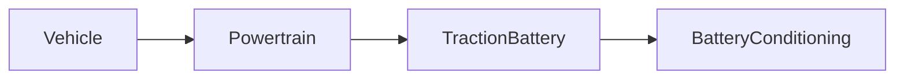

| | |
|---|---|
| Full qualified VSS Path: | `Vehicle.Powertrain.TractionBattery.BatteryConditioning` |
| Description: | Properties related to preparing the vehicle battery for charging or driving. |

## Navigation

## Digital Auto: Playground

[playground.digital.auto](http://digital.auto) provides an in-browser, rapid prototyping environment utilizing the COVESA APIs for connected vehicles. 

| Vehicle Model | Direct link to Vehicle Signal |
|---|---|
| ACME Car (EV) v0.1 | [Vehicle.Powertrain.TractionBattery.BatteryConditioning](https://digitalauto.netlify.app/model/STLWzk1WyqVVLbfymb4f/cvi/list/Vehicle.Powertrain.TractionBattery.BatteryConditioning/) |

## Signal Information

The vehicle signal `Vehicle.Powertrain.TractionBattery.BatteryConditioning` is a **Branch**.

## UUID

Each vehicle signal is identified by a [Universally Unique Identifier (UUID](https://en.wikipedia.org/wiki/Universally_unique_identifier))

The UUID for `Vehicle.Powertrain.TractionBattery.BatteryConditioning` is `3da3ed2e9690563da6000ca209af4a79`

## Children

This vehicle signal is a branch or structure and thus has sub-pages:

- [Vehicle.Powertrain.TractionBattery.BatteryConditioning.IsActive](isactive/) (Indicates if battery conditioning is active (i.e. actively monitors battery temperature). True = Active. False = Inactive.)
- [Vehicle.Powertrain.TractionBattery.BatteryConditioning.IsOngoing](isongoing/) (Indicating if battery conditioning is currently ongoing. Battery conditioning is considered ongoing when the battery conditioning system is actively heating or cooling the battery, or requesting heating or cooling.)
- [Vehicle.Powertrain.TractionBattery.BatteryConditioning.RequestedMode](requestedmode/) (Defines requested mode for battery conditioning. INACTIVE - Battery conditioning inactive. FAST_CHARGING_PREPARATION - Battery conditioning for fast charging. DRIVING_PREPARATION - Battery conditioning for driving.)
- [Vehicle.Powertrain.TractionBattery.BatteryConditioning.StartTime](starttime/) (Start time for battery conditioning, formatted according to ISO 8601 with UTC time zone.)
- [Vehicle.Powertrain.TractionBattery.BatteryConditioning.TargetTemperature](targettemperature/) (Target temperature for battery conditioning.)
- [Vehicle.Powertrain.TractionBattery.BatteryConditioning.TargetTime](targettime/) (Target time when conditioning shall be finished, formatted according to ISO 8601 with UTC time zone.)

## Feedback

Do you think this Vehicle Signal specification needs enhancement? Do you want to discuss with experts? Try the following ressources to get in touch with the VSS community:

| | |
|---|---|
| Enhancement request | [Create COVESA GitHub Issue](https://github.com/COVESA/vehicle_signal_specification/issues/new?body=Please+describe+your+feedback&title=Signal+feedback+Vehicle.Powertrain.TractionBattery.BatteryConditioning) |
| Join COVESA | [www.covesa.global](https://www.covesa.global/join?src=sidebar) |
| Discuss VSS on Slack | [w3cauto.slack.com](http://w3cauto.slack.com/) |
| VSS Data Experts on Google Groups | [covesa.global data-expert-group](https://groups.google.com/a/covesa.global/g/data-expert-group) |

## About VSS

The [Vehicle Signal Specification](https://covesa.github.io/vehicle_signal_specification/) (VSS)
is an initiative by COVESA to define a syntax and a catalog for vehicle signals.
The source code and releases can be found in the [VSS github repository](https://github.com/COVESA/vehicle_signal_specification).

