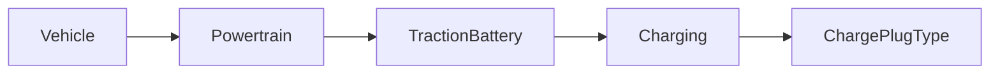

| | |
|---|---|
| Full qualified VSS Path: | `Vehicle.Powertrain.TractionBattery.Charging.ChargePlugType` |
| Description: | Type of charge plug (charging inlet) available on the vehicle. IEC types refer to IEC 62196,  GBT refers to  GB/T 20234. |
| Comment: | A vehicle may have multiple charging inlets. IEC_TYPE_1_AC refers to Type 1 as defined in IEC 62196-2. Also known as Yazaki or J1772 connector. IEC_TYPE_2_AC refers to Type 2 as defined in IEC 62196-2. Also known as Mennekes connector. IEC_TYPE_3_AC refers to Type 3 as defined in IEC 62196-2. Also known as Scame connector. IEC_TYPE_4_DC refers to AA configuration as defined in IEC 62196-3. Also known as Type 4 or CHAdeMO connector. IEC_TYPE_1_CCS_DC refers to EE Configuration as defined in IEC 62196-3. Also known as CCS1 or Combo1 connector. IEC_TYPE_2_CCS_DC refers to FF Configuration as defined in IEC 62196-3. Also known as CCS2 or Combo2 connector. TESLA_ROADSTER, TESLA_HPWC (High Power Wall Connector) and TESLA_SUPERCHARGER refer to non-standardized charging inlets/methods used by Tesla. GBT_AC refers to connector specified in GB/T 20234.2. GBT_DC refers to connector specified in GB/T 20234.3. Also specified as BB Configuration in IEC 62196-3. OTHER shall be used if the vehicle has a charging connector, but not one of the connectors listed above. For additional information see https://en.wikipedia.org/wiki/IEC_62196. |

## Navigation



## Eclipse Leda: Usage Example

In [Eclipse Kuksa.VAL Databroker](https://github.com/eclipse/kuksa.val/tree/master/kuksa_databroker) CLI:


```bash
$ databroker-cli
sdv.databroker.v1 > connect
[connect] OK
sdv.databroker.v1 > get Vehicle.Powertrain.TractionBattery.Charging.ChargePlugType
[get]  OK
Vehicle.Powertrain.TractionBattery.Charging.ChargePlugType: ( NotAvailable )
sdv.databroker.v1 > set Vehicle.Powertrain.TractionBattery.Charging.ChargePlugType 0
[set]  OK
```

## Digital Auto: Playground

[playground.digital.auto](http://digital.auto) provides an in-browser, rapid prototyping environment utilizing the COVESA APIs for connected vehicles. 

| Vehicle Model | Direct link to Vehicle Signal |
|---|---|
| ACME Car (EV) v0.1 | [Vehicle.Powertrain.TractionBattery.Charging.ChargePlugType](https://digitalauto.netlify.app/model/STLWzk1WyqVVLbfymb4f/cvi/list/Vehicle.Powertrain.TractionBattery.Charging.ChargePlugType/) |

## Data Type & Unit

| | | |
|---|---|---|
| Path | `Vehicle.Powertrain.TractionBattery.Charging.ChargePlugType` | [VSS: Addressing nodes](https://covesa.github.io/vehicle_signal_specification/rule_set/basics/) |
| Data type | `string[]` | [VSS: Datatypes](https://covesa.github.io/vehicle_signal_specification/rule_set/data_entry/data_types/) |
| Allowed values | `['IEC_TYPE_1_AC', 'IEC_TYPE_2_AC', 'IEC_TYPE_3_AC', 'IEC_TYPE_4_DC', 'IEC_TYPE_1_CCS_DC', 'IEC_TYPE_2_CCS_DC', 'TESLA_ROADSTER', 'TESLA_HPWC', 'TESLA_SUPERCHARGER', 'GBT_AC', 'GBT_DC', 'OTHER']` | [VSS: Specifying allowed values](https://covesa.github.io/vehicle_signal_specification/rule_set/data_entry/allowed/) |


## Signal Information


The vehicle signal `Vehicle.Powertrain.TractionBattery.Charging.ChargePlugType` is an **Attribute**.


The vehicle signal `Vehicle.Powertrain.TractionBattery.Charging.ChargePlugType` is a **Signal**.


## UUID

Each vehicle signal is identified by a [Universally Unique Identifier (UUID](https://en.wikipedia.org/wiki/Universally_unique_identifier))

The UUID for `Vehicle.Powertrain.TractionBattery.Charging.ChargePlugType` is `4c56357a6f1d586395215a9beeb26d91`


## Feedback

Do you think this Vehicle Signal specification needs enhancement? Do you want to discuss with experts? Try the following ressources to get in touch with the VSS community:

| | |
|---|---|
| Enhancement request | [Create COVESA GitHub Issue](https://github.com/COVESA/vehicle_signal_specification/issues/new?body=Please+describe+your+feedback&title=Signal+feedback+Vehicle.Powertrain.TractionBattery.Charging.ChargePlugType) |
| Join COVESA | [www.covesa.global](https://www.covesa.global/join?src=sidebar) |
| Discuss VSS on Slack | [w3cauto.slack.com](http://w3cauto.slack.com/) |
| VSS Data Experts on Google Groups | [covesa.global data-expert-group](https://groups.google.com/a/covesa.global/g/data-expert-group) |

## About VSS

The [Vehicle Signal Specification](https://covesa.github.io/vehicle_signal_specification/) (VSS)
is an initiative by COVESA to define a syntax and a catalog for vehicle signals.
The source code and releases can be found in the [VSS github repository](https://github.com/COVESA/vehicle_signal_specification).

## Supported datatypes

The following is a list of VSS supported built-in datatypes:

Name       | Type                       | Min  | Max
:----------|:---------------------------|:-----|:---
uint8      | unsigned 8-bit integer     | 0    | 255
int8       | signed 8-bit integer       | -128 | 127
uint16     | unsigned 16-bit integer    |  0   | 65535
int16      | signed 16-bit integer      | -32768 | 32767
uint32     | unsigned 32-bit integer    | 0 | 4294967295
int32      | signed 32-bit integer      | -2147483648 | 2147483647
uint64     | unsigned 64-bit integer    | 0    | 2^64 - 1
int64      | signed 64-bit integer      | -2^63 | 2^63 - 1
boolean    | boolean value              | 0/false | 1/true
float      | floating point number      | -3.4e -38 | 3.4e 38
double     | double precision floating point number | -1.7e -300 | 1.7e 300
string     | character string           | n/a  | n/a

> Min, max and default values defined in a Vehicle Signal Specification must be in the supported range of the data type.
