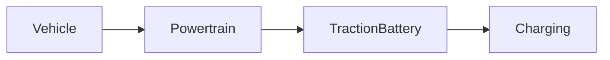

| | |
|---|---|
| Full qualified VSS Path: | `Vehicle.Powertrain.TractionBattery.Charging` |
| Description: | Properties related to battery charging. |

## Navigation

## Digital Auto: Playground

[playground.digital.auto](http://digital.auto) provides an in-browser, rapid prototyping environment utilizing the COVESA APIs for connected vehicles. 

| Vehicle Model | Direct link to Vehicle Signal |
|---|---|
| ACME Car (EV) v0.1 | [Vehicle.Powertrain.TractionBattery.Charging](https://digitalauto.netlify.app/model/STLWzk1WyqVVLbfymb4f/cvi/list/Vehicle.Powertrain.TractionBattery.Charging/) |

## Signal Information

The vehicle signal `Vehicle.Powertrain.TractionBattery.Charging` is a **Branch**.

## UUID

Each vehicle signal is identified by a [Universally Unique Identifier (UUID](https://en.wikipedia.org/wiki/Universally_unique_identifier))

The UUID for `Vehicle.Powertrain.TractionBattery.Charging` is `49b9ef0c8b145a36afdf17d0cb44131b`

## Children

This vehicle signal is a branch or structure and thus has sub-pages:

- [Vehicle.Powertrain.TractionBattery.Charging.ChargeCurrent](chargecurrent/) (Current charging current.)
- [Vehicle.Powertrain.TractionBattery.Charging.ChargeLimit](chargelimit/) (Target charge limit (state of charge) for battery.)
- [Vehicle.Powertrain.TractionBattery.Charging.ChargePlugType](chargeplugtype/) (Type of charge plug (charging inlet) available on the vehicle. IEC types refer to IEC 62196,  GBT refers to  GB/T 20234.)
- [Vehicle.Powertrain.TractionBattery.Charging.ChargePortFlap](chargeportflap/) (Status of the charge port cover, can potentially be controlled manually.)
- [Vehicle.Powertrain.TractionBattery.Charging.ChargeRate](chargerate/) (Current charging rate, as in kilometers of range added per hour.)
- [Vehicle.Powertrain.TractionBattery.Charging.ChargeVoltage](chargevoltage/) (Current charging voltage, as measured at the charging inlet.)
- [Vehicle.Powertrain.TractionBattery.Charging.IsCharging](ischarging/) (True if charging is ongoing. Charging is considered to be ongoing if energy is flowing from charger to vehicle.)
- [Vehicle.Powertrain.TractionBattery.Charging.IsChargingCableConnected](ischargingcableconnected/) (Indicates if a charging cable is physically connected to the vehicle or not.)
- [Vehicle.Powertrain.TractionBattery.Charging.IsChargingCableLocked](ischargingcablelocked/) (Is charging cable locked to prevent removal.)
- [Vehicle.Powertrain.TractionBattery.Charging.IsDischarging](isdischarging/) (True if discharging (vehicle to grid) is ongoing. Discharging is considered to be ongoing if energy is flowing from vehicle to charger/grid.)
- [Vehicle.Powertrain.TractionBattery.Charging.MaximumChargingCurrent](maximumchargingcurrent/) (Maximum charging current that can be accepted by the system, as measured at the charging inlet.)
- [Vehicle.Powertrain.TractionBattery.Charging.Mode](mode/) (Control of the charge process. MANUAL means manually initiated (plug-in event, companion app, etc). TIMER means timer-based. GRID means grid-controlled (eg ISO 15118). PROFILE means controlled by profile download to vehicle.)
- [Vehicle.Powertrain.TractionBattery.Charging.PowerLoss](powerloss/) (Electrical energy lost by power dissipation to heat inside the AC/DC converter.)
- [Vehicle.Powertrain.TractionBattery.Charging.StartStopCharging](startstopcharging/) (Start or stop the charging process.)
- [Vehicle.Powertrain.TractionBattery.Charging.Temperature](temperature/) (Current temperature of AC/DC converter converting grid voltage to battery voltage.)
- [Vehicle.Powertrain.TractionBattery.Charging.TimeToComplete](timetocomplete/) (The time needed for the current charging process to reach Charging.ChargeLimit. 0 if charging is complete or no charging process is active or planned.)
- [Vehicle.Powertrain.TractionBattery.Charging.Timer](timer/) (Properties related to timing of battery charging sessions.)

## Feedback

Do you think this Vehicle Signal specification needs enhancement? Do you want to discuss with experts? Try the following ressources to get in touch with the VSS community:

| | |
|---|---|
| Enhancement request | [Create COVESA GitHub Issue](https://github.com/COVESA/vehicle_signal_specification/issues/new?body=Please+describe+your+feedback&title=Signal+feedback+Vehicle.Powertrain.TractionBattery.Charging) |
| Join COVESA | [www.covesa.global](https://www.covesa.global/join?src=sidebar) |
| Discuss VSS on Slack | [w3cauto.slack.com](http://w3cauto.slack.com/) |
| VSS Data Experts on Google Groups | [covesa.global data-expert-group](https://groups.google.com/a/covesa.global/g/data-expert-group) |

## About VSS

The [Vehicle Signal Specification](https://covesa.github.io/vehicle_signal_specification/) (VSS)
is an initiative by COVESA to define a syntax and a catalog for vehicle signals.
The source code and releases can be found in the [VSS github repository](https://github.com/COVESA/vehicle_signal_specification).

