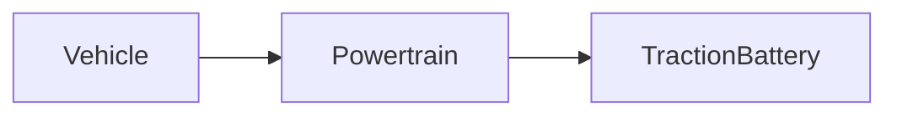

| | |
|---|---|
| Full qualified VSS Path: | `Vehicle.Powertrain.TractionBattery` |
| Description: | Battery Management data. |

## Navigation

## Digital Auto: Playground

[playground.digital.auto](http://digital.auto) provides an in-browser, rapid prototyping environment utilizing the COVESA APIs for connected vehicles. 

| Vehicle Model | Direct link to Vehicle Signal |
|---|---|
| ACME Car (EV) v0.1 | [Vehicle.Powertrain.TractionBattery](https://digitalauto.netlify.app/model/STLWzk1WyqVVLbfymb4f/cvi/list/Vehicle.Powertrain.TractionBattery/) |

## Signal Information

The vehicle signal `Vehicle.Powertrain.TractionBattery` is a **Branch**.

## UUID

Each vehicle signal is identified by a [Universally Unique Identifier (UUID](https://en.wikipedia.org/wiki/Universally_unique_identifier))

The UUID for `Vehicle.Powertrain.TractionBattery` is `1a2515d1a8875d86873431194ade2b50`

## Children

This vehicle signal is a branch or structure and thus has sub-pages:

- [Vehicle.Powertrain.TractionBattery.AccumulatedChargedEnergy](accumulatedchargedenergy/) (The accumulated energy delivered to the battery during charging over lifetime of the battery.)
- [Vehicle.Powertrain.TractionBattery.AccumulatedChargedThroughput](accumulatedchargedthroughput/) (The accumulated charge throughput delivered to the battery during charging over lifetime of the battery.)
- [Vehicle.Powertrain.TractionBattery.AccumulatedConsumedEnergy](accumulatedconsumedenergy/) (The accumulated energy leaving HV battery for propulsion and auxiliary loads over lifetime of the battery.)
- [Vehicle.Powertrain.TractionBattery.AccumulatedConsumedThroughput](accumulatedconsumedthroughput/) (The accumulated charge throughput leaving HV battery for propulsion and auxiliary loads over lifetime of the battery.)
- [Vehicle.Powertrain.TractionBattery.Charging](charging/) (Properties related to battery charging.)
- [Vehicle.Powertrain.TractionBattery.CurrentCurrent](currentcurrent/) (Current current flowing in/out of battery. Positive = Current flowing in to battery, e.g. during charging. Negative = Current flowing out of battery, e.g. during driving.)
- [Vehicle.Powertrain.TractionBattery.CurrentPower](currentpower/) (Current electrical energy flowing in/out of battery. Positive = Energy flowing in to battery, e.g. during charging. Negative = Energy flowing out of battery, e.g. during driving.)
- [Vehicle.Powertrain.TractionBattery.CurrentVoltage](currentvoltage/) (Current Voltage of the battery.)
- [Vehicle.Powertrain.TractionBattery.DCDC](dcdc/) (Properties related to DC/DC converter converting high voltage (from high voltage battery) to vehicle low voltage (supply voltage, typically 12 Volts).)
- [Vehicle.Powertrain.TractionBattery.GrossCapacity](grosscapacity/) (Gross capacity of the battery.)
- [Vehicle.Powertrain.TractionBattery.Id](id/) (Battery Identification Number as assigned by OEM.)
- [Vehicle.Powertrain.TractionBattery.IsGroundConnected](isgroundconnected/) (Indicating if the ground (negative terminator) of the traction battery is connected to the powertrain.)
- [Vehicle.Powertrain.TractionBattery.IsPowerConnected](ispowerconnected/) (Indicating if the power (positive terminator) of the traction battery is connected to the powertrain.)
- [Vehicle.Powertrain.TractionBattery.MaxVoltage](maxvoltage/) (Max allowed voltage of the battery, e.g. during charging.)
- [Vehicle.Powertrain.TractionBattery.NetCapacity](netcapacity/) (Total net capacity of the battery considering aging.)
- [Vehicle.Powertrain.TractionBattery.NominalVoltage](nominalvoltage/) (Nominal Voltage of the battery.)
- [Vehicle.Powertrain.TractionBattery.PowerLoss](powerloss/) (Electrical energy lost by power dissipation to heat inside the battery.)
- [Vehicle.Powertrain.TractionBattery.ProductionDate](productiondate/) (Production date of battery in ISO8601 format, e.g. YYYY-MM-DD.)
- [Vehicle.Powertrain.TractionBattery.Range](range/) (Remaining range in meters using only battery.)
- [Vehicle.Powertrain.TractionBattery.StateOfCharge](stateofcharge/) (Information on the state of charge of the vehicle's high voltage battery.)
- [Vehicle.Powertrain.TractionBattery.StateOfHealth](stateofhealth/) (Calculated battery state of health at standard conditions.)
- [Vehicle.Powertrain.TractionBattery.Temperature](temperature/) (Temperature Information for the battery pack.)

## Feedback

Do you think this Vehicle Signal specification needs enhancement? Do you want to discuss with experts? Try the following ressources to get in touch with the VSS community:

| | |
|---|---|
| Enhancement request | [Create COVESA GitHub Issue](https://github.com/COVESA/vehicle_signal_specification/issues/new?body=Please+describe+your+feedback&title=Signal+feedback+Vehicle.Powertrain.TractionBattery) |
| Join COVESA | [www.covesa.global](https://www.covesa.global/join?src=sidebar) |
| Discuss VSS on Slack | [w3cauto.slack.com](http://w3cauto.slack.com/) |
| VSS Data Experts on Google Groups | [covesa.global data-expert-group](https://groups.google.com/a/covesa.global/g/data-expert-group) |

## About VSS

The [Vehicle Signal Specification](https://covesa.github.io/vehicle_signal_specification/) (VSS)
is an initiative by COVESA to define a syntax and a catalog for vehicle signals.
The source code and releases can be found in the [VSS github repository](https://github.com/COVESA/vehicle_signal_specification).

