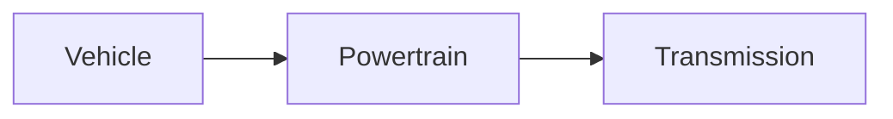

| | |
|---|---|
| Full qualified VSS Path: | `Vehicle.Powertrain.Transmission` |
| Description: | Transmission-specific data, stopping at the drive shafts. |

## Navigation

## Digital Auto: Playground

[playground.digital.auto](http://digital.auto) provides an in-browser, rapid prototyping environment utilizing the COVESA APIs for connected vehicles. 

| Vehicle Model | Direct link to Vehicle Signal |
|---|---|
| ACME Car (EV) v0.1 | [Vehicle.Powertrain.Transmission](https://digitalauto.netlify.app/model/STLWzk1WyqVVLbfymb4f/cvi/list/Vehicle.Powertrain.Transmission/) |

## Signal Information

The vehicle signal `Vehicle.Powertrain.Transmission` is a **Branch**.

## UUID

Each vehicle signal is identified by a [Universally Unique Identifier (UUID](https://en.wikipedia.org/wiki/Universally_unique_identifier))

The UUID for `Vehicle.Powertrain.Transmission` is `6b71e284b63a527caa6296a66e9fdd0c`

## Children

This vehicle signal is a branch or structure and thus has sub-pages:

- [Vehicle.Powertrain.Transmission.ClutchEngagement](clutchengagement/) (Clutch engagement. 0% = Clutch fully disengaged. 100% = Clutch fully engaged.)
- [Vehicle.Powertrain.Transmission.ClutchWear](clutchwear/) (Clutch wear as a percent. 0 = no wear. 100 = worn.)
- [Vehicle.Powertrain.Transmission.CurrentGear](currentgear/) (The current gear. 0=Neutral, 1/2/..=Forward, -1/-2/..=Reverse.)
- [Vehicle.Powertrain.Transmission.DiffLockFrontEngagement](difflockfrontengagement/) (Front Diff Lock engagement. 0% = Diff lock fully disengaged. 100% = Diff lock fully engaged.)
- [Vehicle.Powertrain.Transmission.DiffLockRearEngagement](difflockrearengagement/) (Rear Diff Lock engagement. 0% = Diff lock fully disengaged. 100% = Diff lock fully engaged.)
- [Vehicle.Powertrain.Transmission.DriveType](drivetype/) (Drive type.)
- [Vehicle.Powertrain.Transmission.GearChangeMode](gearchangemode/) (Is the gearbox in automatic or manual (paddle) mode.)
- [Vehicle.Powertrain.Transmission.GearCount](gearcount/) (Number of forward gears in the transmission. -1 = CVT.)
- [Vehicle.Powertrain.Transmission.IsElectricalPowertrainEngaged](iselectricalpowertrainengaged/) (Is electrical powertrain mechanically connected/engaged to the drivetrain or not. False = Disconnected/Disengaged. True = Connected/Engaged.)
- [Vehicle.Powertrain.Transmission.IsLowRangeEngaged](islowrangeengaged/) (Is gearbox in low range mode or not. False = Normal/High range engaged. True = Low range engaged.)
- [Vehicle.Powertrain.Transmission.IsParkLockEngaged](isparklockengaged/) (Is the transmission park lock engaged or not. False = Disengaged. True = Engaged.)
- [Vehicle.Powertrain.Transmission.PerformanceMode](performancemode/) (Current gearbox performance mode.)
- [Vehicle.Powertrain.Transmission.SelectedGear](selectedgear/) (The selected gear. 0=Neutral, 1/2/..=Forward, -1/-2/..=Reverse, 126=Park, 127=Drive.)
- [Vehicle.Powertrain.Transmission.Temperature](temperature/) (The current gearbox temperature.)
- [Vehicle.Powertrain.Transmission.TorqueDistribution](torquedistribution/) (Torque distribution between front and rear axle in percent. -100% = Full torque to front axle, 0% = 50:50 Front/Rear, 100% = Full torque to rear axle.)
- [Vehicle.Powertrain.Transmission.TravelledDistance](travelleddistance/) (Odometer reading, total distance travelled during the lifetime of the transmission.)
- [Vehicle.Powertrain.Transmission.Type](type/) (Transmission type.)

## Feedback

Do you think this Vehicle Signal specification needs enhancement? Do you want to discuss with experts? Try the following ressources to get in touch with the VSS community:

| | |
|---|---|
| Enhancement request | [Create COVESA GitHub Issue](https://github.com/COVESA/vehicle_signal_specification/issues/new?body=Please+describe+your+feedback&title=Signal+feedback+Vehicle.Powertrain.Transmission) |
| Join COVESA | [www.covesa.global](https://www.covesa.global/join?src=sidebar) |
| Discuss VSS on Slack | [w3cauto.slack.com](http://w3cauto.slack.com/) |
| VSS Data Experts on Google Groups | [covesa.global data-expert-group](https://groups.google.com/a/covesa.global/g/data-expert-group) |

## About VSS

The [Vehicle Signal Specification](https://covesa.github.io/vehicle_signal_specification/) (VSS)
is an initiative by COVESA to define a syntax and a catalog for vehicle signals.
The source code and releases can be found in the [VSS github repository](https://github.com/COVESA/vehicle_signal_specification).

