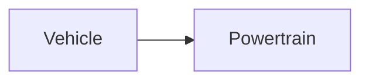

| | |
|---|---|
| Full qualified VSS Path: | `Vehicle.Powertrain` |
| Description: | Powertrain data for battery management, etc. |

## Navigation

## Digital Auto: Playground

[playground.digital.auto](http://digital.auto) provides an in-browser, rapid prototyping environment utilizing the COVESA APIs for connected vehicles. 

| Vehicle Model | Direct link to Vehicle Signal |
|---|---|
| ACME Car (EV) v0.1 | [Vehicle.Powertrain](https://digitalauto.netlify.app/model/STLWzk1WyqVVLbfymb4f/cvi/list/Vehicle.Powertrain/) |

## Signal Information

The vehicle signal `Vehicle.Powertrain` is a **Branch**.

## UUID

Each vehicle signal is identified by a [Universally Unique Identifier (UUID](https://en.wikipedia.org/wiki/Universally_unique_identifier))

The UUID for `Vehicle.Powertrain` is `12f35ec7bd1c58d1a329565ce3d053d5`

## Children

This vehicle signal is a branch or structure and thus has sub-pages:

- [Vehicle.Powertrain.AccumulatedBrakingEnergy](accumulatedbrakingenergy/) (The accumulated energy from regenerative braking over lifetime.)
- [Vehicle.Powertrain.CombustionEngine](combustionengine/) (Engine-specific data, stopping at the bell housing.)
- [Vehicle.Powertrain.ElectricMotor](electricmotor/) (Electric Motor specific data.)
- [Vehicle.Powertrain.FuelSystem](fuelsystem/) (Fuel system data.)
- [Vehicle.Powertrain.PowerOptimizeLevel](poweroptimizelevel/) (Power optimization level for this branch/subsystem. A higher number indicates more aggressive power optimization. Level 0 indicates that all functionality is enabled, no power optimization enabled. Level 10 indicates most aggressive power optimization mode, only essential functionality enabled.)
- [Vehicle.Powertrain.Range](range/) (Remaining range in meters using all energy sources available in the vehicle.)
- [Vehicle.Powertrain.TractionBattery](tractionbattery/) (Battery Management data.)
- [Vehicle.Powertrain.Transmission](transmission/) (Transmission-specific data, stopping at the drive shafts.)
- [Vehicle.Powertrain.Type](type/) (Defines the powertrain type of the vehicle.)

## Feedback

Do you think this Vehicle Signal specification needs enhancement? Do you want to discuss with experts? Try the following ressources to get in touch with the VSS community:

| | |
|---|---|
| Enhancement request | [Create COVESA GitHub Issue](https://github.com/COVESA/vehicle_signal_specification/issues/new?body=Please+describe+your+feedback&title=Signal+feedback+Vehicle.Powertrain) |
| Join COVESA | [www.covesa.global](https://www.covesa.global/join?src=sidebar) |
| Discuss VSS on Slack | [w3cauto.slack.com](http://w3cauto.slack.com/) |
| VSS Data Experts on Google Groups | [covesa.global data-expert-group](https://groups.google.com/a/covesa.global/g/data-expert-group) |

## About VSS

The [Vehicle Signal Specification](https://covesa.github.io/vehicle_signal_specification/) (VSS)
is an initiative by COVESA to define a syntax and a catalog for vehicle signals.
The source code and releases can be found in the [VSS github repository](https://github.com/COVESA/vehicle_signal_specification).

