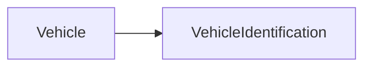

| | |
|---|---|
| Full qualified VSS Path: | `Vehicle.VehicleIdentification` |
| Description: | Attributes that identify a vehicle. |

## Navigation

## Digital Auto: Playground

[playground.digital.auto](http://digital.auto) provides an in-browser, rapid prototyping environment utilizing the COVESA APIs for connected vehicles. 

| Vehicle Model | Direct link to Vehicle Signal |
|---|---|
| ACME Car (EV) v0.1 | [Vehicle.VehicleIdentification](https://digitalauto.netlify.app/model/STLWzk1WyqVVLbfymb4f/cvi/list/Vehicle.VehicleIdentification/) |

## Signal Information

The vehicle signal `Vehicle.VehicleIdentification` is a **Branch**.

## UUID

Each vehicle signal is identified by a [Universally Unique Identifier (UUID](https://en.wikipedia.org/wiki/Universally_unique_identifier))

The UUID for `Vehicle.VehicleIdentification` is `c33861c3e9125208b05f23fe922bf08e`

## Children

This vehicle signal is a branch or structure and thus has sub-pages:

- [Vehicle.VehicleIdentification.AcrissCode](acrisscode/) (The ACRISS Car Classification Code is a code used by many car rental companies.)
- [Vehicle.VehicleIdentification.BodyType](bodytype/) (Indicates the design and body style of the vehicle (e.g. station wagon, hatchback, etc.).)
- [Vehicle.VehicleIdentification.Brand](brand/) (Vehicle brand or manufacturer.)
- [Vehicle.VehicleIdentification.DateVehicleFirstRegistered](datevehiclefirstregistered/) (The date in ISO 8601 format of the first registration of the vehicle with the respective public authorities.)
- [Vehicle.VehicleIdentification.KnownVehicleDamages](knownvehicledamages/) (A textual description of known damages, both repaired and unrepaired.)
- [Vehicle.VehicleIdentification.MeetsEmissionStandard](meetsemissionstandard/) (Indicates that the vehicle meets the respective emission standard.)
- [Vehicle.VehicleIdentification.Model](model/) (Vehicle model.)
- [Vehicle.VehicleIdentification.OptionalExtras](optionalextras/) (Optional extras refers to all car equipment options that are not installed as standard by the manufacturer.)
- [Vehicle.VehicleIdentification.ProductionDate](productiondate/) (The date in ISO 8601 format of production of the item, e.g. vehicle.)
- [Vehicle.VehicleIdentification.PurchaseDate](purchasedate/) (The date in ISO 8601 format of the item e.g. vehicle was purchased by the current owner.)
- [Vehicle.VehicleIdentification.VIN](vin/) (17-character Vehicle Identification Number (VIN) as defined by ISO 3779.)
- [Vehicle.VehicleIdentification.VehicleConfiguration](vehicleconfiguration/) (A short text indicating the configuration of the vehicle, e.g. '5dr hatchback ST 2.5 MT 225 hp' or 'limited edition'.)
- [Vehicle.VehicleIdentification.VehicleInteriorColor](vehicleinteriorcolor/) (The color or color combination of the interior of the vehicle.)
- [Vehicle.VehicleIdentification.VehicleInteriorType](vehicleinteriortype/) (The type or material of the interior of the vehicle (e.g. synthetic fabric, leather, wood, etc.).)
- [Vehicle.VehicleIdentification.VehicleModelDate](vehiclemodeldate/) (The release date in ISO 8601 format of a vehicle model (often used to differentiate versions of the same make and model).)
- [Vehicle.VehicleIdentification.VehicleSeatingCapacity](vehicleseatingcapacity/) (The number of passengers that can be seated in the vehicle, both in terms of the physical space available, and in terms of limitations set by law.)
- [Vehicle.VehicleIdentification.VehicleSpecialUsage](vehiclespecialusage/) (Indicates whether the vehicle has been used for special purposes, like commercial rental, driving school.)
- [Vehicle.VehicleIdentification.WMI](wmi/) (3-character World Manufacturer Identification (WMI) as defined by ISO 3780.)
- [Vehicle.VehicleIdentification.Year](year/) (Model year of the vehicle.)

## Feedback

Do you think this Vehicle Signal specification needs enhancement? Do you want to discuss with experts? Try the following ressources to get in touch with the VSS community:

| | |
|---|---|
| Enhancement request | [Create COVESA GitHub Issue](https://github.com/COVESA/vehicle_signal_specification/issues/new?body=Please+describe+your+feedback&title=Signal+feedback+Vehicle.VehicleIdentification) |
| Join COVESA | [www.covesa.global](https://www.covesa.global/join?src=sidebar) |
| Discuss VSS on Slack | [w3cauto.slack.com](http://w3cauto.slack.com/) |
| VSS Data Experts on Google Groups | [covesa.global data-expert-group](https://groups.google.com/a/covesa.global/g/data-expert-group) |

## About VSS

The [Vehicle Signal Specification](https://covesa.github.io/vehicle_signal_specification/) (VSS)
is an initiative by COVESA to define a syntax and a catalog for vehicle signals.
The source code and releases can be found in the [VSS github repository](https://github.com/COVESA/vehicle_signal_specification).

