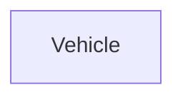

| | |
|---|---|
| Full qualified VSS Path: | `Vehicle` |
| Description: | High-level vehicle data. |

## Navigation

## Digital Auto: Playground

[playground.digital.auto](http://digital.auto) provides an in-browser, rapid prototyping environment utilizing the COVESA APIs for connected vehicles. 

| Vehicle Model | Direct link to Vehicle Signal |
|---|---|
| ACME Car (EV) v0.1 | [Vehicle](https://digitalauto.netlify.app/model/STLWzk1WyqVVLbfymb4f/cvi/list/Vehicle/) |

## Signal Information

The vehicle signal `Vehicle` is a **Branch**.

## UUID

Each vehicle signal is identified by a [Universally Unique Identifier (UUID](https://en.wikipedia.org/wiki/Universally_unique_identifier))

The UUID for `Vehicle` is `ccc825f94139544dbb5f4bfd033bece6`

## Children

This vehicle signal is a branch or structure and thus has sub-pages:

- [Vehicle.ADAS](adas/) (All Advanced Driver Assist Systems data.)
- [Vehicle.Acceleration](acceleration/) (Spatial acceleration. Axis definitions according to ISO 8855.)
- [Vehicle.AngularVelocity](angularvelocity/) (Spatial rotation. Axis definitions according to ISO 8855.)
- [Vehicle.AverageSpeed](averagespeed/) (Average speed for the current trip.)
- [Vehicle.Body](body/) (All body components.)
- [Vehicle.Cabin](cabin/) (All in-cabin components, including doors.)
- [Vehicle.CargoVolume](cargovolume/) (The available volume for cargo or luggage. For automobiles, this is usually the trunk volume.)
- [Vehicle.Chassis](chassis/) (All data concerning steering, suspension, wheels, and brakes.)
- [Vehicle.Connectivity](connectivity/) (Connectivity data.)
- [Vehicle.CurbWeight](curbweight/) (Vehicle curb weight, including all liquids and full tank of fuel, but no cargo or passengers.)
- [Vehicle.CurrentLocation](currentlocation/) (The current latitude and longitude of the vehicle.)
- [Vehicle.CurrentOverallWeight](currentoverallweight/) (Current overall Vehicle weight. Including passengers, cargo and other load inside the car.)
- [Vehicle.Driver](driver/) (Driver data.)
- [Vehicle.EmissionsCO2](emissionsco2/) (The CO2 emissions.)
- [Vehicle.Exterior](exterior/) (Information about exterior measured by vehicle.)
- [Vehicle.GrossWeight](grossweight/) (Curb weight of vehicle, including all liquids and full tank of fuel and full load of cargo and passengers.)
- [Vehicle.Height](height/) (Overall vehicle height.)
- [Vehicle.IsBrokenDown](isbrokendown/) (Vehicle breakdown or any similar event causing vehicle to stop on the road, that might pose a risk to other road users. True = Vehicle broken down on the road, due to e.g. engine problems, flat tire, out of gas, brake problems. False = Vehicle not broken down.)
- [Vehicle.IsMoving](ismoving/) (Indicates whether the vehicle is stationary or moving.)
- [Vehicle.Length](length/) (Overall vehicle length.)
- [Vehicle.LowVoltageBattery](lowvoltagebattery/) (Signals related to low voltage battery.)
- [Vehicle.LowVoltageSystemState](lowvoltagesystemstate/) (State of the supply voltage of the control units (usually 12V).)
- [Vehicle.MaxTowBallWeight](maxtowballweight/) (Maximum vertical weight on the tow ball of a trailer.)
- [Vehicle.MaxTowWeight](maxtowweight/) (Maximum weight of trailer.)
- [Vehicle.OBD](obd/) (OBD data.)
- [Vehicle.PowerOptimizeLevel](poweroptimizelevel/) (Power optimization level for this branch/subsystem. A higher number indicates more aggressive power optimization. Level 0 indicates that all functionality is enabled, no power optimization enabled. Level 10 indicates most aggressive power optimization mode, only essential functionality enabled.)
- [Vehicle.Powertrain](powertrain/) (Powertrain data for battery management, etc.)
- [Vehicle.RoofLoad](roofload/) (The permitted total weight of cargo and installations (e.g. a roof rack) on top of the vehicle.)
- [Vehicle.Service](service/) (Service data.)
- [Vehicle.Speed](speed/) (Vehicle speed.)
- [Vehicle.StartTime](starttime/) (Start time of current or latest trip, formatted according to ISO 8601 with UTC time zone.)
- [Vehicle.Trailer](trailer/) (Trailer signals.)
- [Vehicle.TraveledDistance](traveleddistance/) (Odometer reading, total distance traveled during the lifetime of the vehicle.)
- [Vehicle.TraveledDistanceSinceStart](traveleddistancesincestart/) (Distance traveled since start of current trip.)
- [Vehicle.TravelledDistance](travelleddistance/) (Odometer reading, total distance traveled during the lifetime of the vehicle.)
- [Vehicle.TripDuration](tripduration/) (Duration of latest trip.)
- [Vehicle.TripMeterReading](tripmeterreading/) (Trip meter reading.)
- [Vehicle.VehicleIdentification](vehicleidentification/) (Attributes that identify a vehicle.)
- [Vehicle.VersionVSS](versionvss/) (Supported Version of VSS.)
- [Vehicle.Width](width/) (Overall vehicle width.)

## Feedback

Do you think this Vehicle Signal specification needs enhancement? Do you want to discuss with experts? Try the following ressources to get in touch with the VSS community:

| | |
|---|---|
| Enhancement request | [Create COVESA GitHub Issue](https://github.com/COVESA/vehicle_signal_specification/issues/new?body=Please+describe+your+feedback&title=Signal+feedback+Vehicle) |
| Join COVESA | [www.covesa.global](https://www.covesa.global/join?src=sidebar) |
| Discuss VSS on Slack | [w3cauto.slack.com](http://w3cauto.slack.com/) |
| VSS Data Experts on Google Groups | [covesa.global data-expert-group](https://groups.google.com/a/covesa.global/g/data-expert-group) |

## About VSS

The [Vehicle Signal Specification](https://covesa.github.io/vehicle_signal_specification/) (VSS)
is an initiative by COVESA to define a syntax and a catalog for vehicle signals.
The source code and releases can be found in the [VSS github repository](https://github.com/COVESA/vehicle_signal_specification).

